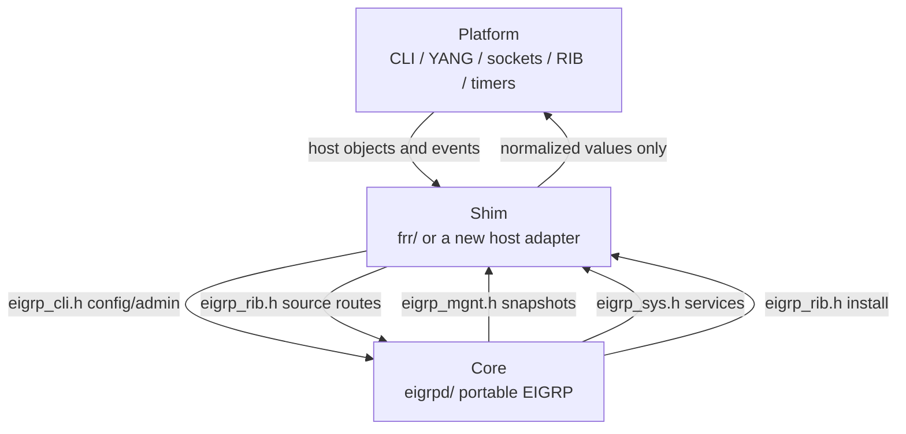

# EIGRP

Portable EIGRP implementation based on RFC 7868.

RFC 7868 and Donnie V. Savage's protocol design decisions define EIGRP
behavior. FRR and BIRD are host frameworks. Neither is the protocol authority.

This tree is in active development. FRR is the working host integration. BIRD
is a reserved layout, not a second implementation yet. IPv4 is the runtime data
path that is being brought up. Named IPv6 configuration uses the same semantic
model, but the IPv6 packet path is still capability-gated.

## Start here by role

Pick the row that matches the job you were given. Read that spec before you
open random source files.

| If you are | Open first | Then |
|---|---|---|
| New contributor | `CONTRIBUTING.md` | this README, `specs/design-spec.md`, and `specs/refactor-work.md` for open items |
| Operator / CLI user | `specs/EIGRP-Config-Guide.md` | `tools/README.md` for UUT and vtysh notes |
| Platform integrator | `specs/integration-spec.md` and the five public headers in `eigrpd/` | `frr/README.md` and `specs/EIGRP-Config-Guide.md` |
| Portable protocol developer | `specs/design-spec.md` | `dual.md`, `rtp-spec.md`, `rfc7868.md`, config guide, `refactor-work.md` |
| FRR adapter developer | this README workflow plus `frr/README.md` and `frr/patch/README.md` | `specs/integration-spec.md`, config guide, `specs/design-spec.md` |

`specs/refactor-work.md` has two kinds of items. Naming/architecture parked
items need a review before a rename sweep. Incomplete feature targets that
still return `NOT_IMPLEMENTED` are fair work for a PR.

## Repository layout

```text
eigrp/
  eigrpd/         Portable EIGRP protocol code
  frr/            FRR adapters and integration
    patch/        Managed changes required outside FRR/eigrpd/
    test/         FRR shim integration tests
  bird/           Reserved BIRD shim location
  test/
    build/        Lightweight compile-smoke harness
    common/       Host-independent fixtures and packet samples
    portable/     Host-independent source/behavior tests
  specs/          Architecture, CLI, integration, and protocol design
  tools/          Build, staging, patch, UUT, and packaging helpers
  CONTRIBUTING.md Fork, pull request, style, AI, and test rules
```

This repository is the canonical source tree. FRR staging creates a projection
of `eigrpd/` plus the FRR adapter files. Do not develop against the staged FRR
copy and then copy changes back.

## Architecture at a glance

Three layers. Host objects stop in the shim. Protocol decisions stay in core.

```text
+---------------------------+
| platform                  |
| CLI/YANG, sockets, RIB,   |
| timers, interfaces        |
+-------------+-------------+
              |
              v
+-------------+-------------+
| shim                      |
| frr/ today                |
| bird/ later               |
|                           |
| eigrp_cli.h   host -> core|
| eigrp_mgnt.h  core -> host|
| eigrp_rib.h   both ways   |
| eigrp_sys.h   core -> host|
+-------------+-------------+
              |
              v
+-------------+-------------+
| core                      |
| eigrpd/                   |
| DUAL, RTP, packets,       |
| topology, neighbors       |
+---------------------------+
```



FRR's path through that shim is drawn in `frr/README.md`.

## Design documents

- `specs/design-spec.md` - contributor spec for portable core: ownership,
  naming, instance model, testing.
- `specs/integration-spec.md` - public black-box contract for a routing
  platform that wants to host this code.
- `specs/EIGRP-Config-Guide.md` - operator CLI/EXEC guide. Integrators use it
  when they build the host equivalent of FRR YANG/CLI.
- `specs/dual.md` - core support doc. DUAL state machine in this tree.
- `specs/rtp-spec.md` - core support doc. Packetization and RTP.
- `specs/rfc7868.md` - core support doc. Pointer to RFC 7868. No forked RFC
  text in this repo.
- `specs/refactor-work.md` - parked naming work, plus incomplete feature
  targets a contributor can pick up.

## Development rules

Portable protocol behavior belongs in `eigrpd/`.
FRR-specific CLI, YANG, management, and Zebra/RIB belong under `frr/`.
BIRD-specific integration belongs under `bird/` when that work exists.

Portable APIs use EIGRP-owned types and structured result codes. FRR VTY, YANG,
Zebra, interface, event, stream, route-map, and equivalent BIRD objects must not
leak into portable protocol APIs.

Every configuration or operational feature terminates at its own real EIGRP
target. An incomplete feature keeps that target and returns the structured
EIGRP `NOT_IMPLEMENTED` result where required. Do not route it through a
generic CLI stub. Retained configuration stays writeable even when runtime
behavior is incomplete.

Function and module naming is for human navigation:

```text
eigrp_<module>.c
eigrp_<module>_<object>_<action>()
```

Read `specs/design-spec.md` before adding or renaming public APIs.
Read `CONTRIBUTING.md` before you open a pull request.

## Stub routing

EIGRP Stub routing is outside project scope. I have no plans to implement,
import, or add runtime tests for the EIGRP Stub feature.

The original Cisco patents on stub announcement and query suppression
(US7042834, US7570582) expired in 2022-2023. A later patent on mixed
stub/non-stub neighbors on the same interface (US7898981) is still in
force. RFC 7868 also leaves the stub TLV reserved. Stubs are omitted to stay
inside the published, unencumbered protocol.

## Normal development workflow

### 1. Work in the canonical project tree

Make source changes in `eigrpd/`, `frr/`, or `bird/` according to ownership.
Changes required outside FRR's `eigrpd/` directory are exceptional and are
carried as managed patches under `frr/patch/`.

### 2. Run the local fast gate

From the repository root:

```sh
make test
```

That runs:

```text
make smoke          standalone compile-smoke harness
make portable-test  host-independent pytest suite
```

Use the narrower targets while iterating:

```sh
make smoke
make portable-test
```

The smoke harness catches syntax and prototype drift. It does not replace the
full FRR build/link gate.

### 3. Stage into an FRR checkout

Keep the EIGRP and FRR repositories as siblings when practical:

```text
~/devel/eigrp/
~/devel/frr/
```

Stage the current EIGRP source and FRR-native test payload:

```sh
tools/frr.sh --install --frr-root ../frr
```

The projection is:

```text
eigrpd/ + FRR adapter files in frr/  -> ../frr/eigrpd/
frr/test/                            -> ../frr/tests/eigrpd/
```

Staging uses `--no-patches`. It never modifies FRR-wide source.

### 4. Apply managed FRR patches explicitly

When the managed patch state changes, or when preparing a fresh FRR checkout:

```sh
tools/frr.sh --patch --frr-root ../frr
```

Patch application is idempotent. An already-applied patch is left alone. A
patch that is neither cleanly applicable nor recognized as already applied
stops the operation for source-drift review. Do not fuzz or force managed
patches.

`--install`, `--configure`, `--build`, `--check`, `--all`, and `--uut` do not
apply FRR-wide patches.

### 5. Run the FRR build gate

For an already configured FRR checkout:

```sh
tools/frr.sh --build --frr-root ../frr
```

For the complete configure/build/check gate:

```sh
tools/frr.sh --all --frr-root ../frr
```

Use `--configure-first` with `--build`, `--check`, or `--uut` when the FRR
configure state needs to be regenerated.

The minimum code-change gate is a successful FRR build with `eigrpd` linked.

### 6. Run the live named-mode UUT

On the Linux FRR UUT:

```sh
tools/frr.sh --uut --frr-root ../frr
```

This stages the current EIGRP source, builds and installs FRR, restarts FRR,
starts the just-built `eigrpd`, and drives the daemon with
`sudo vtysh -d eigrpd`.

Named-mode validation is ordered:

1. `router eigrp savage`, IPv4 AF AS 4453 - applicable commands, mutation,
   writeback, and documented `no` forms.
2. IPv6 AF AS 4453 - the same configuration/writeback discipline for commands
   applicable to IPv6.
3. Additional AS contexts under the same named parent.
4. Case-sensitive named parents such as `savage` and `SAVAGE`.

Do not blame runtime worker code for a parser or config-retention failure until
the command has crossed the CLI/northbound boundary.

Set `EIGRP_UUT_INTERFACE` when the UUT interface is not `enp0s8`.

### 7. Run aggregate or remote UUT testing

`tools/frr-uut.sh` builds before running the selected test set. Locally:

```sh
tools/frr-uut.sh --frr-root ../frr
```

From another development host:

```sh
tools/frr-uut.sh --host USER@HOST --frr-root '~/devel/frr'
```

Useful subsets:

```sh
tools/frr-uut.sh --packet   --frr-root ../frr
tools/frr-uut.sh --portable --frr-root ../frr
tools/frr-uut.sh --frr      --frr-root ../frr
```

Required managed FRR patches must already be present on the UUT checkout.

## Debugging

For daemon debugging, stop any service-managed or manual EIGRP daemon before
starting another copy. From the FRR checkout, a typical GDB launch is:

```sh
sudo gdb eigrpd/.libs/eigrpd
```

Useful smoke commands:

```sh
sudo vtysh -d eigrpd -c 'show running-config'
sudo vtysh -d eigrpd -c 'show ip eigrp topology'
sudo vtysh -d eigrpd -c 'show ip eigrp neighbors'
```

The UUT scripts own daemon-start and cleanup. Prefer them over a hand-built
launch sequence when you are validating a change.

## Sending changes

Fork https://github.com/diivious/eigrpd, push a branch, open a pull request.
The PR must say what the issue was, what changed, and how it was tested.
See `CONTRIBUTING.md`.

## Copyright and contribution history

Preserve existing copyright, SPDX, and author history in files derived from
FRR or earlier EIGRP implementations. New files use the copyright of the
person who wrote them.

Small, reviewable changes are preferred. Do not add alias wrappers, duplicate
old/new paths, or compatibility layers without an approved migration reason.

See `CONTRIBUTING.md` for AI use, style, and diff hygiene.

## Security

Security reports may be sent to:

```text
diivious [at] hotmail.com
```
