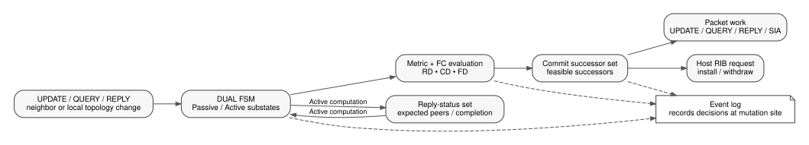

# OpenEIGRP Portable DUAL Design

Copyright (C) 2026 Donnie V. Savage

## 1. Scope

This document specifies the portable Diffusing Update Algorithm (DUAL)
implementation under `eigrp/code/`.

It owns destination state, feasibility processing, Passive/Active transitions,
QUERY/REPLY behavior, reply-status bookkeeping, SIA interaction, and the point
at which a completed DUAL decision is handed to topology/RIB/update processing.

It does not define host integration, CLI syntax, RIB APIs, packet framing, TLV
encoding, or RTP retransmission mechanics. Those belong to the repository-wide
integration specs or `eigrp/specs/rtp.md`.

Protocol behavior follows RFC 7868 and explicit OpenEIGRP design decisions.

## 2. DUAL topology objects




DUAL separates destination state from per-neighbor path state.

```text
prefix_descriptor
  route_descriptor
  route_descriptor
  ...
```

The prefix descriptor is the destination-level DUAL object. A route descriptor
is one path to that destination learned through one source/neighbor.

Historical EIGRP terms DNDB/NDB and DRDB/RDB describe these same conceptual
levels. Current source naming remains unchanged pending the planned
pre-production terminology review.

A host RIB route is not a DUAL route descriptor. Host RIB programming occurs
after portable route selection.

## 3. Distance values

For a destination/path pair, OpenEIGRP distinguishes:

- **Reported Distance (RD)** — distance advertised by the neighbor;
- **Computed Distance (CD)** — local distance through that neighbor;
- **Feasible Distance (FD)** — destination-level loop-free anchor used by the
  Feasibility Condition;
- **selected destination distance** — metric of the currently selected Passive
  result.

The Feasibility Condition is:

```text
neighbor RD < destination FD
```

A path satisfying the condition is a feasible-successor candidate. A successor
is a selected least-cost feasible path.

A path may be loop free without satisfying FC, but DUAL does not adopt it as a
successor without the required diffusing computation.

Route ordering among internal/external paths is defined in
`route-selection-spec.md`.

## 4. Passive state

A destination is **Passive** when no coordinated diffusing computation is in
progress.

While Passive, path updates may cause normal successor reselection. If the best
candidate satisfies the Feasibility Condition against the current FD, DUAL may
remain Passive and update selected destination state.

If the required path cannot be proven feasible against the current FD, DUAL
enters Active.

## 5. Active state

A destination is **Active** while DUAL is coordinating a recomputation with
neighbors through QUERY and REPLY.

Active is destination state, not neighbor state. One prefix may be Active while
unrelated prefixes remain Passive.

The implementation retains the traditional states:

```text
PASSIVE
ACTIVE_0
ACTIVE_1
ACTIVE_2
ACTIVE_3
```

The Active substates encode query-origin/history needed by the DUAL transition
table. They are internal protocol state, not operator configuration modes.

## 6. Active-state freeze invariant

The critical OpenEIGRP DUAL invariant is:

> When a destination becomes Active, the destination-level successor, FD,
> reported distance, selected distance, and advertised destination metric are
> frozen until DUAL is allowed to return that destination to Passive.

While Active, OpenEIGRP may update:

- per-neighbor RD and CD observations;
- path metrics and availability;
- reply-status membership;
- query-origin state;
- SIA progress state;
- pending semantic QUERY/REPLY/SIA work.

Those observations must not prematurely rewrite the frozen destination state.

This distinction prevents a partially completed diffusing computation from
changing the loop-free anchor used to evaluate the computation itself.

## 7. FSM event classes

The current implementation uses these event classes in the DUAL state table:

```text
NQ_FCN   non-query trigger, FC not satisfied
LR       last outstanding reply
Q_FCN    query trigger, FC not satisfied
LR_FCS   last reply, FC satisfied
DINC     successor distance increase while Active
QACT     query from successor while Active
LR_FCN   last reply, FC still not satisfied
KEEP     no transition
```

The exact transition table belongs in `eigrp_fsm.c`. This specification defines
the invariants that table must preserve.

## 8. Entering Active

For a Passive destination:

1. update the relevant path observation;
2. identify the best available candidate under portable route-selection rules;
3. evaluate FC against the current destination FD;
4. remain Passive if FC permits adoption;
5. otherwise initialize a diffusing computation and enter the appropriate
   Active substate.

A non-query trigger normally enters the local-origin Active path. A query from
the current successor uses the successor-origin path.

Entering Active creates the reply-status set for eligible neighbors and queues
semantic QUERY work as required.

If no neighbor must be queried, the computation may complete locally without an
on-wire query round.

## 9. Reply-status ownership

Each Active destination owns the set of neighbors from which a REPLY is still
required.

Rules:

- adding a queried neighbor adds it to reply status;
- receiving a valid REPLY removes that neighbor;
- neighbor loss must remove or otherwise resolve its outstanding reply status;
- intermediate replies update path observations but do not complete the
  computation;
- the last outstanding reply triggers completion evaluation.

Reply-status state is destination-specific and must not be reconstructed from a
host neighbor list after the fact.

## 10. Completing a diffusing computation

When reply status becomes empty, DUAL evaluates the best available path using
the FD that remained frozen throughout the Active interval.

If FC is satisfied, DUAL may:

1. transition the destination to Passive;
2. commit the selected destination metric/FD/successor state;
3. refresh successor and feasible-successor flags;
4. notify topology/RIB/update processing of the committed result;
5. send any deferred REPLY required by query-origin state.

If FC is still not satisfied, DUAL remains Active and begins the required next
query round. Frozen destination state remains frozen across that continued
computation.

## 11. QUERY processing

QUERY is route-bearing DUAL input.

For a Passive destination, OpenEIGRP may answer immediately when current local
state permits a valid response. If satisfying the query requires a diffusing
computation, the destination enters Active.

For an already Active destination, a query from the current successor changes
query-origin/substate bookkeeping according to the FSM. It does not unfreeze
FD or selected destination state.

DUAL produces semantic reply/query work. It does not encode TLVs or choose
packet MTUs.

## 12. REPLY processing

A REPLY:

1. validates the neighbor/path context;
2. updates that neighbor's path information;
3. clears that neighbor from reply status;
4. if replies remain, keeps the destination Active;
5. if this was the last reply, performs completion evaluation.

A successor distance increase observed during Active changes Active-state
bookkeeping as required by DUAL. It does not directly commit a new destination
FD or successor.

## 13. UPDATE processing

In Passive state, UPDATE input may alter path RD/CD and trigger normal route
selection.

In Active state, UPDATE input may update path observations, but destination-level
selected state remains frozen until DUAL completes the computation.

An UPDATE that represents a relevant successor distance increase must enter the
FSM through the proper event path rather than bypassing DUAL with direct
selected-state mutation.

## 14. SIA processing

Stuck-in-Active handling is part of the same destination-level diffusing
computation.

SIA-QUERY checks progress from a neighbor that still owes DUAL state. SIA-REPLY
confirms that the remote computation is alive and making progress.

SIA processing may refresh progress/timer state but must not violate the
Active-state freeze invariant.

Packet delivery and reliable retransmission of SIA messages follow
`eigrp/specs/rtp.md`.

## 15. Successor and feasible-successor state

Successor and feasible-successor flags are derived from committed portable
topology state when DUAL is allowed to select paths.

They do not replace the destination FSM state.

After a destination returns to Passive, topology processing may:

- commit destination distance/FD information;
- recompute successor/feasible-successor flags;
- apply variance and maximum-paths rules;
- construct public RIB output;
- queue required UPDATE work.

Host RIB installation is an output of this decision, not part of the DUAL FSM.

## 16. DUAL to route-selection boundary

DUAL decides when path selection may be committed. Route-selection code decides
which eligible path(s) are preferred under internal/external ordering, metric,
variance, and maximum-path rules.

`route-selection-spec.md` owns those ordering rules.

No route-selection helper may bypass Active-state freezing by committing a new
successor while the destination is still Active.

## 17. DUAL to packetization boundary

DUAL produces semantic protocol work:

```text
DUAL/topology state change
    -> QUERY / REPLY / UPDATE / SIA semantic work
    -> packetizer
    -> TLV codec
    -> immutable packet
    -> RTP delivery
```

Packetization revalidates the current interface/neighbor/path context when work
is consumed. DUAL therefore does not own MTU, authentication framing, pacing,
codec selection, or retransmission state.

## 18. Ordering and reentrancy

A single destination's DUAL state changes must be serialized through the
portable event/FSM path.

Code handling one event must not assume that unrelated destinations are frozen.
The implementation may process unrelated prefixes independently.

Deferred packetization or host I/O must not retain writable pointers that allow
later code to mutate DUAL state outside the owning FSM/topology path.

## 19. State-transition event logging

DUAL state-transition events must be recorded at the exact location where the
state variable is changed.

Do not centralize logging at a higher-level caller that merely expects a
transition. Logging an intended X -> Y transition before or after a different
code path actually writes X -> Z produces misleading diagnostic history.

For every state mutation that is operationally significant:

```text
capture old state
perform the authoritative state assignment
record old -> new at that assignment site
```

The event log is diagnostic evidence of what the implementation did, not what a
caller expected it to do. The same exact-site rule applies to FC/feasible-
successor decisions, metric commits, ACTIVE reply accounting, and committed
successor-set changes: log the decision where the authoritative state is
changed, not in a later observer that infers what should have happened.

## 20. Source ownership

Portable DUAL behavior is primarily owned by:

```text
eigrp_fsm.c / eigrp_fsm.h
eigrp_topology.c / eigrp_topology.h
eigrp_query.c
eigrp_reply.c
eigrp_update.c
eigrp_siaquery.c
eigrp_siareply.c
eigrp_timer.c
```

Supporting metric and route-selection code remains portable under `eigrp/code/`.

No FRR, BIRD, Unix host, CLI, or RIB adapter may implement a second DUAL state
machine.

## 21. DUAL correctness checklist

A DUAL change is not complete unless it preserves all of the following:

- FC compares neighbor RD against the correct destination FD;
- Active destination state remains frozen until completion;
- reply status contains exactly the neighbors still owed;
- last-reply handling distinguishes FC-satisfied from FC-unsatisfied outcomes;
- upstream query-origin obligations survive nested/continued computations;
- SIA progress does not masquerade as a completed REPLY;
- committed successor state is updated only at a legal Passive transition;
- state transitions are event-logged at the actual mutation site;
- packet/TLV/host concerns remain outside the FSM.
