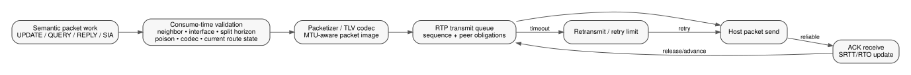

# OpenEIGRP Portable Packetization and Reliable Transport Design

Copyright (C) 2026 Donnie V. Savage

## 1. Scope

This document specifies the portable OpenEIGRP packetization and EIGRP Reliable
Transport Protocol (RTP) design under `eigrp/code/`.

It owns the boundary between semantic routing work and wire packets, packet
construction/lifetime, route-TLV codec selection, interface output queues,
reliable sequence/ACK/retransmission state, packet sizing, and the division of
responsibility among packetizer, packet, TLV, neighbor, and update modules.

It does not define DUAL state transitions, route selection, host socket APIs, or
platform event-loop implementation. DUAL is specified in `dual.md`; host
integration is specified in `../../specs/platform-integration.md`.

## 2. Authority and invariants

Protocol behavior follows RFC 7868 and explicit OpenEIGRP design decisions.

The packetization/RTP implementation must preserve these invariants:

1. DUAL/topology produces semantic work, not prebuilt wire TLVs.
2. Packetization revalidates current context when queued work is consumed.
3. Interface/neighbor codec state determines the route-TLV encoder.
4. A finalized packet wire image is immutable.
5. Reliable retransmission uses the original reliable sequence and wire image.
6. Multicast reliable retransmission becomes unicast to outstanding peers.
7. Packet construction never exceeds the transmitting interface packet limit.
8. Host scheduling and sockets remain behind `eigrp_sys.h`.

## 3. Work and packet terminology

### 3.1 Packetizer work item

A packetizer work item is semantic protocol work queued by DUAL/topology or
another portable protocol module.

It identifies what must be advertised or answered, not the final packet bytes.

Work may be destination-scoped, path/neighbor-scoped, or otherwise targeted by
protocol context.

### 3.2 Destination-level work

Destination-level work refers to one prefix descriptor and may need to be
encoded independently for multiple interfaces.

One work item can therefore produce:

- no packet, if no interface is eligible;
- one packet;
- multiple interface-specific packets.

### 3.3 Route/neighbor-specific work

Some operations are tied to one advertising path or neighbor, such as REPLY,
SIA-REPLY, SIA-QUERY, or adjacency-specific startup/resync behavior.

The work item must retain enough identity to revalidate the path and neighbor
before packet construction.

### 3.4 Built packet

A built packet owns or references an immutable EIGRP wire image plus the
metadata required for output/reliable transport.

Built packets are not topology state.

## 4. Queue model




OpenEIGRP uses two different queue concepts:

```text
semantic work queue
    -> packetizer consumes protocol work
    -> builds immutable packet(s)

interface packet queue
    -> output/RTP consumes built packet(s)
    -> host send service transmits bytes
```

Do not collapse these queues into one object merely because both are scheduled.
They have different ownership and lifetime rules.

## 5. Semantic work ownership

The module that detects a protocol change allocates/enqueues the semantic work
needed to describe that change.

The packetizer owns work from successful enqueue until it is consumed or
cancelled/freed.

Queued work represents a reason to reconsider current protocol state. It must
not be treated as a frozen copy of every mutable topology field unless the work
contract explicitly requires a snapshot.

## 6. Consume-time validation

When the packetizer consumes work, it must verify that referenced state is still
valid.

Depending on work type, validation includes:

- destination still exists;
- route descriptor still belongs to the destination;
- interface still participates in the EIGRP runtime;
- neighbor still exists and is eligible;
- work opcode/context remains meaningful;
- split-horizon/poison rules still apply as expected.

Stale work should be discarded safely, not used to dereference freed state or
advertise an obsolete topology decision.

## 7. Native data and codec dispatch

Portable protocol modules should exchange native OpenEIGRP route/topology data.
Wire-layout structures belong inside TLV codecs.

The packetizer asks the selected encoder to encode current native route data. It
does not construct TLV1/TLV2 wire fields itself.

This keeps:

- topology independent of wire format;
- packetizer independent of metric/TLV layout details;
- codec selection explicit and inspectable.

## 8. Codec ownership

Route-TLV encoding is owned by the TLV modules, currently including
`eigrp_tlv1.*` and `eigrp_tlv2.*`.

The selected codec is a runtime branch, not an ad hoc `if (peer supports X)`
check scattered through packetization.

Neighbor and interface state maintain the encoder/codec decision required for
that context.

Private wire structs remain private to codec/packet implementation.

## 9. Neighbor codec state

A neighbor's negotiated/eligible codec state is established and updated by the
portable neighbor/capability path.

Neighbor-targeted first-build unicast uses the neighbor's selected encoder.

The packetizer does not independently renegotiate or recompute the neighbor's
capability on every work item.

## 10. Interface aggregate codec state

An interface may need an aggregate encoder state representing the established
neighbors that will receive one interface-level packet.

Neighbor bind/unbind operations own updates to the aggregate state and its
counts. Interface teardown clears aggregate codec state unconditionally.

Operational/debug output should read this owned state rather than silently
recomputing it, so capability drift remains diagnosable.

## 11. Destination-level packetization

For destination-scoped work, the packetizer conceptually performs:

```text
for each eligible EIGRP interface:
    validate interface/runtime state
    determine eligible receiving-neighbor context
    apply split horizon / poison reverse
    select the interface encoder
    encode route content
    append/build packet subject to MTU limit
    enqueue only if content was produced
```

A destination work item is not tied to one interface wire image before this
loop runs.

## 12. Neighbor/path-specific packetization

For neighbor- or path-targeted work:

```text
validate destination/path
validate neighbor/interface binding
apply suppression/poison rules
select neighbor or required interface encoder
encode content
build/enqueue packet only when valid content exists
```

REPLY and SIA-REPLY are normally neighbor-specific because an inbound request
establishes the response context.

SIA-QUERY is also neighbor/destination-specific.

## 13. Split horizon and poison reverse

Split-horizon and poison decisions are made with current portable
interface/path context during packetization.

The semantic topology work item should not pre-render one global advertisement
that ignores interface-specific suppression requirements.

When poison reverse is required, the encoder receives semantic unreachable/
poison state and produces the correct wire representation.

## 14. Packet construction

A packet object owns:

- EIGRP header/framing state;
- encoded TLVs;
- sequence/flag information;
- authentication/checksum result;
- output/reliable-transport metadata;
- lifetime required by send/retransmit queues.

Packet construction completes before the packet is exposed to RTP/output.

## 15. Packet immutability

After route TLVs, authentication, checksum, and header completion, the wire
image is immutable.

No later queue, output, ACK, or retransmit path may rewrite the packet bytes in
place.

An implementation may either:

- allocate one packet object per reliable ownership context; or
- share an immutable backing buffer with explicit reference ownership.

Either design must prevent use-after-free and release the backing image only
after the last output/retransmit owner is done.

## 16. Interface output and pacing

Each EIGRP interface owns the built-packet output state required for that
interface.

Pacing is per interface because bandwidth, MTU, queue state, and available send
budget differ by interface.

When one interface is pacing-blocked:

- its packet remains queued;
- unrelated interfaces may continue transmitting;
- the host scheduler is asked to resume that interface when appropriate.

Do not impose one global packetizer delay that serializes unrelated interfaces.

## 17. Reliable versus unreliable packets

RTP decides whether a packet requires reliable delivery according to EIGRP
packet semantics.

Reliable packets carry sequence state and remain owned until required peers
acknowledge or are otherwise resolved.

Unreliable packets do not enter the reliable retransmission state machine merely
because they share an output queue.

## 18. Reliable first send

A reliable route packet may be transmitted by multicast on its first send when
protocol/interface conditions allow.

Before or at successful first send, OpenEIGRP records the established neighbors
required to acknowledge that sequence.

Neighbor-targeted reliable messages are unicast from their first send.

## 19. ACK tracking

ACK state is per neighbor and sequence.

A valid ACK for the expected sequence resolves that neighbor's ownership of the
reliable packet.

The packet may be released when every required neighbor has either:

- acknowledged the sequence; or
- been removed/reset through a defined neighbor-lifecycle path that resolves
  its outstanding reliable state.

An ACK for unrelated sequence state must not release the packet.

## 20. Retransmission

A reliable packet initially sent by multicast is never retransmitted by
multicast.

Retransmission is unicast only to neighbors that still owe the ACK.

Do not re-encode a packet merely because a retransmission is unicast. The
original immutable wire image and reliable sequence are reused.

## 21. RTT and RTO

Each neighbor owns its reliable-transport timing state.

RTT samples are taken from successfully acknowledged reliable packets only when
the sample is unambiguous, meaning the packet was not retransmitted.

The sample is measured from the first successful wire send to receipt of the
matching ACK. HELLO traffic does not create an RTP RTT sample.

The current OpenEIGRP transport design uses:

```text
initial RTO:      2000 ms
first SRTT:       R
first RTTVAR:     R / 2
alpha:            1/8
beta:             1/4
operational RTO:  6 * SRTT
RTO clamp:        200 .. 5000 ms
```

For later samples, RTTVAR is updated using the old SRTT before SRTT is updated.

A timeout backs off the current RTO, capped at 5000 ms. A later valid,
unambiguous sample replaces the backed-off value with a newly computed RTO.

## 22. Retry limit

A peer is allowed 16 retransmissions of the same reliable packet.

If the sixteenth retry is also not acknowledged, the neighbor is reset using
the `retry limit exceeded` reason.

Retry accounting is neighbor-specific. One slow peer must not force already
acknowledged peers to receive multicast retransmissions or retain unnecessary
ownership.

## 23. Conditional Receive

Conditional Receive and Sequence-TLV behavior belongs to RTP.

Neighbor exception sets and receive conditions must correspond to the reliable
sequence being transmitted. Packetizer shortcuts must not desynchronize
Conditional Receive state from the packet/RTP sequence state.

## 24. Packet sizing

Packet construction uses the transmitting interface's EIGRP packet limit.

Rules:

- never write beyond packet storage or the interface packet limit;
- append complete route TLVs while they fit;
- start another EIGRP packet when the next complete TLV does not fit;
- never split one EIGRP TLV across packets;
- preserve reliable sequence/transport behavior for every generated packet;
- do not confuse EIGRP packet segmentation with IP fragmentation.

The encoder must make encoded length knowable/validated before final packet
completion.

## 25. HELLO and ACK ownership

HELLO and ACK packets are not destination-level DUAL work.

The neighbor/hello/RTP path may build them directly while still obeying:

- packet bounds;
- authentication;
- checksum rules;
- immutable final wire image;
- output queue/lifetime requirements.

## 26. Topology-change UPDATE ownership

Normal topology-change UPDATEs originate from portable topology/DUAL semantic
work and pass through the packetizer.

The packetizer chooses the final interface/neighbor context and encoder.

Do not maintain a parallel host-specific UPDATE builder.

## 27. Initialization, EOT, and resync UPDATEs

Adjacency initialization, End-of-Table, and graceful-resync table walks are tied
to one adjacency's startup/resync protocol state.

The UPDATE/neighbor startup path may walk portable topology state directly for
that purpose, but it must reuse the same:

- native route data;
- codec implementations;
- packet limits;
- filtering/split-horizon behavior;
- authentication/checksum framing;
- sequence/RTP send machinery.

It must not create a second TLV implementation.

## 28. QUERY ownership

DUAL queues QUERY semantic work when a diffusing computation requires it.

Packetization selects eligible interfaces/neighbors and applies current
split-horizon, poison, capability, and pending-neighbor rules.

QUERY construction must not mutate DUAL destination state.

## 29. REPLY and SIA ownership

REPLY and SIA-REPLY are normally neighbor-specific reliable route work.

SIA-QUERY is neighbor/destination-specific reliable work.

The opcode changes protocol semantics and timers; it does not justify separate
copies of common route-TLV construction or reliable-send logic.

## 30. Module ownership

### `eigrp_packetizer.[ch]`

Owns semantic packetizer work, queueing, consume-time validation,
interface/neighbor selection, and work-to-packet orchestration.

### `eigrp_packet.[ch]`

Owns packet buffers/objects, fixed EIGRP packet framing, built-packet queue
primitives, output scheduling hooks, and reliable send/retransmit mechanics.

### `eigrp_tlv1.[ch]` and `eigrp_tlv2.[ch]`

Own route-TLV wire encoding/decoding and codec bindings.

### `eigrp_neighbor.[ch]`

Owns neighbor capability/binding state and per-neighbor reliable transport
state used by packet/RTP processing.

### `eigrp_update.c`

Owns UPDATE protocol semantics and adjacency startup/EOT/resync behavior.

### `eigrp_sys.h`

Defines the host runtime mechanisms used for scheduling, packet I/O, and time.
It does not own RTP policy.

## 31. Host boundary

Portable packet/RTP modules do not call FRR, BIRD, or raw host event-loop APIs
directly.

They request scheduling and packet I/O through `eigrp_sys.h`.

The host adapter may choose socket descriptors, ancillary data structures,
event objects, and platform queue implementation. It may not decide EIGRP
reliability, sequence, retransmission, codec, or packetization semantics.

## 32. Teardown

Interface or neighbor teardown must resolve every outstanding ownership edge:

- semantic work that references removed context;
- built output packets;
- reliable packet references;
- ACK/retransmit timers;
- aggregate codec state;
- pending scheduler callbacks.

Cancellation must occur before the referenced portable object becomes invalid.

## 33. Optimization rule

Correctness and inspectability take priority over packetization
micro-optimization.

Optimizations such as work coalescing, reduced wakeups, or shared immutable
packet storage are acceptable only when they preserve:

- object lifetime;
- interface-specific MTU/authentication/pacing;
- exact reliable sequence behavior;
- codec dispatch rules;
- split-horizon/poison decisions;
- per-neighbor ACK state;
- diagnostic visibility.

Do not add parallel old/new packetization paths as a temporary optimization
migration without an explicitly approved reason.

## 34. RTP correctness checklist

A packetization/RTP change is not complete unless:

- queued work is revalidated before dereference/encoding;
- wire-format structs remain inside packet/TLV ownership;
- selected codec state is authoritative and inspectable;
- finalized packet bytes never mutate;
- multicast first-send retransmits only by unicast to outstanding peers;
- ACK ownership is per neighbor and sequence;
- RTT samples obey retransmission ambiguity rules;
- RTO/retry behavior remains within the defined transport policy;
- packet sizing never splits a TLV or overruns the packet limit;
- terminal route-encoding failure, host send failure, unexpected ACK, retry
  limit, and protocol-significant suppression decisions remain visible through
  the diagnostic event log;
- host socket/event objects do not leak into portable protocol APIs.
