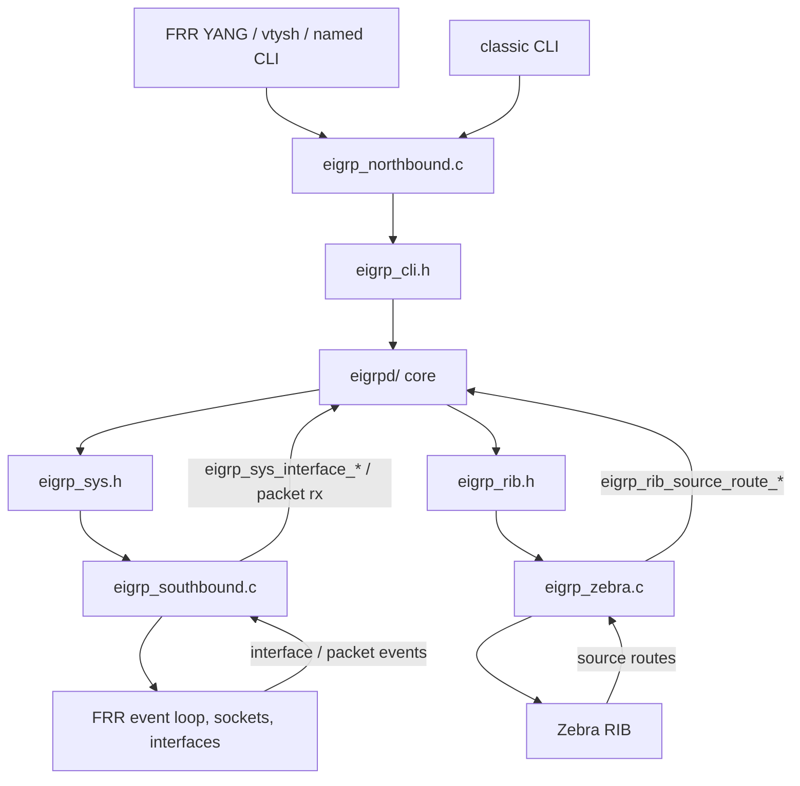
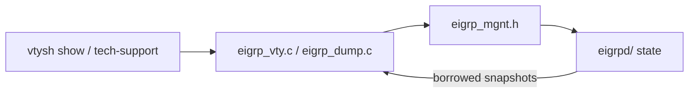

# FRR host adapter

Copyright (C) 2026 Donnie V. Savage

This directory is the FRR shim. It is not portable EIGRP.

If you were told to add EIGRP to some other platform, do not copy this
directory wholesale. Read `specs/integration-spec.md` first. Use this file as
a map of how FRR currently wires onto the public contract.

Portable protocol code stays in `../eigrpd/`. Tools that stage this tree into
an FRR checkout live in `../tools/`.

## What a host shim is

A host shim has four jobs:

1. Implement the services in `eigrpd/eigrp_sys.h`.
2. Implement the host side of `eigrpd/eigrp_rib.h`.
3. Call `eigrpd/eigrp_cli.h` from the platform config/admin path.
4. Call `eigrpd/eigrp_mgnt.h` from show, tech-support, or telemetry.

Shared values come from `eigrpd/eigrp.h`.

A new platform compiles `eigrpd/*.c`, links its own adapter objects, and does
not compile the files in this directory.

## FRR control and data paths

Config commit. YANG and classic/named CLI both have to land on the same
`eigrp_cli.h` target. Named mode is the surface for new work.

```text
vtysh / frr-reload / netconf
        |
        v
FRR YANG + VTY parser          frr/eigrp_cli_named.c
        |                      frr/eigrp_cli_classic.c
        |                      frr/patch YANG schema
        v
northbound adapter             frr/eigrp_northbound.c
        |
        | eigrp_cli.h
        v
portable core                  eigrpd/
        |
        +-- eigrp_sys.h -----> southbound     frr/eigrp_southbound.c
        |                      sockets, timers, multicast, IPv4 I/O
        |
        +-- eigrp_rib.h -----> zebra adapter  frr/eigrp_zebra.c
                               install / withdraw / redistribute
```



Show and debug do not walk DUAL objects. They ask core for snapshots.

```text
vtysh show
   |
   v
eigrp_vty.c / eigrp_dump.c
   |
   | eigrp_mgnt.h
   v
core neighbor / interface / topology / stats snapshots
```



Packet path is host bytes in, EIGRP payload out. The shim does not decode
route TLVs.

```text
kernel / socket
   |  IPv4 proto 88
   v
eigrp_southbound.c          eigrp_sys_ipv4_packet_receive
   |
   v
eigrpd packet / RTP / DUAL
   |
   v
eigrp_southbound.c          eigrp_sys_ipv4_packet_send
   |
   v
kernel / socket
```

## File map

| File | Job | Public header it should sit on |
|---|---|---|
| `eigrp_southbound.c` | timers, events, sockets, multicast, IPv4 packet I/O, interface facts | `eigrp_sys.h` |
| `eigrp_zebra.c` | route install/remove and redistribution feed | `eigrp_rib.h` |
| `eigrp_frr.c` / `eigrp_frr.h` | convert FRR `prefix` / `interface` objects into EIGRP values | `eigrp.h`, `eigrp_sys.h` |
| `eigrp_northbound.c` | committed FRR config to semantic EIGRP targets | `eigrp_cli.h` |
| `eigrp_cli_named.c` | named-mode CLI front end | host parser only, then `eigrp_cli.h` |
| `eigrp_cli_classic.c` | classic CLI front end | host parser only, then `eigrp_cli.h` |
| `eigrp_vty.c` / `eigrp_dump.c` | show and operational output | `eigrp_mgnt.h` |
| `eigrp_policy.c` | FRR route-map / filter lookup | `eigrp_sys.h` policy calls |
| `eigrp_main.c` | FRR process, signals, init/teardown | host lifecycle, then `eigrp_sys.h` / `eigrp_rib.h` |
| `eigrp_log.c` | FRR zlog sink for `eigrp_log()` | replaces the stderr fallback in `eigrpd/eigrp_log.c` |
| `eigrp_vrf.c` | FRR VRF glue | host identity only |
| `eigrp_snmp.c` | optional SNMP | not part of the base five-header contract |
| `patch/` | FRR-wide YANG/vtysh changes outside `eigrpd/` | host tree, not portable core |

`subdir.am` is the FRR automake fragment used after staging. Do not treat it as
the portable file list. It names both `eigrpd/` sources and these adapter
files after they have been flattened into FRR's `eigrpd/` directory.

## How FRR is built

The supported FRR path is documented in the top-level `README.md` and in
`tools/README.md`:

```sh
tools/frr.sh --install --frr-root ../frr
tools/frr.sh --patch --frr-root ../frr
tools/frr.sh --build --frr-root ../frr
```

`--install` copies `eigrpd/` plus the adapter files here into `frr/eigrpd/`.
`--patch` applies `patch/` onto FRR sources outside that directory.

## What not to copy onto a new host

Current FRR adapter files still include some private portable headers
(`eigrp_structs.h`, `eigrpd.h`, topology/neighbor module headers). That is
existing host debt. It is not the integration model.

A new shim must:

- include only `eigrp.h`, `eigrp_cli.h`, `eigrp_mgnt.h`, `eigrp_rib.h`,
  `eigrp_sys.h`, plus host-native headers
- convert host objects at the adapter boundary
- walk neighbors and topology through `eigrp_mgnt.h` snapshots
- install routes with `eigrp_rib_route_t`, not DUAL descriptors

If the public contract is missing a call you need, file it as a spec/header
change. Do not reach into `prefix_descriptor` or packet objects from host code.

## Tests

FRR-native tests live in `test/` and are staged to `frr/tests/eigrpd/`.
See `test/README.md`.

Live named-mode config/writeback is driven by `tools/frr.sh --uut` and
`tools/frr-uut.sh`.
