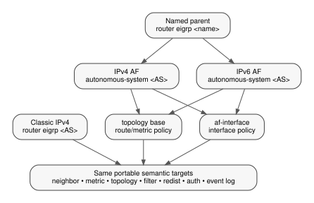

# OpenEIGRP Configuration and EXEC Guide

Copyright (C) 2026 Donnie V. Savage

## 1. Scope

This document defines the user-visible EIGRP configuration and operational
surface provided by OpenEIGRP.

It is an operator/integrator guide. It describes semantic commands and expected
configuration placement. It does not define DUAL, RTP, topology storage, host
YANG schemas, or platform-specific parser implementation.

A host platform may express the same semantics through CLI, YANG, an API, or a
configuration database. The host-specific front end must normalize those values
and call the public OpenEIGRP semantic API described in
`specs/platform-integration.md`.

**OpenEIGRP** is the software project. **EIGRP** remains the protocol name and
the CLI keyword; commands such as `router eigrp` are not renamed.

## 2. Configuration models

OpenEIGRP supports two configuration models:

| Model | Entry | Scope |
|---|---|---|
| Classic IPv4 | `router eigrp <as> [vrf <name>]` | IPv4 process plus interface commands |
| Named | `router eigrp <name>` | parent with IPv4/IPv6 address families, `af-interface`, and `topology base` |

In named mode the parent name is local configuration identity. The autonomous
system configured under the address family is the EIGRP protocol AS.

Configuration syntax shown here follows the current FRR-facing command surface,
but the semantics are project-wide.



## 3. Classic IPv4 router configuration

### 3.1 Process lifecycle

```text
router eigrp 100
router eigrp 100 vrf BLUE
```

Delete with the matching `no router eigrp ...` form.

### 3.2 Router ID

```text
router eigrp 100
 eigrp router-id 192.0.2.1
```

Reset to automatic/default selection with:

```text
no eigrp router-id
```

### 3.3 Network participation

```text
router eigrp 100
 network 10.0.0.0/8
 network 192.0.2.0/24
```

Remove with the matching `no network ...` form.

### 3.4 Static neighbors

```text
router eigrp 100
 neighbor 192.0.2.2
```

Remove with:

```text
no neighbor 192.0.2.2
```

### 3.5 Passive interfaces

```text
router eigrp 100
 passive-interface eth1
 no passive-interface eth0
```

### 3.6 DUAL and metric controls

```text
router eigrp 100
 timers active-time 180
 variance 2
 maximum-paths 4
 metric weights 0 1 0 1 0 0
```

Reset forms:

```text
no timers active-time
no variance
no maximum-paths
no metric weights
```

The active timer may also be disabled explicitly:

```text
timers active-time disabled
```

### 3.7 Filtering

Access-list form:

```text
distribute-list FILTER-IN in
distribute-list FILTER-OUT out eth0
```

Prefix-list form:

```text
distribute-list prefix PL-IN in
distribute-list prefix PL-OUT out eth0
```

Use the corresponding `no distribute-list ...` form to remove a filter.

### 3.8 Redistribution

Examples:

```text
redistribute connected
redistribute static metric 100000 10 255 1 1500
redistribute ospf metric 100000 10 255 1 1500 route-map OSPF-EIGRP
```

The current parser recognizes these source protocol names:

```text
kernel connected local static rip ospf isis bgp nhrp vnc babel openfabric
```

Remove a source with:

```text
no redistribute <protocol>
```

## 4. Classic IPv4 interface configuration

Classic interface commands are entered in host interface configuration mode.

### 4.1 Bandwidth and delay

```text
interface eth0
 eigrp bandwidth 1000000
 delay 10
```

Reset with:

```text
no eigrp bandwidth
no delay
```

### 4.2 Hello and hold timers

```text
interface eth0
 ip hello-interval eigrp 5
 ip hold-time eigrp 15
```

Use the matching `no` form to restore defaults.

### 4.3 Authentication

```text
interface eth0
 ip authentication mode eigrp 100 md5
 ip authentication key-chain eigrp 100 EIGRP-KEYS
```

The authentication mode surface supports `md5` and `hmac-sha-256` where the
selected host/configuration form exposes them.

### 4.4 Manual summary

```text
interface eth0
 ip summary-address eigrp 100 10.10.0.0/16
```

Remove with the matching `no ip summary-address eigrp ...` form.

## 5. Named configuration model

Create a named parent and address-family context:

```text
router eigrp CORE
 address-family ipv4 unicast autonomous-system 100
  ...
 exit-address-family
 address-family ipv6 unicast autonomous-system 100
  ...
 exit-address-family
```

`unicast` may be omitted where the parser permits it.

A VRF may be selected before the AS:

```text
address-family ipv4 unicast vrf BLUE autonomous-system 100
```

A named parent may retain multiple address families and, eventually, multiple
AS contexts. Parent names are case-sensitive configuration identities.

Enable a configured address family with:

```text
no shutdown
```

Disable it administratively with:

```text
shutdown
```

IPv6 named configuration must remain retainable/writeable even where a specific
runtime capability is not yet implemented.

## 6. Named address-family commands

### 6.1 Network participation

IPv4 examples:

```text
network 10.0.0.0 0.255.255.255
network 192.0.2.1 0.0.0.0
```

Remove with the corresponding `no network ...` form.

### 6.2 Router ID

```text
eigrp router-id 192.0.2.1
```

The same 32-bit EIGRP router-ID form is used for IPv4 and IPv6 address families.

### 6.3 Static neighbors

IPv4:

```text
neighbor 192.0.2.2 eth0
```

IPv6:

```text
neighbor 2001:db8::2 eth0
```

Delete with the corresponding `no neighbor ...` form.

### 6.4 Neighbor description and prefix limits

```text
neighbor 192.0.2.2 description branch-router
neighbor 192.0.2.2 maximum-prefix 5000 80 warning-only
neighbor maximum-prefix 20000 80 warning-only
```

The grammar also retains `dampened`, `reset-time`, `restart`, and
`restart-count`. The current runtime enforces the maximum, threshold, and
`warning-only` behavior. A live runtime returns `EIGRP_RESULT_UNSUPPORTED` when
restart/dampening fields are requested; the configuration remains retainable.

### 6.5 Neighbor logging

```text
eigrp log-neighbor-changes
eigrp log-neighbor-warnings
eigrp log-neighbor-warnings 10
```

Use the matching `no` form to restore the default.

### 6.6 Metric weights

```text
metric weights 0 1 0 1 0 0 0
```

TOS must be zero. K6 is optional where supported by the selected metric version.
Reset with:

```text
no metric weights
```

## 7. Named `af-interface`

Enter interface-specific address-family configuration with:

```text
af-interface default
```

or:

```text
af-interface eth0
```

Leave with:

```text
exit-af-interface
```

Remove a retained interface block with the corresponding `no af-interface ...`
form.

### 7.1 Bandwidth and delay

```text
bandwidth-percent 50
bandwidth 1000000
delay 10
```

### 7.2 Hello and hold timers

```text
hello-interval 5
hold-time 15
```

### 7.3 Authentication

MD5 with a key chain:

```text
authentication mode md5
authentication key-chain EIGRP-KEYS
```

HMAC-SHA-256 form:

```text
authentication mode hmac-sha-256 0 secret
```

The encryption-type field accepts `0` or `7`. Type `0` supplies plaintext HMAC
key material to the runtime. Type `7` text is retained for configuration
compatibility but is not decoded or used as HMAC key material; applying it to
a live runtime returns `EIGRP_RESULT_UNSUPPORTED`.

### 7.4 Passive, next-hop-self, and split horizon

```text
passive-interface
next-hop-self
split-horizon
```

Each has a matching `no` form.

A common pattern is passive by default with explicit transit interfaces:

```text
router eigrp CORE
 address-family ipv4 unicast autonomous-system 100
  af-interface default
   passive-interface
  exit-af-interface
  af-interface eth0
   no passive-interface
  exit-af-interface
```

### 7.5 Manual summaries

IPv4:

```text
summary-address 10.10.0.0 255.255.0.0
summary-address 10.10.0.0 255.255.0.0 90
summary-address 10.10.0.0 255.255.0.0 90 leak-map SUMMARY-LEAK
```

IPv6:

```text
summary-address 2001:db8:10::/48
summary-address 2001:db8:10::/48 90
```

Remove with the corresponding `no summary-address ...` form.

## 8. Named `topology base`

Enter topology configuration with:

```text
topology base
```

Leave with:

```text
exit-af-topology
```

### 8.1 Variance and maximum paths

```text
variance 2
maximum-paths 4
```

### 8.2 Active timer

```text
timers active-time 180
timers active-time disabled
```

### 8.3 IPv4 automatic summary

```text
auto-summary
```

Reset with:

```text
no auto-summary
```

### 8.4 Default information and default metric

```text
default-information in
default-information out
default-information in POLICY
default-metric 100000 10 255 1 1500
```

Use matching `no` forms to reset each value.

### 8.5 Administrative distance

```text
distance eigrp 90 170
```

### 8.6 Prefix limits

Topology limit:

```text
maximum-prefix 10000 80 warning-only
```

Redistribution limit:

```text
redistribute maximum-prefix 5000 80 warning-only
```

The grammar also retains `dampened`, `reset-time`, `restart`, and
`restart-count`. Runtime admission enforcement currently supports the maximum,
threshold, and `warning-only` behavior; restart/dampening controls are retained
but report `EIGRP_RESULT_UNSUPPORTED` on a live runtime.

### 8.7 Metric and traffic controls

```text
metric maximum-hops 100
traffic-share balanced
```

Use matching `no` forms to restore defaults.

### 8.8 Event-log size

```text
eigrp event-log-size 1000
```

### 8.9 Distribute lists

```text
distribute-list FILTER-IN in
distribute-list FILTER-OUT out eth0
distribute-list prefix PL-IN in
distribute-list prefix PL-OUT out eth0
```

### 8.10 Offset lists

```text
offset-list OFFSET-ACL in 256000
offset-list OFFSET-ACL out 256000 eth0
```

### 8.11 Redistribution

```text
redistribute connected
redistribute static metric 100000 10 255 1 1500
redistribute ospf metric 100000 10 255 1 1500 route-map OSPF-EIGRP
```

### 8.12 Summary metrics

IPv4:

```text
summary-metric 10.10.0.0 255.255.0.0 100000 10 255 1 1500
summary-metric 10.10.0.0 255.255.0.0 distance 90
```

IPv6:

```text
summary-metric 2001:db8:10::/48 100000 10 255 1 1500
summary-metric 2001:db8:10::/48 distance 90
```

## 9. Named configuration example

```text
router eigrp CORE
 address-family ipv4 unicast autonomous-system 100
  eigrp router-id 192.0.2.1
  network 10.0.0.0 0.255.255.255
  no shutdown
  af-interface default
   passive-interface
  exit-af-interface
  af-interface eth0
   no passive-interface
   hello-interval 5
   hold-time 15
  exit-af-interface
  topology base
   maximum-paths 4
   variance 2
  exit-af-topology
 exit-address-family
```

## 10. Classic IPv4 operational commands

### 10.1 Interfaces

```text
show ip eigrp interfaces
show ip eigrp interfaces detail
show ip eigrp interfaces eth0 detail
show ip eigrp vrf BLUE interfaces
```

### 10.2 Neighbors

```text
show ip eigrp neighbors
show ip eigrp neighbors detail
show ip eigrp neighbors eth0 detail
show ip eigrp vrf BLUE neighbors
```

Detailed output may include hold time, queue depth, SRTT, RTO, sequence, and
retry state where maintained by the runtime.

### 10.3 Topology

```text
show ip eigrp topology
show ip eigrp topology all-links
show ip eigrp topology 100
show ip eigrp topology 10.10.1.0/24
show ip eigrp vrf BLUE topology
```

`all-links` exposes known paths beyond the normal successor/feasible-successor
view.

### 10.4 Event log

```text
show ip eigrp events
show ip eigrp vrf BLUE events
```

The bounded event history is intended for protocol diagnosis rather than
full-packet tracing. It records DUAL/FC/FD/RD decisions, successor changes,
packet and RTP failures, peer transitions and down reasons, filtering and
prefix-limit decisions, poison-reverse decisions, interface/capability changes,
and RIB ingress/install/withdraw outcomes. The display includes stored/capacity
and total-written/overwritten accounting so history loss is visible.

### 10.5 Clear neighbors

```text
clear ip eigrp neighbors
clear ip eigrp neighbors eth0
clear ip eigrp neighbors 192.0.2.2
clear ip eigrp neighbors soft
clear ip eigrp neighbors eth0 soft
clear ip eigrp neighbors 192.0.2.2 soft
```

A VRF selector may be included where supported by the current command grammar.

### 10.6 Clear event log

```text
clear ip eigrp events
clear ip eigrp vrf BLUE events
```

## 11. Named operational commands

Named operational commands use an explicit address-family selector where the
operation is AF-specific.

### 11.1 Interfaces

```text
show eigrp address-family ipv4 interfaces
show eigrp address-family ipv4 100 interfaces detail
show eigrp address-family ipv4 vrf BLUE interfaces eth0 detail
```

### 11.2 Neighbors

```text
show eigrp address-family ipv4 neighbors
show eigrp address-family ipv4 100 neighbors detail
show eigrp address-family ipv4 vrf BLUE neighbors eth0 detail
```

### 11.3 Topology

```text
show eigrp address-family ipv4 topology
show eigrp address-family ipv4 topology all-links
show eigrp address-family ipv4 topology 100 10.10.1.0/24
```

### 11.4 Accounting, events, timers, and traffic

```text
show eigrp address-family ipv4 accounting
show eigrp address-family ipv4 events
show eigrp address-family ipv4 timers
show eigrp address-family ipv4 traffic
```

Optional VRF and AS selectors narrow the requested runtime context.

### 11.5 Protocol summary and support

```text
show eigrp protocols
show eigrp tech-support
```

### 11.6 Clear topology

```text
clear eigrp ipv4 topology
clear eigrp 100 ipv4 topology
clear eigrp ipv4 topology 10.10.1.0/24
clear eigrp 100 vrf BLUE ipv4 topology 10.10.1.0/24
```

The IPv4 network/mask form may also be accepted:

```text
clear eigrp ipv4 topology 10.10.1.0 255.255.255.0
```

### 11.7 Clear neighbors

```text
clear eigrp address-family ipv4 neighbors
clear eigrp address-family ipv4 100 neighbors
clear eigrp address-family ipv4 neighbors eth0
clear eigrp address-family ipv4 neighbors 192.0.2.2
clear eigrp address-family ipv4 neighbors soft
```

### 11.8 Clear event log

```text
clear eigrp address-family ipv4 events
clear eigrp events
```

## 12. Debug commands

The debug surface covers packets, transport/transmit work, event processing,
timers, FSM activity, neighbors, notifications, and address-family scoping.

Examples:

```text
debug eigrp packet hello
debug eigrp packet update send detail
debug eigrp packet query receive
debug eigrp transmit ack packetize
debug eigrp event detail
debug eigrp timers
debug eigrp fsm
debug eigrp neighbor siatimer
debug eigrp notifications rib
debug eigrp address-family ipv4 100
debug eigrp address-family ipv4 100 neighbor 192.0.2.2
```

Disable with the matching `no debug eigrp ...` command.

Packet categories currently represented by the command/API surface include:

```text
siaquery siareply ack hello probe query reply request retry terse update all
```

Packet debugging may be restricted to send or receive and may request detail.

## 13. Operational interpretation

Neighbor transport fields commonly include:

- **Hold** — remaining neighbor hold time;
- **SRTT** — smoothed round-trip time for reliable packets;
- **RTO** — retransmission timeout;
- **Q** — queued reliable work/packets as presented by the implementation;
- **Seq** — reliable sequence state.

Topology state uses the EIGRP meanings:

- **P** — Passive;
- **A** — Active;
- successor and feasible-successor state comes from portable DUAL/topology;
- `all-links` exposes additional known paths.

For adjacency troubleshooting, verify the selected AF/AS/VRF, router ID,
interface participation, passive state, authentication, IP reachability, and
EIGRP protocol-88 packet flow before treating the problem as a DUAL/RIB issue.

## 14. Implementation status rule

This guide describes the current command/semantic surface. Every command reaches
its real OpenEIGRP feature target; host parser or YANG layers do not substitute
generic success or generic not-implemented handlers.

Where a valid configured option exceeds the active runtime or host capability,
the owning semantic target returns a precise structured result such as
`EIGRP_RESULT_UNSUPPORTED` while intentionally retainable configuration remains
writeable. The current portable production source has no feature target that
returns `EIGRP_RESULT_NOT_IMPLEMENTED`.

EIGRP Stub runtime behavior is outside project scope and is not expanded by
this guide.
