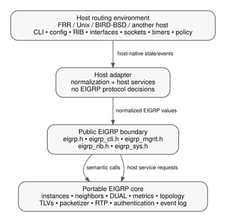

# OpenEIGRP Project Architecture

Copyright (C) 2026 Donnie V. Savage

## 1. Scope

This document defines the repository-wide architecture of OpenEIGRP.

It owns the boundaries between portable EIGRP protocol code and host-platform
integration, the authority order used when behavior is ambiguous, the location
of specifications and tests, and the dependency rules that keep the protocol
implementation portable.

It does **not** specify the internal operation of DUAL, route selection,
packetization, or Reliable Transport Protocol (RTP). Those details belong under
`eigrp/specs/`, beside the portable implementation they describe.

It does **not** define FRR- or BIRD-specific wiring. Platform-specific design
belongs under the corresponding platform directory.

## 2. Project and protocol names

**OpenEIGRP** is the name of this implementation project.

**EIGRP** is the routing protocol implemented by the project. Protocol names,
RFC terminology, CLI keywords, packet fields, and existing source/API symbols
continue to use EIGRP where that is the correct technical name.

The project rebrand does not by itself rename:

- the repository directory `eigrp/`;
- the portable source directory `eigrp/code/`;
- C symbols beginning with `eigrp_`;
- `EIGRP_*` constants and types;
- protocol-visible strings required for interoperability;
- established CLI syntax such as `router eigrp`.

Such renames are separate source-compatibility changes and require their own
review.

## 3. Authority

RFC 7868 is the primary reference for EIGRP protocol behavior and wire
semantics. Repository specifications define the implementation contracts used
to realize that behavior.

When sources disagree, use this order:

1. RFC 7868 for protocol behavior and interoperability.
2. The OpenEIGRP specification that owns the affected implementation area.
3. Public host-integration contracts required by FRR, Unix, BIRD/BSD, or
   another routing stack.
4. Existing implementation behavior when it is consistent with the above.

Project-specific choices that RFC 7868 does not determine belong in the owning
specification and must not silently change wire-visible protocol semantics.
FRR, Unix, BIRD/BSD, and other routing stacks provide host/integration
mechanisms rather than defining EIGRP protocol behavior. Cisco behavior may be
consulted for interoperability and operational presentation where the RFC does
not fully specify those details.

## 4. Repository ownership

The repository is divided by ownership, not by build target.

```text
eigrp/
  eigrp/
    code/          portable EIGRP protocol implementation
    specs/         portable protocol/module design specifications
    test/          portable and protocol-focused tests
  frr/
    code/          FRR adapters and FRR-facing integration
    specs/         FRR-specific specifications, when needed
    test/          FRR-native integration/UUT material
    patch/         managed changes outside FRR's staged daemon tree
  bird/
    README.md      BIRD/BSD integration boundary and current status
    test/           BIRD/BSD-native test area
  unix/
    code/          standalone Unix host shim
    test/          Unix-host tests
  specs/           repository-wide contracts and operator documentation
  tools/           repository-wide build/staging/UUT helpers
```

The root `specs/` directory is for contracts that apply across the project.
Portable implementation internals do not belong there merely because they are
important.

Likewise, a FRR or BIRD integration rule does not belong in a portable protocol
specification.

## 5. Architectural layers

OpenEIGRP has three logical layers:

```text
+-------------------------------------------------------------+
| Host routing stack                                          |
| CLI/config, RIB, interfaces, sockets, timers, policy, logs  |
+------------------------------+------------------------------+
                               |
                               v
+-------------------------------------------------------------+
| Host adapter                                                 |
| FRR, BIRD/BSD, Unix, or another platform                    |
| normalizes host state and implements OpenEIGRP host services|
+------------------------------+------------------------------+
                               |
                               v
+-------------------------------------------------------------+
| Portable EIGRP core                                          |
| instances, neighbors, DUAL, metrics, topology, RTP, TLVs    |
+-------------------------------------------------------------+
```

The central rule is:

> If equivalent normalized inputs should produce the same EIGRP decision on
> every host, that decision belongs in the portable core.

Host adapters provide mechanisms. Portable code owns protocol decisions.



The diagram is architectural, not a call-graph substitute: exact callable
boundaries are defined by `specs/public-api.md` and the installed public
headers.

## 6. Portable/core boundary

Portable code under `eigrp/code/` may depend on:

- C library facilities allowed by the build contract;
- OpenEIGRP-owned public and private types;
- services exposed through OpenEIGRP host abstraction headers.

Portable code must not depend directly on FRR, BIRD, Zebra, VTY, YANG, BIRD
routing-table objects, platform event objects, platform socket wrappers, or
other host-native structures.

Host-native objects are converted at the adapter boundary to OpenEIGRP-owned
values or snapshots.

### 6.1 Boundary normalization

Validate and normalize external values when they enter OpenEIGRP.

Examples include:

- interface identity and addresses;
- VRF identity;
- configured timers and metric values;
- route redistribution attributes;
- policy results;
- received packet metadata.

Once a boundary contract has accepted a value, portable code may rely on the
contract rather than reinterpreting host-specific semantics in multiple
modules.

### 6.2 Northbound direction

Configuration and administrative operations flow from the host into semantic
OpenEIGRP targets.

```text
host CLI/YANG/config store
        -> platform adapter
        -> eigrp_cli.h semantic operation
        -> owning portable module
```

A parser or YANG callback is not the implementation of the feature. It must
terminate at the real EIGRP-owned target.

### 6.3 Southbound direction

Portable code requests host mechanisms through OpenEIGRP-owned contracts.

```text
portable module
        -> eigrp_sys.h / eigrp_rib.h
        -> host adapter
        -> host event loop, socket layer, RIB, policy, interface system
```

The adapter may translate representation and lifecycle. It must not duplicate
DUAL, topology, metric, neighbor, packetizer, or RTP decisions.

## 7. Public integration contract

The portable integration boundary is centered on these headers:

```text
eigrp/code/eigrp.h
eigrp/code/eigrp_cli.h
eigrp/code/eigrp_mgnt.h
eigrp/code/eigrp_rib.h
eigrp/code/eigrp_sys.h
```

Feature-specific public headers may extend that set when justified, but the
base integration model must remain understandable without private protocol
headers.

`specs/platform-integration.md` defines the black-box integration contract.
The headers define the exact C declarations.

Host code must not include a private portable header merely to bypass a missing
public operation. A missing integration capability is an API/design issue and
must be addressed at the public boundary.

## 8. Configuration and feature targets

Every externally visible feature must terminate at the module that owns the
behavior.

Examples:

```text
variance                  -> metric module
active timer              -> timer/DUAL-facing configuration target
summary                    -> summary module
redistribution             -> redistribution module
neighbor authentication   -> authentication/neighbor target
```

Do not create generic command stubs or unrelated dispatch functions just to
make a CLI path parse.

Every current production configuration path terminates at its real semantic
target. Optional capability limits are reported with a structured result such
as `EIGRP_RESULT_UNSUPPORTED`; they are not hidden behind parser stubs or false
success. Configuration that is intentionally retainable remains representable
and writeable even when an optional host/runtime capability is unavailable.

`EIGRP_RESULT_NOT_IMPLEMENTED` remains part of the public result enum for API
stability, but the current portable production source has no feature target
that returns it. EIGRP Stub runtime behavior is explicitly outside project
scope.

## 9. Runtime ownership

An EIGRP runtime is owned by an address-family/AS/VRF context, not by a parser
mode or host configuration object.

Host configuration may create, update, disable, or delete that context, but
runtime protocol state remains portable.

The portable core owns, among other things:

- neighbor protocol state;
- topology and route descriptors;
- metric computation;
- DUAL state;
- packet and TLV protocol representation;
- packetization and reliable delivery;
- protocol timers and protocol-visible event decisions.

The host owns the mechanisms used to schedule, transmit, receive, install, and
observe that state.

## 10. Address-family portability

IPv4 and IPv6 use the same architectural model.

Address-family-specific protocol encoding or behavior may be separated inside
the portable core where the protocol requires it. Host-specific IPv4/IPv6
socket representation stays in the adapter.

Named-mode IPv4 and IPv6 configuration use the same portable ownership model.
A host-specific capability limit must be reported explicitly at the public
boundary and must not be confused with a parser, writeback, or configuration
retention failure.

## 11. Specification ownership

Documentation location is part of the architecture.

### `specs/`

Repository-wide material:

- this architecture document;
- code conventions shared across the project;
- generic platform integration contract;
- operator configuration/EXEC guide;
- RFC 7868 reference and project interpretation rules.

### `eigrp/specs/`

Portable implementation internals:

- DUAL state machine;
- route selection and topology storage;
- packetization and RTP;
- additional portable protocol-module specifications owned by the core.

### `frr/specs/`

Only FRR-specific contracts that cannot be expressed generically.

### `bird/`

`bird/README.md` defines the current BIRD/BSD integration boundary. The current
tree does not contain a BIRD runtime adapter or a `bird/specs/` subtree.

Do not make a root specification a dumping ground for implementation details
owned by a lower directory.

## 12. Test ownership

Tests follow the same ownership boundary as code.

- `eigrp/test/` tests portable protocol behavior and portable boundaries.
- `frr/test/` tests FRR integration and FRR-native behavior.
- `bird/test/` tests BIRD/BSD integration.
- `unix/test/` tests the standalone Unix host.

A protocol defect should be reproducible without requiring an FRR-specific
object unless the defect is specifically in the FRR adapter.

The root build/test orchestration may run multiple owned suites, but it does not
change where those tests belong.

## 13. Managed host-tree changes

FRR is an independent upstream checkout. Changes outside the staged FRR daemon
area are exceptional and must be carried as managed patches under `frr/patch/`.

Patch application must be idempotent. A patch that is neither cleanly
applicable nor already applied is a source-drift condition and must stop for
review. Do not fuzz or force it.

Equivalent host-wide changes for another platform belong under that platform's
integration ownership, not in the portable core.

## 14. Naming boundary

Repository-wide naming rules are in `specs/code-conventions.md`.

Portable modules are optimized for human navigation and generally follow:

```text
eigrp_<module>.c
eigrp_<module>_<object>_<action>()
```

Host adapters may need to follow host framework conventions at their external
boundary, but OpenEIGRP-owned portable APIs must remain host-neutral.

Do not derive portable symbol names from Cisco CLI hierarchy, FRR YANG paths,
or BIRD configuration grammar.

## 15. Source and history preservation

Existing source files must preserve prior copyright notices, SPDX identifiers,
and author history. Refactoring or moving a file does not erase its provenance.

New documentation may use the OpenEIGRP project name while still crediting
historical EIGRP-derived source as required.

## 16. Architectural acceptance test

Before accepting a design, ask:

1. Is this rule protocol behavior, repository-wide policy, or host-specific
   integration?
2. Is the code and its specification located in the directory that owns it?
3. Does the portable core receive only OpenEIGRP-owned normalized values?
4. Could FRR and BIRD use the same portable decision without duplicating it?
5. Does every command or management operation reach its real feature target?
6. Does an unsupported host/runtime capability return a structured result rather
   than being hidden by a parser stub or false success?
7. Did the change preserve existing protocol/API names unless a separate rename
   was intentionally approved?

If those answers are correct, the change is likely on the right architectural
side of the project.
