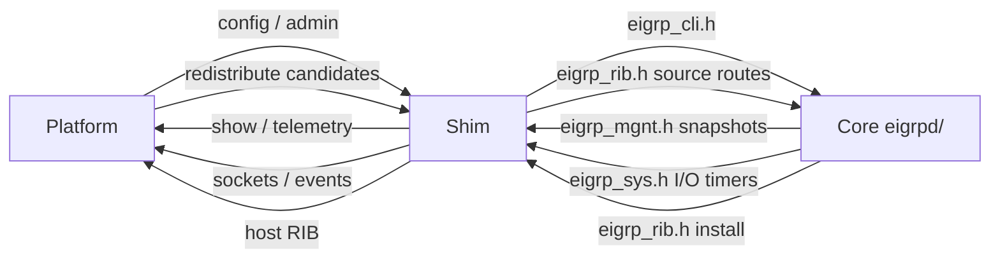

# EIGRP Platform Integration Specification

Copyright (C) 2026 Donnie V. Savage

## 1. Purpose

The goal of the integration API is simple:

> A developer who is told to add EIGRP to a routing platform should be able to understand the integration model from this document and the public headers without first learning the internal EIGRP source tree.

The platform developer should not need to understand DUAL implementation details, TLV layouts, packetizer internals, reliable transport queues, topology descriptors, or private module structures to integrate EIGRP.

The public integration surface is intentionally small and organized around five headers:

```text
 eigrp.h
 eigrp_cli.h
 eigrp_mgnt.h
 eigrp_rib.h
 eigrp_sys.h
```

Optional capabilities may use feature-specific public headers, but they must not become dependencies of the base integration contract.

If you are a platform owner or junior integrator, read this section, Section 2,
Section 10, and the five public headers. Come back to the API inventory in
Section 11 when you start writing function calls. You do not need `dual.md`
or the TLV codecs to write a shim.

### 1.1 Who this document is for

This spec is the black-box contract. You were handed `eigrpd/` and told to make
it run on a routing platform. You should be able to do that from:

```text
this file
eigrpd/eigrp.h
eigrpd/eigrp_cli.h
eigrpd/eigrp_mgnt.h
eigrpd/eigrp_rib.h
eigrpd/eigrp_sys.h
```

FRR is one host. It is not the API. `frr/README.md` maps current FRR files onto
these headers. Copy the job split from FRR, not the private includes.

`EIGRP-Config-Guide.md` is the command surface you are binding to. If your
platform has YANG, a CLI, or another config store, that guide is the semantic
list you implement through `eigrp_cli.h`. You do not need `dual.md`,
`rtp-spec.md`, or RFC 7868 internals to write the shim.

```text
+------------------+     +------------------+     +------------------+
| platform         |     | shim             |     | core             |
|                  |     |                  |     |                  |
| config store     +---->+ eigrp_cli.h      +---->+ instance/config  |
| show/telemetry   +<----+ eigrp_mgnt.h     +<----+ neighbors/topo   |
| RIB              +<--->+ eigrp_rib.h      +<--->+ route selection  |
| sockets/timers   +<----+ eigrp_sys.h      +<----+ hello/RTP/DUAL   |
+------------------+     +------------------+     +------------------+
```



### 1.2 What you compile

Portable protocol objects are the `.c` files under `eigrpd/`.

Host adapter objects are written by you. They implement the host side of
`eigrp_sys.h` and `eigrp_rib.h`, and they call `eigrp_cli.h` / `eigrp_mgnt.h`.

Do not compile `frr/*.c` into a non-FRR product. Those files know FRR types.

Include path:

```text
-I<path-to-eigrp-repo>
```

so this works:

```c
#include "eigrpd/eigrp.h"
#include "eigrpd/eigrp_cli.h"
#include "eigrpd/eigrp_mgnt.h"
#include "eigrpd/eigrp_rib.h"
#include "eigrpd/eigrp_sys.h"
```

Compile flags used by the in-tree smoke harness:

```text
-std=gnu11
```

Link portable `eigrpd/*.o` with your adapter `.o` files and the host libc.
MD5 and SHA-256 used by EIGRP auth live in `eigrpd/`. You do not need an
external crypto library for the current auth code.

`eigrpd/eigrp_log.c` is a stderr fallback. A host may replace that one file
with a log sink that still implements `eigrp_log()` from `eigrpd/eigrp_log.h`.
FRR does that in `frr/eigrp_log.c`. If you keep the portable log file, do not
also link the FRR one.

Current packet I/O in `eigrp_sys.h` is an IPv4 envelope. Named IPv6 config uses
the same CLI/semantic model. IPv6 send/receive is capability-gated and is not a
second integration API.

### 1.3 Host process start and stop

Order at process start:

```text
1. host process and event loop exist
2. eigrp_sys_runtime_init()     host implements
3. eigrp_rib_init()             host implements
4. eigrp_sys_policy_init()      host implements if policy is used
5. eigrp_init()                 portable, declared in eigrpd/eigrpd.h
6. host config/admin binds to eigrp_cli.h
7. host interface/RIB callbacks start feeding eigrp_sys.h / eigrp_rib.h
```

`eigrp_init()` is the current portable runtime constructor. It is declared in
`eigrpd/eigrpd.h`, not in the five public headers. FRR `eigrp_main.c` calls
it. A new host needs that call until the symbol moves into `eigrp.h`. That
gap is listed in `refactor-work.md`.

Create protocol context through `eigrp_cli.h`:

```text
named:
  eigrp_instance_parent_create()
  eigrp_instance_address_family_create()

classic IPv4:
  eigrp_instance_classic_create()
```

Do not invent a second instance constructor in host code.

Order at process stop:

```text
1. stop accepting config and packet I/O
2. delete address-family / instance context through eigrp_cli.h
3. eigrp_rib_instance_delete() for each runtime, then eigrp_rib_finish()
4. eigrp_sys_policy_finish()
5. eigrp_sys_runtime_finish()
```

Cancel host timers and work queues before EIGRP state is freed. Do not leave a
host callback pointing at a destroyed `eigrp_instance_t`.

### 1.4 Minimum link set for a new host

You need:

```text
all eigrpd/*.c except a file you replaced on purpose (today: eigrp_log.c)
your eigrp_sys_* implementation
your eigrp_rib_* host-side implementation
your config/admin caller of eigrp_cli.h
your show/state caller of eigrp_mgnt.h, if the product has show
```

Host implements these `eigrp_sys.h` / `eigrp_rib.h` entry points:

```text
eigrp_sys_runtime_init / finish
eigrp_sys_event_* / timer / read / write / monotime
eigrp_sys_work_queue_*
eigrp_sys_socket_* / multicast_* / ipv4_packet_*
eigrp_sys_vrf_resolve / router_id_get / interface_walk
eigrp_sys_policy_* / filter_evaluate / auth_key_lookup
eigrp_rib_init / finish / instance_delete
eigrp_rib_route_install / eigrp_rib_route_remove
eigrp_rib_redistribute_add / remove
```

Portable EIGRP implements the inbound notifications:

```text
eigrp_sys_interface_state_apply / link_down / link_remove / address_remove
eigrp_sys_router_id_refresh
eigrp_sys_policy_runtime_refresh
eigrp_sys_filter_runtime_replace
eigrp_rib_source_route_add / remove
eigrp_init
all eigrp_cli.h targets
all eigrp_mgnt.h walkers
```

Exact prototypes are in Section 11. Ownership and result codes are in
Section 11.1.

### 1.5 FRR worked example

`frr/` is the current host. Use it to see a full split, then write your own
files.

```text
frr/eigrp_southbound.c   eigrp_sys.h services
frr/eigrp_zebra.c        eigrp_rib.h host side
frr/eigrp_northbound.c   committed config -> eigrp_cli.h
frr/eigrp_cli_named.c    named parser only
frr/eigrp_cli_classic.c  classic parser only
frr/eigrp_vty.c          show surface, should consume eigrp_mgnt.h
frr/eigrp_main.c         process lifecycle
frr/eigrp_log.c          host log sink
frr/patch/               host-tree edits outside the daemon directory
```

Some FRR files still include private portable headers. That is leftover host
coupling. A new platform must not copy it. If show code walks
`prefix_descriptor` or `eigrp_neighbor_t` fields, that is a contract miss,
not a model to follow.

---

## 2. Integration model in five minutes

The five public headers map to five concepts:

```text
                         +----------------+
                         |    eigrp.h     |
                         | common public  |
                         | types / values |
                         +-------+--------+
                                 |
             +-------------------+-------------------+
             |                   |                   |
             v                   v                   v
     +---------------+   +---------------+   +---------------+
     | eigrp_cli.h   |   | eigrp_rib.h   |   | eigrp_sys.h   |
     |               |   |               |   |               |
     | host -> EIGRP |   | host <-> EIGRP|   | EIGRP -> host |
     | config/admin  |   | routing data  |   | OS/runtime    |
     +-------+-------+   +---------------+   +---------------+
             |
             v
     +---------------+
     | eigrp_mgnt.h  |
     |               |
     | runtime state |
     | instrumentation|
     +---------------+
```

The relationships are conceptual, not source-file call chains. `eigrp_mgnt.h` is not implemented beneath `eigrp_cli.h`; CLI show commands are simply one consumer of the management/state API.

### 2.1 What the platform developer does

A new platform integration normally has four jobs:

1. Implement the system/runtime services required by `eigrp_sys.h`.
2. Implement the routing-table exchange required by `eigrp_rib.h`.
3. Connect the platform's configuration and administrative command system to `eigrp_cli.h`.
4. Connect show, telemetry, or other state consumers to `eigrp_mgnt.h` as needed.

All shared public value types come from `eigrp.h`.

### 2.2 What the platform developer does not do

The platform must not implement or depend on:

```text
DUAL/FSM processing
EIGRP topology database internals
prefix_descriptor or route_descriptor layouts
TLV1/TLV2 wire structures
packetizer work objects
EIGRP packet object internals
reliable transport queues
neighbor retransmission internals
codec vectors
stream/list implementation details
internal work queue representation
internal timer representation
```

Those remain portable EIGRP implementation details.

---

## 3. Public versus private API rule

A type or function belongs in the public integration API only when an external routing-stack integrator must do at least one of the following:

- construct it;
- consume it;
- retain it;
- return it;
- implement it;
- call it as part of the documented host/EIGRP boundary.

Everything else is private.

A public header must not expose a private type merely because the current FRR implementation happens to use that type.

### 3.1 Public type classes

Public types fall into two categories.

#### Public value types

The integrator needs the fields and therefore receives the complete definition.

Examples include normalized addresses, prefixes, RIB route snapshots, management-state snapshots, and system-service argument structures.

#### Public opaque objects

The integrator may need identity or lifetime without needing the object's layout.

Example shape:

```c
typedef struct eigrp_instance eigrp_instance_t;
```

Opaque handles are used only where they simplify a real integration contract. They are not the default way to expose internal objects.

### 3.2 Private types

Private types are not declared in public integration headers, even as convenience typedefs, unless an opaque handle is explicitly part of the contract.

Examples include:

```text
eigrp_prefix_descriptor_t
eigrp_route_descriptor_t
eigrp_packet_t
packetizer work objects
TLV structures
codec objects
DUAL FSM internal state
neighbor queue entries
```

### 3.3 Public headers cannot include private headers

Public headers may include other public headers.

Public headers must not include internal module headers that expose private implementation state as a side effect.

Private portable code may include public headers.

Host integration code under `frr/` or `bird/` must use only approved public integration headers, plus host-native headers.

---

## 4. Public header set

## 4.1 `eigrp.h`

### Purpose

`eigrp.h` defines the common public EIGRP data model required by more than one integration surface.

It answers:

> What EIGRP values and identities does an integrator need to understand regardless of the host platform?

### Expected contents

Typical public definitions include:

```text
eigrp_result_t
address-family identifiers
VRF identifiers
interface identifiers
normalized EIGRP address types
normalized EIGRP prefix types
public metric/value types used across contracts
public capability/result enums
small shared public value structures
explicitly approved opaque handles
```

### Excluded contents

`eigrp.h` must not expose:

```text
TLV layouts
packet layouts other than explicitly public wire-independent values
DUAL descriptor layouts
packetizer objects
RTP queue state
codec vectors
internal topology tables
host-native objects
```

### Header organization

Common integration definitions live in `eigrp.h`. `eigrp_types.h` and `eigrp_structs.h` are private portable implementation headers and are not part of the integration contract.

Private types belong in their owning module header where practical. A shared `_internal.h` file is acceptable only when several portable modules genuinely require the same private definition.

---

## 4.2 `eigrp_cli.h`

### Purpose

`eigrp_cli.h` is the public semantic API used by a platform's configuration and administrative command implementation.

It does not implement command parsing. It does not contain FRR VTY/YANG objects, BIRD CLI objects, or any other host parser representation.

It answers:

> How does the host tell EIGRP what the administrator wants it to do?

### Direction

```text
host management/configuration -> EIGRP
```

### Scope

The header owns public semantic operations for retained configuration and administrative actions.

Typical configuration families include:

```text
instance/address-family configuration
router ID
shutdown/no shutdown
network participation
interface EIGRP configuration
neighbor configuration
authentication
summaries
metrics
filters and offset configuration
redistribution configuration
EIGRP timers and protocol configuration
other retained protocol configuration
```

Current administrative actions include:

```text
clear neighbor
clear event log
clear topology
debug set/reset
other explicit EXEC actions represented by a documented semantic target
```

There is no generic public clear-counters endpoint in the current five-header contract.

### Not included

`eigrp_cli.h` does not own:

```text
host event scheduling
host timers
threads/process execution
work queues
socket creation
packet I/O
host interface discovery
host RIB installation
show/state snapshot structures
SNMP-specific integration
```

System services belong in `eigrp_sys.h`.

Routing exchange belongs in `eigrp_rib.h`.

Runtime state and instrumentation belong in `eigrp_mgnt.h`.

### Configuration versus runtime execution

A configuration operation may trigger runtime work, but the runtime mechanism is not part of the configuration API.

Example:

```text
FRR/BIRD configuration
        |
        | eigrp_cli.h
        v
portable EIGRP semantic target
        |
        | EIGRP determines runtime work is required
        v
     eigrp_sys.h
        |
        v
host runtime implementation
```

The host configuration layer expresses intent. Portable EIGRP decides what runtime services are required to apply that intent.

---

## 4.3 `eigrp_mgnt.h`

### Purpose

`eigrp_mgnt.h` is the public runtime-state and instrumentation API.

It answers:

> How does a host inspect EIGRP without learning private runtime structures?

### Direction

```text
EIGRP runtime state -> host management consumers
```

### Consumers

Possible consumers include:

```text
FRR show commands
BIRD show commands
future SNMP integration
future telemetry integration
technical-support output
other host monitoring systems
```

Not every platform integration is required to implement every consumer.

### Scope

The current API exports stable public snapshots and synchronous walkers for:

```text
configured protocol/address-family status
interfaces
neighbors
topology destinations and paths
protocol statistics/accounting
HELLO and peer-hold timers
event log state and entries
debug address-family selectors
runtime capability information
```

The management API exports value snapshots, not live private DUAL, topology,
neighbor, packet, or queue objects.

For example, `eigrp_neighbor_state_t` is the current public neighbor snapshot.
It carries the normalized neighbor address and interface name together with
maintained operational values such as state, hold time, uptime, queue/sequence
state, prefix count, retransmit/retry state, SRTT/RTO, software version, and
negotiated TLV capability. The host receives that snapshot through
`eigrp_neighbor_state_walk()` and does not inspect `eigrp_neighbor_t`.

The current public management types and walkers are listed in Section 11.4.

### CLI show relationship

CLI show commands are consumers of `eigrp_mgnt.h`.

```text
                    +-> FRR show
                    |
EIGRP mgnt state ---+-> BIRD show
                    |
                    +-> SNMP
                    |
                    +-> telemetry
```

A show command must not inspect private neighbor, topology, or packet structures directly merely because the host adapter can see them.

### Not included

`eigrp_mgnt.h` does not expose:

```text
mutable DUAL objects
TLVs
packet queues
packetizer work
retransmission internals
codec vectors
host-native presentation objects
```

---

## 4.4 `eigrp_rib.h`

### Purpose

`eigrp_rib.h` defines the routing information exchange between EIGRP and the host routing stack.

It answers:

> How does EIGRP install/remove routes, and how does the host feed redistribution candidates into EIGRP?

### Direction

```text
EIGRP <-> host routing table
```

### EIGRP to host

The host RIB side must support the routing operations required by EIGRP, such as:

```text
install route
replace/update route where required by the contract
remove route
```

### Host to EIGRP

The host must be able to report redistribution candidates and lifecycle changes, such as:

```text
source route appeared
source route changed
source route disappeared
source protocol subscription/lifecycle where required
```

### RIB data is a public snapshot

The RIB contract must not expose DUAL topology descriptors.

This is prohibited:

```c
eigrp_result_t
eigrp_rib_install(eigrp_route_descriptor_t *route);
```

The RIB receives only the normalized routing data it needs.

The current public route snapshots are:

```c
typedef struct eigrp_rib_nexthop {
    eigrp_ifindex_t ifindex;
    bool gateway_present;
    eigrp_address_t gateway;
} eigrp_rib_nexthop_t;

typedef struct eigrp_rib_route {
    eigrp_prefix_t prefix;
    const eigrp_rib_nexthop_t *nexthops;
    size_t nexthop_count;
    uint64_t metric;
    uint32_t administrative_distance;
    uint32_t tag;
    eigrp_rib_route_type_t type;
} eigrp_rib_route_t;

typedef struct eigrp_rib_source_route {
    eigrp_prefix_t prefix;
    eigrp_address_t gateway;
    bool gateway_present;
    eigrp_ifindex_t ifindex;
    uint64_t metric;
    uint32_t tag;
    eigrp_redistribute_source_t source;
    bool eigrp_vector_present;
    eigrp_metrics_t eigrp_vector;
} eigrp_rib_source_route_t;
```

These are the public field sets. `eigrp_rib_route_t` is the
EIGRP-to-host installation snapshot. `eigrp_rib_source_route_t` is the
host-to-EIGRP redistribution snapshot. Neither object contains a DUAL
descriptor or host-native route object.

`eigrp_rib_source_route_t::metric` is a host/RIB scalar and is not an EIGRP
seed metric. The host must not invent bandwidth, delay, reliability, load, or
MTU values from that scalar. When an EIGRP source can supply its native
per-route vector, it sets `eigrp_vector_present` and supplies the complete
`eigrp_metrics_t` vector without narrowing it into a configuration metric
tuple.

### Separate outbound and redistribution types

EIGRP-to-RIB route installation and RIB-to-EIGRP redistribution are not assumed to use the same structure.

If their required data differs, define separate public objects, for example:

```text
eigrp_rib_route_t
eigrp_rib_source_route_t
```

Do not create one oversized structure merely to reuse a type in both directions.

### Internal conversion

The intended ownership is:

```text
private DUAL/topology objects
        |
        | extract public routing snapshot
        v
 eigrp_rib_route_t
        |
        +----> FRR Zebra adapter
        |
        +----> BIRD routing-table adapter
        |
        +----> another host RIB
```

The host never receives `eigrp_route_descriptor_t` or `eigrp_prefix_descriptor_t`.

---

## 4.5 `eigrp_sys.h`

### Purpose

`eigrp_sys.h` defines the mandatory host runtime/platform services used by portable EIGRP.

It answers:

> What services must my operating environment provide so EIGRP can run?

### Direction

```text
EIGRP -> host runtime services
```

### Scope

The current public API includes services in these categories:

```text
runtime/process execution context
runtime start/stop support where required
scheduled callbacks/events
timers
read/write scheduling
monotonic time
work queues

protocol socket open/close
packet send/receive
multicast join/leave

interface discovery
interface lifecycle/state
interface address information
MTU/bandwidth and other host interface attributes required by EIGRP

VRF/context lookup and identity

policy/filter evaluation
key-chain/authentication lookup

host/platform/software identification where required
```

The current packet-I/O envelope in this header is IPv4. Named IPv6
configuration uses the same public semantic/configuration model, but the IPv6
runtime/data path remains capability-gated and does not add a second
host-specific integration model.

The contract describes the service EIGRP requires. It does not prescribe FRR events, BIRD timers, Unix `fork()`, threads, processes, kqueue, epoll, or any other implementation mechanism.

### Example abstraction

```text
EIGRP requirement:
    execute callback after N milliseconds

FRR implementation:
    FRR event/timer object

BIRD implementation:
    BIRD timer/event mechanism

other host:
    native scheduler
```

Only the timing and callback contract is public.

### Interface configuration versus interface system state

The split is intentional.

`eigrp_cli.h` owns EIGRP configuration such as:

```text
hello interval
hold time
passive
bandwidth-percent
authentication
shutdown
summary configuration
```

`eigrp_sys.h` owns host facts/services such as:

```text
interface exists/disappeared
interface up/down
interface addresses
ifindex
MTU
host-reported bandwidth
multicast membership
packet I/O
```

---

## 5. Required integration flows

The following flows define the boundary. Exact public function names and signatures are listed in Section 11.

## 5.1 Packet receive flow

```text
host socket / routing stack
        |
        | host-native packet receive
        v
platform shim
        |
        | normalize VRF/interface/AF and packet bytes
        | use public system/packet receive boundary
        v
portable EIGRP packet receive
        |
        v
EIGRP packet validation / decode
        |
        v
neighbor / protocol dispatch
        |
        v
DUAL / topology / packetizer as required
```

The platform shim provides host context and packet bytes.

The shim must not decode EIGRP route TLVs, select DUAL actions, or depend on private packet objects.

## 5.2 Packet transmit flow

```text
portable EIGRP protocol logic
        |
        v
packet / RTP / packetizer internals
        |
        | final packet bytes + normalized send context
        v
 eigrp_sys.h
        |
        v
platform shim
        |
        v
host socket / network stack
```

The host receives only the data necessary to transmit the packet.

The host does not receive packetizer work items, TLV objects, or reliable transport queue entries.

## 5.3 Configuration flow

```text
host CLI/config parser
        |
        v
host retained configuration machinery
        |
        | normalize host values
        v
platform configuration shim
        |
        | eigrp_cli.h
        v
real EIGRP feature target
        |
        +----> update retained/portable state as defined
        |
        +----> request runtime work through eigrp_sys.h when required
```

FRR YANG/VTY objects and BIRD configuration objects stop in the platform shim.

## 5.4 Show/state flow

```text
host show/SNMP/telemetry consumer
        |
        | eigrp_mgnt.h
        v
public EIGRP state snapshot/walker
        |
        v
host presentation layer
```

The consumer must not walk private neighbor lists, topology tables, or DUAL descriptors directly.

## 5.5 Route install flow

```text
DUAL/topology selects route
        |
        | build public RIB snapshot
        v
 eigrp_rib.h
        |
        v
host RIB shim
        |
        v
FRR Zebra / BIRD routing table / other RIB
```

Only public route data crosses the boundary.

## 5.6 Redistribution flow

```text
host RIB/source protocol
        |
        | normalized source-route snapshot
        v
 eigrp_rib.h
        |
        v
EIGRP redistribution logic
        |
        v
metric/policy/topology processing
```

Host-native route objects stop at the shim.

## 5.7 Interface lifecycle flow

```text
host interface subsystem
        |
        v
platform shim
        |
        | eigrp_sys.h normalized interface event/state
        v
portable EIGRP interface/runtime logic
```

Host interface objects must not be stored directly in portable EIGRP state.

## 5.8 Runtime scheduling flow

```text
portable EIGRP module
        |
        | schedule timer/event/work
        v
 eigrp_sys.h
        |
        v
FRR/BIRD/native scheduler
        |
        | callback according to public contract
        v
portable EIGRP module
```

---

## 6. API documentation contract

Every public API added to one of the integration headers must have a corresponding specification entry in this document before the public interface is considered stable.

Each API entry uses the following schema. Section 11 may factor fields that are
identical for a function family into one family contract. In that form, the
family direction/requirement/lifetime/execution/ordering rules, the common
argument conventions in Section 11.1, the exact prototype, and the per-function
purpose/return/status row together constitute the complete API entry. Any API
whose argument ownership or ordering differs from the family rule must state
the exception explicitly.

### API name

```c
return_type function_name(arguments);
```

**Header:** `eigrp_*.h`

**Direction:** `Host -> EIGRP`, `EIGRP -> Host`, or `Bidirectional contract`

**Requirement:** `Required` or `Optional`

**Purpose:**

Short description of the semantic operation.

**Arguments:**

| Argument | Type | Required | Ownership | Description |
|---|---|---:|---|---|
| `arg` | `type` | Yes/No | borrowed/copied/transferred | Meaning and constraints |

**Return value:**

Document all valid `eigrp_result_t` or other return outcomes.

**Lifetime:**

State whether pointers are valid only for the call, retained by the receiver, copied, or transferred.

**Execution context:**

Document callback/thread/event-loop assumptions where relevant.

**Ordering requirements:**

Document any required relationship to instance, interface, route, or runtime lifecycle.

**Error handling:**

Document semantic errors, host failures, unsupported capability behavior, and whether retry is appropriate.

**Notes:**

Protocol or integration constraints that do not fit elsewhere.

---

## 7. Public API design rules

## 7.1 Use semantic data, not implementation objects

Public APIs carry the information the other side needs.

Do not expose a large internal object because it already contains the required fields.

Bad:

```c
eigrp_rib_install(eigrp_route_descriptor_t *route);
```

Good shape:

```c
eigrp_rib_install(const eigrp_rib_route_t *route);
```

## 7.2 Avoid public APIs that differ only by attributes

Where functions perform the same semantic action and differ only by a selector or attribute, prefer one public API with an explicit public selector.

Do not multiply public endpoints solely for grepability when the semantic operation is the same.

Distinct actions such as `set/reset`, `add/remove`, and `create/delete` remain separate when they represent genuinely different semantic operations.

## 7.3 Do not expose host-native types

Public portable APIs must not accept or return:

```text
FRR struct vty
FRR struct interface
FRR struct event
FRR stream/list objects
libyang objects
Zebra route objects
BIRD configuration objects
BIRD routing-table objects
BIRD event/timer/socket/interface objects
```

Normalize at the host adapter boundary.

## 7.4 Do not expose private portable types

Public APIs must not expose internal EIGRP structures merely because they are portable.

Portability does not make an object public.

## 7.5 Prefer public snapshots for observation

Management and RIB consumers should receive stable value snapshots rather than mutable pointers into protocol-owned structures.

## 7.6 Ownership must be explicit

Every pointer argument must define whether the callee:

```text
borrows it for the duration of the call
copies it
retains it
assumes ownership
```

No public API may rely on undocumented lifetime assumptions.

## 7.7 Address family must be explicit where required

Shared IPv4/IPv6 APIs are preferred where semantics are identical.

AF-specific APIs or fields are used only where behavior genuinely differs.

## 7.8 Structured results

Portable public APIs return EIGRP-owned result codes where an operation can fail semantically.

The host decides how to render or log the result.

Portable EIGRP code does not call host CLI output routines to report an API result.

---

## 8. Optional feature pattern

The base integration contract is intentionally limited to the five mandatory public headers.

Optional capabilities may later add feature-specific public headers, for example:

```text
eigrp_bfd.h
eigrp_snmp.h
eigrp_manet.h
```

These names are illustrative only. Optional feature APIs are defined when the feature is actually designed or implemented.

Rules:

1. Optional headers must not become dependencies of the base integration contract.
2. An integrator must be able to build and run base EIGRP without implementing optional features.
3. Optional host services must report unsupported capability cleanly when absent.
4. Optional protocol features remain owned by their EIGRP feature module and must not become generic system-service dumping grounds.
5. Do not stuff optional feature types into `eigrp.h` or `eigrp_sys.h` just to avoid adding a header.
---


## 9. Integration acceptance criteria

A platform integration is correct when it can provide runtime scheduling and
timers, interface discovery/lifecycle, packet send/receive, host context/VRF
identity, RIB install/remove, redistribution input, configuration binding,
operational state consumption, and clean teardown without requiring private
DUAL, topology, packetizer, TLV, RTP, metric, or neighbor internals.

Treat the following as integration-contract failures:

```text
platform code must include a private EIGRP module header
platform code must decode or construct route TLVs
platform code must inspect a DUAL descriptor
platform code must manipulate neighbor or packet queues directly
platform scheduler differences require changes to DUAL/packetizer behavior
host-native object types appear in public EIGRP headers
a public API exists only to expose one host's convenient internal object
```

## 10. Minimum bring-up checklist

### Phase 1: compile the public contract

- Include `eigrp.h` and only the public integration headers required by the port.
- Implement mandatory `eigrp_sys.h` services.
- Implement the host side of `eigrp_rib.h`.
- Keep private `eigrpd/` module headers out of platform code.

### Phase 2: runtime basics

- Initialize the EIGRP runtime.
- Provide monotonic time, timers, and event/work scheduling.
- Provide interface discovery and lifecycle notifications.
- Provide protocol 88 packet I/O.
- Verify packet receive and transmit paths.

### Phase 3: configuration

- Map host configuration to `eigrp_cli.h` semantic calls.
- Create an EIGRP context.
- Configure router ID and participation/interface state.
- Apply shutdown/no-shutdown through the semantic API.

### Phase 4: adjacency

- Verify HELLO transmission and receive dispatch.
- Verify neighbor formation, hold-time expiration, and teardown.

### Phase 5: RIB and redistribution

- Verify learned routes reach the host through `eigrp_rib.h`.
- Verify route removal and nexthop/interface handling.
- Feed normalized host source routes into redistribution and verify change/withdrawal handling.

### Phase 6: management

- Build host show/telemetry output from `eigrp_mgnt.h` snapshots/walkers.
- Bind administrative clear/debug operations through `eigrp_cli.h`.

### Phase 7: teardown

- Stop packet I/O.
- Cancel timers/events/work.
- Detach interfaces and neighbors.
- Remove RIB state.
- Release host resources without leaving callbacks into destroyed EIGRP state.

## 11. Public API reference

This section documents the public integration inventory for the five installed headers. Public types, constants, callbacks, and function declarations in these headers form the host/EIGRP contract.

The exact declarations are grouped by public header below. The installed headers remain the source-level contract; this document defines their integration semantics.

### 11.1 Contract-wide rules

- Unless an API says otherwise, pointer arguments are borrowed for the duration of the call.
- Configuration targets copy values and strings that become retained EIGRP configuration. Callers do not transfer ownership of parser/YANG/BIRD objects.
- Opaque `eigrp_*_t` identities remain owned by portable EIGRP or by the documented host service. Callers must not free or inspect opaque layouts.
- Management callbacks are synchronous. Snapshot pointers and embedded strings are valid only for the callback unless the caller explicitly copies them.
- `eigrp_result_t` reports semantic state. `NOT_IMPLEMENTED` means the public semantic target exists but that runtime operation is not available. Valid retained configuration is not rolled back solely for that result.
- `UNSUPPORTED` means the requested AF/capability is outside the active runtime contract, not a parser or host-object failure.
- `INTERNAL_FAILURE` represents allocation/host-service/internal failures after arguments and semantic identity were otherwise valid.
- Public APIs make no cross-thread concurrency guarantee. A platform must serialize calls and callbacks consistently with its routing/event-loop model.
- `eigrp_cli.h` targets are portable semantic operations. `eigrp_mgnt.h` exports snapshots. `eigrp_rib.h` and `eigrp_sys.h` define the platform boundary. Host adapters must not bypass these APIs by reaching into private module state.

Common argument conventions used by the function-family entries below:

| Argument/name pattern | Ownership and meaning |
|---|---|
| `context` | Borrowed `eigrp_instance_context_t` or `eigrp_interface_context_t` selecting the retained configuration/runtime objects to which the semantic operation applies. |
| `runtime` / `eigrp` | Borrowed opaque `eigrp_instance_t`. The caller does not inspect or free the runtime. |
| `parent`, `af`, `config` | Borrowed opaque retained-configuration identity. EIGRP owns its lifetime. |
| `prefix`, `destination`, `address`, `neighbor` | Borrowed normalized EIGRP value. A callee copies the value if it must retain it after return. |
| `interface_name`, `vrf_name`, `route_map`, `keychain`, policy/list names | Borrowed NUL-terminated host-normalized text. Retained configuration targets copy strings they keep. |
| `callback` | Synchronous callback unless the API family explicitly says otherwise. The callback and snapshot arguments are not retained after the call. |
| `arg` | Opaque caller cookie passed back unchanged to the synchronous callback. |
| `state`, `exists`, `affected_count`, scalar output pointers | Caller-owned output storage populated before return. |
| `event` | Caller-owned storage for an opaque host-scheduler handle. The host implementation owns the scheduled object represented by the handle. |
| `queue` | Opaque work-queue identity returned/owned according to the `eigrp_sys.h` work-queue lifecycle. |
| `payload`, packet receive `buffer` | Raw caller-owned byte storage. The public contract does not expose the private EIGRP packet/stream representation. |
| `nexthops` in `eigrp_rib_route_t` | Borrowed array valid for the route-install call; the host copies anything it retains. |

### 11.2 `eigrp.h`: Common public values and opaque identities

#### Public types

| Type | Contract |
|---|---|
| `eigrp_result_t` | Structured semantic result used by portable/public APIs: SUCCESS, NOT_IMPLEMENTED, INVALID_ARGUMENT, NOT_FOUND, CONFLICT, UNSUPPORTED, or INTERNAL_FAILURE. |
| `eigrp_address_family_t` | Normalized EIGRP address-family selector. Public values are IPv4 (4) and IPv6 (6). |
| `eigrp_topology_id_t` | Public topology/VRID-style identifier. Base topology is EIGRP_TOPOLOGY_ID_BASE. |
| `eigrp_vrf_id_t` | Stable host VRF/context identifier normalized to a 32-bit public value. Default VRF is EIGRP_VRF_DEFAULT. |
| `eigrp_ifindex_t` | Stable host interface index normalized to a 32-bit public value. |
| `eigrp_address_t` | Normalized address value: afi selects IPv4 or IPv6 and bytes holds the address in network-byte representation. IPv4 uses the first 4 bytes. |
| `eigrp_prefix_t` | Normalized prefix value consisting of eigrp_address_t plus prefix_length. |
| `eigrp_bandwidth_t` | 64-bit EIGRP bandwidth metric value. |
| `eigrp_delay_t` | 64-bit EIGRP delay metric value. |
| `eigrp_metric_t` | 64-bit composite EIGRP metric value. |
| `eigrp_scaled_t` | 32-bit scaled metric component used by classic metric conversion. |
| `eigrp_system_metric_t` | 32-bit host/system metric scalar. |
| `eigrp_system_delay_t` | 32-bit host/system delay scalar. |
| `eigrp_system_bandwidth_t` | 32-bit host/system bandwidth scalar. |
| `eigrp_metrics_t` | Native EIGRP metric vector: delay, bandwidth, 24-bit MTU bytes, hop count, reliability, load, tag, and flags. |
| `eigrp_metric_values_t` | Public/configuration metric tuple: bandwidth, delay, reliability, load, and MTU. |
| `eigrp_metric_weights_t` | Public metric K-value set: TOS and K1 through K6. |
| `eigrp_prefix_limit_t` | Public maximum-prefix policy value: maximum, threshold, warning-only/dampened flags, reset time, restart minutes, and restart count. |
| `eigrp_offset_direction_t` | Filter/offset direction selector: IN or OUT. |
| `eigrp_distribute_list_type_t` | Public distribute-list selector: access-list or prefix-list. |
| `eigrp_filter_decision_t` | Normalized host policy result: PERMIT or DENY. |
| `eigrp_redistribute_protocol_t` | EIGRP-owned redistribution source protocol selector: connected, static, RIP, OSPF, IS-IS, BGP, EIGRP, or unspecified for invalid/uninitialized state. |
| `eigrp_route_instance_t` | 32-bit normalized route-instance value identifying one source-protocol process/instance where applicable. |
| `eigrp_redistribute_source_t` | Exact redistribution source identity `{protocol, route_instance}`. Route instance zero is an ordinary identity value, not a wildcard. |
| `eigrp_state_request_t` | Operational state selector carrying AF, optional VRF name, AS (0 means all), all_vrfs, and Cisco MAF multicast selector. |
| `eigrp_instance_t` | Opaque portable EIGRP runtime instance identity. Host code may pass the handle but may not inspect its layout. |
| `eigrp_interface_t` | Opaque portable EIGRP interface runtime identity. Host code may pass the handle only through documented APIs. |
| `eigrp_neighbor_t` | Opaque neighbor identity forward declaration. The current five-header contract does not otherwise expose neighbor objects to host code. |
| `eigrp_event_t` | Opaque scheduled-event handle owned by the system-service contract. |
| `eigrp_work_queue_t` | Opaque work-queue handle owned by the system-service contract. |
| `eigrp_instance_parent_config_t` | Opaque retained named-parent configuration identity. |
| `eigrp_address_family_config_t` | Opaque retained named address-family configuration identity. |
| `eigrp_interface_config_t` | Opaque retained af-interface configuration identity. |
| `eigrp_instance_context_t` | Small public semantic context binding retained AF config, optional runtime, and topology ID. Callers borrow the referenced objects. |
| `eigrp_debug_scope_t` | Debug ownership scope: terminal/runtime scope or retained configuration scope. |
| `eigrp_debug_address_family_category_t` | Address-family debug category: route, neighbor, notifications, or summary. |

#### Public constants and masks

| Constant | Value | Contract |
|---|---:|---|
| `EIGRP_TOPOLOGY_ID_BASE` | `((eigrp_topology_id_t)0)` | Base/default EIGRP topology identifier. |
| `EIGRP_VRF_DEFAULT` | `((eigrp_vrf_id_t)0)` | Default host VRF identifier. |

#### 11.2.3 Identity and capability accessors

**Header:** `eigrp.h`  
**Direction:** Host -> EIGRP read-only access  
**Requirement:** Required  
**Implemented by:** Portable EIGRP

**Ownership/lifetime:** Opaque EIGRP object arguments are borrowed. Returned strings are borrowed from the owning object and must not be freed. Value outputs are copied to caller storage.

**Execution context:** Synchronous. No callback or deferred execution.

**Ordering:** The referenced runtime/interface object must still be alive. Accessors do not create or retain objects.

Exact prototypes:

```c
eigrp_vrf_id_t eigrp_instance_vrf_id(const eigrp_instance_t *eigrp);
eigrp_address_family_t eigrp_instance_address_family(const eigrp_instance_t *eigrp);
uint16_t eigrp_instance_asn(const eigrp_instance_t *eigrp);
const char *eigrp_instance_name(const eigrp_instance_t *eigrp);
bool eigrp_instance_data_path_ready(const eigrp_instance_t *runtime);
eigrp_ifindex_t eigrp_interface_ifindex(const eigrp_interface_t *ei);
const char *eigrp_interface_name(const eigrp_interface_t *ei);
eigrp_result_t eigrp_interface_address_read(const eigrp_interface_t *ei, eigrp_prefix_t *address);
```


### 11.3 `eigrp_cli.h`: Configuration and administrative semantic API

#### Public types

| Type | Contract |
|---|---|
| `eigrp_interface_context_t` | Semantic interface context binding retained af-interface config and optional runtime interface. |
| `eigrp_authentication_mode_t` | Authentication mode selector: NONE, MD5, or HMAC-SHA256. |
| `eigrp_auth_hmac_config_t` | HMAC configuration carrying encryption type and password text for the set operation. |
| `eigrp_summary_options_t` | Manual-summary options: administrative distance and optional leak-map name. |
| `eigrp_summary_metric_config_t` | Summary-metric override with independent metric-configured and distance-configured flags. |
| `eigrp_neighbor_log_type_t` | Neighbor log selector: changes or warnings. |
| `eigrp_default_information_direction_t` | Default-information topology selector: IN or OUT. |
| `eigrp_neighbor_clear_request_t` | Neighbor clear selector: optional interface, optional address, and soft flag. |
| `eigrp_neighbor_clear_state_t` | Snapshot reported to the clear callback for each affected neighbor. |
| `eigrp_neighbor_clear_cb` | Synchronous callback invoked once for each neighbor affected by eigrp_neighbor_clear(). Snapshot pointers are borrowed for the callback. |
| `eigrp_topology_clear_request_t` | Topology clear selector containing an optional destination prefix. |
| `eigrp_debug_packet_category_t` | Packet debug category enum for update, request, query, reply, hello, probe, ack, retry, SIA-query, and SIA-reply. |
| `eigrp_debug_target_t` | General debug target selector: general, neighbor, notifications, or transmit. |

#### Public constants and masks

| Constant | Value | Contract |
|---|---:|---|
| `EIGRP_INTERFACE_BANDWIDTH_MIN` | `1U` | Minimum accepted configured interface bandwidth value. |
| `EIGRP_INTERFACE_BANDWIDTH_MAX` | `10000000U` | Maximum accepted configured interface bandwidth value. |
| `EIGRP_INTERFACE_DELAY_MIN` | `1U` | Minimum accepted configured interface delay value. |
| `EIGRP_INTERFACE_DELAY_MAX` | `16777215U` | Maximum accepted configured interface delay value. |
| `EIGRP_DEBUG_EVENT` | `0x01` | General event debug flag. |
| `EIGRP_DEBUG_DETAIL` | `0x02` | General detail debug flag. |
| `EIGRP_DEBUG_TIMERS` | `0x04` | General timers debug flag. |
| `EIGRP_DEBUG_FSM` | `0x08` | General DUAL FSM debug flag. |
| `EIGRP_DEBUG_NSF` | `0x10` | General NSF debug flag. |
| `EIGRP_DEBUG_FAST_REROUTE` | `0x20` | General fast-reroute debug flag. |
| `EIGRP_DEBUG_NEI` | `0x01` | Neighbor debug base flag. |
| `EIGRP_DEBUG_NEI_SIATIMER` | `0x02` | Neighbor SIA-timer debug flag. |
| `EIGRP_DEBUG_NEI_STATIC` | `0x04` | Static-neighbor debug flag. |
| `EIGRP_DEBUG_NEI_ALL` | `(EIGRP_DEBUG_NEI \| EIGRP_DEBUG_NEI_SIATIMER \| EIGRP_DEBUG_NEI_STATIC)` | Mask containing every neighbor debug flag. |
| `EIGRP_DEBUG_UPDATE` | `(1U << EIGRP_DEBUG_PACKET_UPDATE)` | Packet debug mask bit for UPDATE. |
| `EIGRP_DEBUG_REQUEST` | `(1U << EIGRP_DEBUG_PACKET_REQUEST)` | Packet debug mask bit for REQUEST. |
| `EIGRP_DEBUG_QUERY` | `(1U << EIGRP_DEBUG_PACKET_QUERY)` | Packet debug mask bit for QUERY. |
| `EIGRP_DEBUG_REPLY` | `(1U << EIGRP_DEBUG_PACKET_REPLY)` | Packet debug mask bit for REPLY. |
| `EIGRP_DEBUG_HELLO` | `(1U << EIGRP_DEBUG_PACKET_HELLO)` | Packet debug mask bit for HELLO. |
| `EIGRP_DEBUG_PROBE` | `(1U << EIGRP_DEBUG_PACKET_PROBE)` | Packet debug mask bit for PROBE. |
| `EIGRP_DEBUG_ACK` | `(1U << EIGRP_DEBUG_PACKET_ACK)` | Packet debug mask bit for ACK. |
| `EIGRP_DEBUG_RETRY` | `(1U << EIGRP_DEBUG_PACKET_RETRY)` | Packet debug mask bit for reliable retry processing. |
| `EIGRP_DEBUG_SIAQUERY` | `(1U << EIGRP_DEBUG_PACKET_SIAQUERY)` | Packet debug mask bit for SIA-QUERY. |
| `EIGRP_DEBUG_SIAREPLY` | `(1U << EIGRP_DEBUG_PACKET_SIAREPLY)` | Packet debug mask bit for SIA-REPLY. |
| `EIGRP_DEBUG_PACKETS_ALL` | `(EIGRP_DEBUG_UPDATE \| EIGRP_DEBUG_REQUEST \| EIGRP_DEBUG_QUERY \| EIGRP_DEBUG_REPLY \| EIGRP_DEBUG_HELLO \| EIGRP_DEBUG_PROBE \| EIGRP_DEBUG_ACK \| EIGRP_DEBUG_SIAQUERY \| EIGRP_DEBUG_SIAREPLY)` | Mask containing all packet categories except retry. |
| `EIGRP_DEBUG_PACKETS_TERSE` | `(EIGRP_DEBUG_PACKETS_ALL & ~EIGRP_DEBUG_HELLO)` | Packet-category mask used by terse packet debugging; excludes HELLO. |
| `EIGRP_DEBUG_PACKET_VALID_MASK` | `(EIGRP_DEBUG_PACKETS_ALL \| EIGRP_DEBUG_RETRY)` | Mask of every valid packet-debug category including retry. |
| `EIGRP_DEBUG_SEND` | `0x01` | Packet send-direction flag. |
| `EIGRP_DEBUG_RECV` | `0x02` | Packet receive-direction flag. |
| `EIGRP_DEBUG_SEND_RECV` | `0x03` | Packet send and receive direction mask. |
| `EIGRP_DEBUG_PACKET_DETAIL` | `0x04` | Packet detail flag. |
| `EIGRP_DEBUG_PACKET_FLAG_MASK` | `(EIGRP_DEBUG_SEND_RECV \| EIGRP_DEBUG_PACKET_DETAIL)` | Mask of valid packet direction/detail flags. |
| `EIGRP_DEBUG_TRANSMIT_ACK` | `0x0001` | Transmit debug flag for ACK processing. |
| `EIGRP_DEBUG_TRANSMIT_BUILD` | `0x0002` | Transmit debug flag for packet building. |
| `EIGRP_DEBUG_TRANSMIT_DETAIL` | `0x0004` | Transmit detail flag. |
| `EIGRP_DEBUG_TRANSMIT_LINK` | `0x0008` | Transmit link/interface flag. |
| `EIGRP_DEBUG_TRANSMIT_PACKETIZE` | `0x0010` | Transmit packetizer flag. |
| `EIGRP_DEBUG_TRANSMIT_PEERDOWN` | `0x0020` | Transmit peer-down flag. |
| `EIGRP_DEBUG_TRANSMIT_SIA` | `0x0040` | Transmit SIA flag. |
| `EIGRP_DEBUG_TRANSMIT_STARTUP` | `0x0080` | Transmit adjacency-startup flag. |
| `EIGRP_DEBUG_TRANSMIT_STRANGE` | `0x0100` | Transmit unusual-condition flag. |
| `EIGRP_DEBUG_TRANSMIT_ALL` | `(EIGRP_DEBUG_TRANSMIT_ACK \| EIGRP_DEBUG_TRANSMIT_BUILD \| EIGRP_DEBUG_TRANSMIT_DETAIL \| EIGRP_DEBUG_TRANSMIT_LINK \| EIGRP_DEBUG_TRANSMIT_PACKETIZE \| EIGRP_DEBUG_TRANSMIT_PEERDOWN \| EIGRP_DEBUG_TRANSMIT_SIA \| EIGRP_DEBUG_TRANSMIT_STARTUP \| EIGRP_DEBUG_TRANSMIT_STRANGE)` | Mask containing every transmit debug flag. |
| `EIGRP_DEBUG_NOTIFICATION_INTERFACE` | `0x01` | Notification debug flag for interface changes. |
| `EIGRP_DEBUG_NOTIFICATION_RIB` | `0x02` | Notification debug flag for RIB changes. |
| `EIGRP_DEBUG_NOTIFICATIONS` | `0x03` | Mask containing all notification debug flags. |

#### 11.3.3 Instance and address-family lifecycle/configuration
**Header:** `eigrp_cli.h`  
**Direction:** Host -> EIGRP  
**Requirement:** Required  
**Implemented by:** Portable EIGRP
**Ownership/lifetime:** Names/scalars are borrowed for the call and copied when retained. Returned parent/AF/runtime pointers and `owner_name` are borrowed EIGRP-owned identities/strings. Output pointer storage belongs to the caller.
**Execution context:** Synchronous semantic target calls from the host configuration path.
**Ordering:** Create/bind the named parent before child address-family configuration. Address-family deletion tears down its runtime before retained child state is freed. Classic runtime calls use AS/VRF identity and must not collide with a named owner.
Exact prototypes:
```c
eigrp_result_t eigrp_instance_classic_validate( uint16_t asn, eigrp_vrf_id_t vrf_id, const char **owner_name);
eigrp_result_t eigrp_instance_classic_create( uint16_t asn, eigrp_vrf_id_t vrf_id, eigrp_instance_t **runtime);
eigrp_instance_t *eigrp_instance_classic_read(uint16_t asn, eigrp_vrf_id_t vrf_id);
eigrp_result_t eigrp_instance_classic_delete(eigrp_instance_t *runtime);
eigrp_result_t eigrp_instance_parent_create(const char *name);
eigrp_instance_parent_config_t *eigrp_instance_parent_read(const char *name);
eigrp_result_t eigrp_instance_parent_delete(const char *name);
eigrp_result_t eigrp_instance_address_family_create( const char *name, eigrp_address_family_t afi, const char *vrf_name, uint16_t asn);
eigrp_address_family_config_t *eigrp_instance_address_family_read( const char *name, eigrp_address_family_t afi, const char *vrf_name, uint16_t asn);
eigrp_result_t eigrp_instance_address_family_delete( const char *name, eigrp_address_family_t afi, const char *vrf_name, uint16_t asn);
eigrp_result_t eigrp_instance_router_id_set( eigrp_instance_context_t *context, uint32_t router_id);
eigrp_result_t eigrp_instance_router_id_reset( eigrp_instance_context_t *context);
eigrp_result_t eigrp_instance_address_family_shutdown_set( eigrp_address_family_config_t *af);
eigrp_result_t eigrp_instance_address_family_shutdown_reset( eigrp_address_family_config_t *af);
eigrp_result_t eigrp_instance_parent_shutdown_set( eigrp_instance_parent_config_t *parent);
eigrp_result_t eigrp_instance_parent_shutdown_reset( eigrp_instance_parent_config_t *parent);
eigrp_result_t eigrp_instance_distance_set( eigrp_address_family_config_t *af, uint8_t internal_distance, uint8_t external_distance);
eigrp_result_t eigrp_instance_distance_reset( eigrp_address_family_config_t *af);
```

#### 11.3.4 Network participation
**Header:** `eigrp_cli.h`  
**Direction:** Host -> EIGRP  
**Requirement:** Required for IPv4 network-statement configuration  
**Implemented by:** Portable EIGRP
**Ownership/lifetime:** Context/prefix inputs are borrowed. The create target copies retained prefix state. `exists` is caller-owned output storage.
**Execution context:** Synchronous.
**Ordering:** Requires an owning address-family context. The current `network` semantic is IPv4 participation; AF-specific vectors reject/avoid applying IPv4 network semantics to IPv6.
Exact prototypes:
```c
eigrp_result_t eigrp_network_create(eigrp_instance_context_t *context, const eigrp_prefix_t *prefix);
eigrp_result_t eigrp_network_delete(eigrp_instance_context_t *context, const eigrp_prefix_t *prefix);
eigrp_result_t eigrp_network_runtime_exists( eigrp_instance_t *eigrp, const eigrp_prefix_t *prefix, bool *exists);
```

#### 11.3.5 Interface configuration
**Header:** `eigrp_cli.h`  
**Direction:** Host -> EIGRP  
**Requirement:** Required  
**Implemented by:** Portable EIGRP
**Ownership/lifetime:** Address-family/context/name inputs are borrowed. Interface configuration targets copy retained values. Returned config/runtime pointers are borrowed opaque identities.
**Execution context:** Synchronous. Set/reset operations may immediately refresh a bound runtime when that runtime capability exists.
**Ordering:** Create/read the af-interface configuration beneath its owning address family before applying retained interface attributes. Delete retained/runtime bindings before the owning AF is freed.
Exact prototypes:
```c
eigrp_result_t eigrp_interface_config_create(eigrp_address_family_config_t *af, const char *interface_name);
eigrp_interface_config_t *eigrp_interface_config_read( eigrp_address_family_config_t *af, const char *interface_name);
eigrp_result_t eigrp_interface_config_delete(eigrp_address_family_config_t *af, const char *interface_name);
eigrp_interface_t *eigrp_interface_runtime_lookup( eigrp_instance_t *runtime, const char *interface_name);
eigrp_result_t eigrp_interface_bandwidth_percent_set( eigrp_interface_context_t *context, uint32_t percent);
eigrp_result_t eigrp_interface_bandwidth_percent_reset( eigrp_interface_context_t *context);
eigrp_result_t eigrp_interface_bandwidth_set( eigrp_interface_context_t *context, uint32_t bandwidth);
eigrp_result_t eigrp_interface_bandwidth_reset( eigrp_interface_context_t *context);
eigrp_result_t eigrp_interface_delay_set(eigrp_interface_context_t *context, uint32_t delay);
eigrp_result_t eigrp_interface_delay_reset(eigrp_interface_context_t *context);
eigrp_result_t eigrp_interface_hello_interval_set( eigrp_interface_context_t *context, uint16_t seconds);
eigrp_result_t eigrp_interface_hello_interval_reset( eigrp_interface_context_t *context);
eigrp_result_t eigrp_interface_hold_time_set( eigrp_interface_context_t *context, uint16_t seconds);
eigrp_result_t eigrp_interface_hold_time_reset( eigrp_interface_context_t *context);
eigrp_result_t eigrp_interface_passive_set( eigrp_interface_context_t *context);
eigrp_result_t eigrp_interface_passive_reset( eigrp_interface_context_t *context);
eigrp_result_t eigrp_interface_next_hop_self_set( eigrp_interface_context_t *context);
eigrp_result_t eigrp_interface_next_hop_self_reset( eigrp_interface_context_t *context);
eigrp_result_t eigrp_interface_split_horizon_set( eigrp_interface_context_t *context);
eigrp_result_t eigrp_interface_split_horizon_reset( eigrp_interface_context_t *context);
eigrp_result_t eigrp_interface_shutdown_set( eigrp_interface_context_t *context);
eigrp_result_t eigrp_interface_shutdown_reset( eigrp_interface_context_t *context);
```

#### 11.3.6 Neighbor configuration and clear
**Header:** `eigrp_cli.h`  
**Direction:** Host -> EIGRP  
**Requirement:** Required  
**Implemented by:** Portable EIGRP
**Ownership/lifetime:** Addresses, strings, limits, and clear requests are borrowed for the call. Retained configuration copies required values. Clear callback snapshots/strings are borrowed only during the callback.
**Execution context:** Configuration operations are synchronous. `eigrp_neighbor_clear()` synchronously walks matching runtime neighbors and invokes the optional callback.
**Ordering:** Static/configuration operations require the owning address-family configuration/context. Clear requires a live runtime and does not change retained configuration.
Exact prototypes:
```c
eigrp_result_t eigrp_neighbor_static_create(eigrp_address_family_config_t *af, const eigrp_address_t *address, const char *interface_name);
eigrp_result_t eigrp_neighbor_static_delete(eigrp_address_family_config_t *af, const eigrp_address_t *address, const char *interface_name);
eigrp_result_t eigrp_neighbor_description_set( eigrp_instance_context_t *context, const eigrp_address_t *address, const char *description);
eigrp_result_t eigrp_neighbor_description_reset( eigrp_instance_context_t *context, const eigrp_address_t *address);
eigrp_result_t eigrp_neighbor_maximum_prefix_set( eigrp_instance_context_t *context, const eigrp_address_t *address, const eigrp_prefix_limit_t *limit);
eigrp_result_t eigrp_neighbor_maximum_prefix_reset( eigrp_instance_context_t *context, const eigrp_address_t *address);
eigrp_result_t eigrp_neighbor_maximum_prefix_all_set( eigrp_instance_context_t *context, const eigrp_prefix_limit_t *limit);
eigrp_result_t eigrp_neighbor_maximum_prefix_all_reset( eigrp_instance_context_t *context);
eigrp_result_t eigrp_neighbor_log_set(eigrp_instance_context_t *context, eigrp_neighbor_log_type_t type, bool enabled, uint16_t seconds);
eigrp_result_t eigrp_neighbor_log_reset(eigrp_instance_context_t *context, eigrp_neighbor_log_type_t type);
eigrp_result_t eigrp_neighbor_clear( eigrp_instance_t *runtime, const eigrp_neighbor_clear_request_t *request, eigrp_neighbor_clear_cb callback, void *arg, size_t *affected_count);
```

#### 11.3.7 Authentication
**Header:** `eigrp_cli.h`  
**Direction:** Host -> EIGRP  
**Requirement:** Required when authentication is configured  
**Implemented by:** Portable EIGRP
**Ownership/lifetime:** Context/HMAC/key-chain inputs are borrowed for the call. Retained authentication state copies required values.
**Execution context:** Synchronous.
**Ordering:** Applies beneath one af-interface context. Host key-chain resolution remains a host service in `eigrp_sys.h`.
Exact prototypes:
```c
eigrp_result_t eigrp_auth_mode_set( eigrp_interface_context_t *context, eigrp_authentication_mode_t mode, const eigrp_auth_hmac_config_t *hmac);
eigrp_result_t eigrp_auth_mode_reset(eigrp_interface_context_t *context);
eigrp_result_t eigrp_auth_keychain_set(eigrp_interface_context_t *context, const char *keychain);
eigrp_result_t eigrp_auth_keychain_reset(eigrp_interface_context_t *context);
```

#### 11.3.8 Summary configuration
**Header:** `eigrp_cli.h`  
**Direction:** Host -> EIGRP  
**Requirement:** Required  
**Implemented by:** Portable EIGRP
**Ownership/lifetime:** Context, prefix, options, metric configuration, and strings are borrowed for the call. Retained summary state copies required values.
**Execution context:** Synchronous.
**Ordering:** Manual summaries belong to an interface context. Auto-summary and summary-metric belong to the address-family/topology semantic context. IPv4-only auto-summary semantics are not applied to IPv6.
Exact prototypes:
```c
eigrp_result_t eigrp_summary_create( eigrp_interface_context_t *context, const eigrp_prefix_t *prefix, const eigrp_summary_options_t *options);
eigrp_result_t eigrp_summary_delete( eigrp_interface_context_t *context, const eigrp_prefix_t *prefix);
eigrp_result_t eigrp_summary_auto_set(eigrp_instance_context_t *context);
eigrp_result_t eigrp_summary_auto_reset(eigrp_instance_context_t *context);
eigrp_result_t eigrp_summary_metric_set( eigrp_instance_context_t *context, const eigrp_prefix_t *prefix, const eigrp_summary_metric_config_t *config);
eigrp_result_t eigrp_summary_metric_reset( eigrp_instance_context_t *context, const eigrp_prefix_t *prefix);
```

#### 11.3.9 Metric configuration
**Header:** `eigrp_cli.h`  
**Direction:** Host -> EIGRP  
**Requirement:** Required  
**Implemented by:** Portable EIGRP
**Ownership/lifetime:** Context and metric/weight inputs are borrowed. Retained values are copied.
**Execution context:** Synchronous. Targets update retained state and, where implemented, the bound runtime.
**Ordering:** Applies to the selected address-family/topology context. Runtime-dependent effects remain capability-gated without discarding valid retained configuration.
Exact prototypes:
```c
eigrp_result_t eigrp_metric_default_set(eigrp_instance_context_t *context, const eigrp_metric_values_t *metric);
eigrp_result_t eigrp_metric_default_reset(eigrp_instance_context_t *context);
eigrp_result_t eigrp_metric_weights_set(eigrp_instance_context_t *context, const eigrp_metric_weights_t *weights);
eigrp_result_t eigrp_metric_weights_reset(eigrp_instance_context_t *context);
eigrp_result_t eigrp_metric_variance_set(eigrp_instance_context_t *context, uint8_t variance);
eigrp_result_t eigrp_metric_variance_reset(eigrp_instance_context_t *context);
eigrp_result_t eigrp_metric_traffic_share_balanced_set( eigrp_instance_context_t *context);
eigrp_result_t eigrp_metric_traffic_share_balanced_reset( eigrp_instance_context_t *context);
eigrp_result_t eigrp_metric_maximum_hops_set( eigrp_instance_context_t *context, uint8_t maximum_hops);
eigrp_result_t eigrp_metric_maximum_hops_reset( eigrp_instance_context_t *context);
eigrp_result_t eigrp_metric_holddown_set(eigrp_instance_context_t *context, bool enabled);
eigrp_result_t eigrp_metric_holddown_reset(eigrp_instance_context_t *context);
```

#### 11.3.10 Topology configuration and clear
**Header:** `eigrp_cli.h`  
**Direction:** Host -> EIGRP  
**Requirement:** Required  
**Implemented by:** Portable EIGRP
**Ownership/lifetime:** Context, list names, prefix-limit values, and clear request are borrowed. Retained state copies required values. `affected_count` is caller-owned output storage.
**Execution context:** Configuration and clear operations are synchronous.
**Ordering:** Base-topology configuration belongs beneath one address-family context. Operational clear requires the selected runtime/topology state and does not alter retained configuration.
Exact prototypes:
```c
eigrp_result_t eigrp_topology_create(eigrp_instance_context_t *context);
eigrp_result_t eigrp_topology_delete(eigrp_instance_context_t *context);
eigrp_result_t eigrp_topology_default_information_set( eigrp_instance_context_t *context, eigrp_default_information_direction_t direction, const char *access_list);
eigrp_result_t eigrp_topology_default_information_reset( eigrp_instance_context_t *context, eigrp_default_information_direction_t direction, const char *access_list);
eigrp_result_t eigrp_topology_maximum_prefix_set( eigrp_instance_context_t *context, const eigrp_prefix_limit_t *limit);
eigrp_result_t eigrp_topology_maximum_prefix_reset( eigrp_instance_context_t *context);
eigrp_result_t eigrp_topology_maximum_paths_set( eigrp_instance_context_t *context, uint8_t maximum_paths);
eigrp_result_t eigrp_topology_maximum_paths_reset( eigrp_instance_context_t *context);
eigrp_result_t eigrp_topology_clear( eigrp_instance_context_t *context, const eigrp_topology_clear_request_t *request, size_t *affected_count);
```

#### 11.3.11 Filtering and redistribution
**Header:** `eigrp_cli.h`  
**Direction:** Host -> EIGRP  
**Requirement:** Required when filtering/redistribution features are configured  
**Implemented by:** Portable EIGRP, with host policy/RIB services reached through the public integration contracts
**Ownership/lifetime:** Context, normalized metric/limit values, redistribution source identity, and all names are borrowed inputs. `eigrp_redistribute_source_t` is an EIGRP-owned value object and is copied when retained. Retained portable configuration also copies metric values and route-map names that persist after the call.
**Execution context:** Synchronous semantic targets. Host subscriptions/policy evaluation may be requested through `eigrp_rib.h`/`eigrp_sys.h`.
**Ordering:** Requires an owning address-family context. Host policy/RIB objects never cross the public semantic boundary.

**Current route-map capability boundary:** A redistribution route-map name is valid retained configuration and remains attached by name to the matching portable redistribution entry. Configuration parsing, commit, mutation, `no` handling, and running-config writeback do not depend on route-map evaluation being available. Route-map evaluation for redistributed source-route candidates is intentionally deferred at this development stage. When a candidate belongs to a redistribution entry with a configured route-map, portable redistribution returns `EIGRP_RESULT_NOT_IMPLEMENTED` for that import instead of admitting the route as though policy had permitted it. No partial or synthetic route-map evaluator is provided. Withdrawals may still remove matching redistributed topology state because removal does not require a policy permit decision.

Exact prototypes:
```c
eigrp_result_t eigrp_offset_add(eigrp_instance_context_t *context, const char *access_list, eigrp_offset_direction_t direction, uint32_t offset, const char *interface_name);
eigrp_result_t eigrp_offset_remove(eigrp_instance_context_t *context, const char *access_list, eigrp_offset_direction_t direction, uint32_t offset, const char *interface_name);
eigrp_result_t eigrp_distribute_add( eigrp_instance_context_t *context, eigrp_distribute_list_type_t type, const char *name, eigrp_offset_direction_t direction, const char *interface_name);
eigrp_result_t eigrp_distribute_remove( eigrp_instance_context_t *context, eigrp_distribute_list_type_t type, const char *name, eigrp_offset_direction_t direction, const char *interface_name);
eigrp_result_t eigrp_redistribute_add(eigrp_instance_context_t *context, const eigrp_redistribute_source_t *source, const eigrp_metric_values_t *metric, const char *route_map);
eigrp_result_t eigrp_redistribute_remove(eigrp_instance_context_t *context, const eigrp_redistribute_source_t *source);
eigrp_result_t eigrp_redistribute_maximum_prefix_set( eigrp_instance_context_t *context, const eigrp_prefix_limit_t *limit);
eigrp_result_t eigrp_redistribute_maximum_prefix_reset( eigrp_instance_context_t *context);
```

#### 11.3.12 Timers and event log
**Header:** `eigrp_cli.h`  
**Direction:** Host -> EIGRP  
**Requirement:** Required for the corresponding configured/administrative features  
**Implemented by:** Portable EIGRP
**Ownership/lifetime:** Context and scalar inputs are borrowed. Retained values are copied; event-log clear mutates only runtime operational state.
**Execution context:** Synchronous.
**Ordering:** Active-time configuration belongs to the address-family/topology context. Event-log size applies retained state and resizes a live log when runtime state exists; clear does not change configured size.
Exact prototypes:
```c
eigrp_result_t eigrp_timer_active_time_set(eigrp_instance_context_t *context, uint16_t seconds);
eigrp_result_t eigrp_timer_active_time_reset(eigrp_instance_context_t *context);
eigrp_result_t eigrp_eventlog_clear(eigrp_instance_context_t *context);
eigrp_result_t eigrp_eventlog_size_set(eigrp_instance_context_t *context, uint32_t size);
eigrp_result_t eigrp_eventlog_size_reset(eigrp_instance_context_t *context);
```

#### 11.3.13 Debug controls
**Header:** `eigrp_cli.h`  
**Direction:** Host -> EIGRP  
**Requirement:** Required for supported debug command surfaces  
**Implemented by:** Portable EIGRP
**Ownership/lifetime:** Requests/addresses are borrowed. Debug selectors are stored by value. Category-name helpers return borrowed static strings.
**Execution context:** Synchronous.
**Ordering:** `scope` selects terminal/runtime or retained configuration debug state. Packet masks and flags must be valid for their target/category before state is changed.
Exact prototypes:
```c
eigrp_result_t eigrp_debug_set(eigrp_debug_target_t target, unsigned long flags, eigrp_debug_scope_t scope);
eigrp_result_t eigrp_debug_reset(eigrp_debug_target_t target, unsigned long flags, eigrp_debug_scope_t scope);
eigrp_result_t eigrp_debug_address_family_set( const eigrp_state_request_t *request, eigrp_debug_address_family_category_t category, const eigrp_address_t *neighbor, eigrp_debug_scope_t scope);
eigrp_result_t eigrp_debug_address_family_reset( const eigrp_state_request_t *request, eigrp_debug_address_family_category_t category, const eigrp_address_t *neighbor, eigrp_debug_scope_t scope);
eigrp_result_t eigrp_debug_packet_set(uint32_t packet_mask, unsigned long flags, eigrp_debug_scope_t scope);
eigrp_result_t eigrp_debug_packet_reset(uint32_t packet_mask, unsigned long flags, eigrp_debug_scope_t scope);
const char *eigrp_debug_packet_category_name(eigrp_debug_packet_category_t category);
const char *eigrp_debug_packet_category_cli_name(eigrp_debug_packet_category_t category);
```

### 11.4 `eigrp_mgnt.h`: Runtime-state and instrumentation API

#### Public types

| Type | Contract |
|---|---|
| `eigrp_interface_state_t` | Read-only interface snapshot including retained/runtime presence, passive/shutdown/auth state, metric/timer values, peer/queue counts, encoder peer counts, split-horizon/next-hop-self, and transmit counters. |
| `eigrp_interface_state_walk_cb` | Synchronous callback for one interface-state snapshot. The snapshot and embedded strings are borrowed only for the callback. |
| `eigrp_neighbor_state_t` | Read-only neighbor snapshot including address/interface/state, static/runtime flags, hold/uptime, queue/sequence/prefix/retry state, SRTT/RTO, software version, and TLV capability. |
| `eigrp_neighbor_state_walk_cb` | Synchronous callback for one neighbor-state snapshot. The snapshot and embedded strings are borrowed only for the callback. |
| `eigrp_topology_prefix_state_t` | Read-only destination-level topology snapshot: prefix, Active state, feasible distance, successor count, and serial number. |
| `eigrp_topology_route_state_t` | Read-only path-level topology snapshot: next hop, interface, connected/successor/feasible-successor flags, distance, and reported distance. |
| `eigrp_topology_prefix_state_cb` | Synchronous callback for a destination-level topology snapshot. |
| `eigrp_topology_route_state_cb` | Synchronous callback for a path-level topology snapshot beneath the current destination. |
| `eigrp_topology_instance_walk_cb` | Synchronous callback receiving each matching opaque EIGRP runtime instance. |
| `eigrp_timer_state_t` | Read-only timer snapshot containing type, interface, optional neighbor, and remaining expiration seconds. |
| `eigrp_timer_state_type_t` | Timer snapshot selector: interface HELLO or peer hold timer. |
| `eigrp_timer_state_cb` | Synchronous callback for one timer-state snapshot. |
| `eigrp_eventlog_entry_t` | Raw EIGRP event-log record: opcode plus two unsigned-long arguments. |
| `eigrp_eventlog_state_t` | Event-log capacity/count snapshot. |
| `eigrp_eventlog_show_cb` | Synchronous callback for one numbered event-log record and its format string. |
| `eigrp_statistics_traffic_state_t` | Packet traffic counters plus validity bitmasks for sent/received ACK, HELLO, QUERY, REPLY, UPDATE, SIA-QUERY, and SIA-REPLY counts. |
| `eigrp_statistics_accounting_state_t` | Per-neighbor accounting snapshot: neighbor address, interface, neighbor state string, and prefix count. |
| `eigrp_statistics_accounting_cb` | Synchronous callback for one accounting snapshot. |
| `eigrp_status_protocol_state_t` | Protocol summary snapshot for one configured AF: local instance name, opaque config identity, AF/VRF/AS, shutdown/router-ID state, runtime presence, and data-path capability. |
| `eigrp_status_protocol_cb` | Synchronous callback for one protocol summary/tech-support snapshot. |
| `eigrp_debug_address_family_state_t` | Stored address-family debug selector snapshot: used flag, AF/AS/VRF scope, category, and optional neighbor. |

#### Public constants and masks

| Constant | Value | Contract |
|---|---:|---|
| `EIGRP_EVENTLOG_DEFAULT_SIZE` | `500U` | Default event-log capacity. |
| `EIGRP_STATISTICS_TRAFFIC_ACK` | `(1U << 0)` | Traffic-validity bit for ACK counters. |
| `EIGRP_STATISTICS_TRAFFIC_HELLO` | `(1U << 1)` | Traffic-validity bit for HELLO counters. |
| `EIGRP_STATISTICS_TRAFFIC_QUERY` | `(1U << 2)` | Traffic-validity bit for QUERY counters. |
| `EIGRP_STATISTICS_TRAFFIC_REPLY` | `(1U << 3)` | Traffic-validity bit for REPLY counters. |
| `EIGRP_STATISTICS_TRAFFIC_UPDATE` | `(1U << 4)` | Traffic-validity bit for UPDATE counters. |
| `EIGRP_STATISTICS_TRAFFIC_SIA_QUERY` | `(1U << 5)` | Traffic-validity bit for SIA-QUERY counters. |
| `EIGRP_STATISTICS_TRAFFIC_SIA_REPLY` | `(1U << 6)` | Traffic-validity bit for SIA-REPLY counters. |

#### 11.4.3 Interface state

**Header:** `eigrp_mgnt.h`  
**Direction:** EIGRP -> Host management consumer  
**Requirement:** Required for interface show/state consumers  
**Implemented by:** Portable EIGRP

**Ownership/lifetime:** Config/runtime inputs are borrowed. Callback snapshot and embedded strings are borrowed only for the callback.

**Execution context:** Synchronous walker; callback return may stop/propagate the walk according to the implementation.

**Ordering:** May operate with retained config, runtime, or both. Runtime-only fields are valid only when runtime_present is true.

Exact prototypes:

```c
eigrp_result_t eigrp_interface_state_walk( eigrp_address_family_config_t *config, eigrp_instance_t *runtime, const char *interface_name, eigrp_interface_state_walk_cb callback, void *arg);
```


#### 11.4.4 Neighbor state

**Header:** `eigrp_mgnt.h`  
**Direction:** EIGRP -> Host management consumer  
**Requirement:** Required for neighbor show/state consumers  
**Implemented by:** Portable EIGRP

**Ownership/lifetime:** Config/runtime inputs are borrowed. Callback snapshot and embedded strings are borrowed only for the callback.

**Execution context:** Synchronous walker.

**Ordering:** Runtime-dependent neighbor data requires a live runtime. static_only limits output to configured static neighbors.

Exact prototypes:

```c
eigrp_result_t eigrp_neighbor_state_walk( eigrp_address_family_config_t *config, eigrp_instance_t *runtime, const char *interface_name, bool static_only, eigrp_neighbor_state_walk_cb callback, void *arg);
```


#### 11.4.5 Topology state

**Header:** `eigrp_mgnt.h`  
**Direction:** EIGRP -> Host management consumer  
**Requirement:** Required for topology show/state consumers  
**Implemented by:** Portable EIGRP

**Ownership/lifetime:** Inputs are borrowed. Prefix/route snapshots are borrowed only for callbacks. Runtime handles passed to instance callbacks remain EIGRP-owned.

**Execution context:** Synchronous walkers.

**Ordering:** Topology state requires a supported live runtime. Destination may be NULL to walk all destinations.

Exact prototypes:

```c
eigrp_result_t eigrp_topology_state_walk( eigrp_address_family_config_t *config, eigrp_instance_t *runtime, const eigrp_prefix_t *destination, bool all_links, eigrp_topology_prefix_state_cb prefix_callback, eigrp_topology_route_state_cb route_callback, void *arg);
eigrp_result_t eigrp_topology_instance_walk( eigrp_address_family_t afi, eigrp_vrf_id_t vrf_id, uint16_t asn, eigrp_topology_instance_walk_cb callback, void *arg);
```


#### 11.4.6 Timer state

**Header:** `eigrp_mgnt.h`  
**Direction:** EIGRP -> Host management consumer  
**Requirement:** Required for timer show/state consumers  
**Implemented by:** Portable EIGRP

**Ownership/lifetime:** Context is borrowed. Callback snapshot and strings are borrowed for the callback.

**Execution context:** Synchronous walker.

**Ordering:** Requires runtime timer state for the selected instance context.

Exact prototypes:

```c
eigrp_result_t eigrp_timer_show(const eigrp_instance_context_t *context, eigrp_timer_state_cb callback, void *arg);
```


#### 11.4.7 Event log

**Header:** `eigrp_mgnt.h`  
**Direction:** EIGRP -> Host management consumer  
**Requirement:** Required for event-log show/state consumers  
**Implemented by:** Portable EIGRP

**Ownership/lifetime:** Context/entry arguments are borrowed. show callback data and format strings are borrowed. entry_format writes only to caller-owned buffer.

**Execution context:** Synchronous.

**Ordering:** Operates on event-log state owned by the selected EIGRP context.

Exact prototypes:

```c
eigrp_result_t eigrp_eventlog_state_read( const eigrp_instance_context_t *context, eigrp_eventlog_state_t *state);
eigrp_result_t eigrp_eventlog_show( const eigrp_instance_context_t *context, eigrp_eventlog_show_cb callback, void *arg);
const char *eigrp_eventlog_format_read(unsigned long opcode);
eigrp_result_t eigrp_eventlog_entry_format( const eigrp_eventlog_entry_t *entry, char *buffer, size_t buffer_size);
```


#### 11.4.8 Statistics

**Header:** `eigrp_mgnt.h`  
**Direction:** EIGRP -> Host management consumer  
**Requirement:** Required for traffic/accounting consumers  
**Implemented by:** Portable EIGRP

**Ownership/lifetime:** Context is borrowed. Output structures/counts are copied to caller storage; accounting callback snapshots are borrowed for the callback.

**Execution context:** Synchronous.

**Ordering:** Requires maintained runtime statistics; validity masks identify counters that are actually available.

Exact prototypes:

```c
eigrp_result_t eigrp_statistics_accounting_show( const eigrp_instance_context_t *context, uint32_t *total_prefix_count, eigrp_statistics_accounting_cb callback, void *arg);
eigrp_result_t eigrp_statistics_traffic_show( const eigrp_instance_context_t *context, eigrp_statistics_traffic_state_t *state);
```


#### 11.4.9 Protocol/status

**Header:** `eigrp_mgnt.h`  
**Direction:** EIGRP -> Host management consumer  
**Requirement:** Required for protocol summary and tech-support consumers  
**Implemented by:** Portable EIGRP

**Ownership/lifetime:** Callback snapshot and strings are borrowed for the callback. config is an opaque borrowed identity only for use with other public management walkers.

**Execution context:** Synchronous walker over configured protocol contexts.

**Ordering:** May report configured contexts without a live data path. Consumers must honor runtime_present and data_path_ready.

Exact prototypes:

```c
eigrp_result_t eigrp_status_protocol_show( eigrp_status_protocol_cb callback, void *arg);
eigrp_result_t eigrp_status_tech_support_show( eigrp_status_protocol_cb callback, void *arg);
```


#### 11.4.10 Debug state

**Header:** `eigrp_mgnt.h`  
**Direction:** EIGRP -> Host management consumer  
**Requirement:** Required for debug show/writeback consumers  
**Implemented by:** Portable EIGRP

**Ownership/lifetime:** state_get copies one public value into caller storage.

**Execution context:** Synchronous.

**Ordering:** scope selects terminal or retained configuration debug state.

Exact prototypes:

```c
size_t eigrp_debug_address_family_state_count(void);
bool eigrp_debug_address_family_state_get( eigrp_debug_scope_t scope, size_t index, eigrp_debug_address_family_state_t *state);
```


### 11.5 `eigrp_rib.h`: Routing-table exchange API

#### Public types

| Type | Contract |
|---|---|
| `eigrp_rib_route_t` | EIGRP-to-host route snapshot: prefix, borrowed nexthop array, metric, administrative distance, tag, and route type. |
| `eigrp_rib_route_type_t` | Route installation selector: internal or external EIGRP route. |
| `eigrp_rib_nexthop_t` | Normalized host-RIB nexthop: ifindex, optional gateway flag, and gateway address. |
| `eigrp_rib_source_route_t` | Host-to-EIGRP redistribution snapshot: prefix, optional gateway, ifindex, scalar host metric, tag, exact source identity, and an optional native EIGRP per-route vector. |

#### 11.5.3 RIB lifecycle

**Header:** `eigrp_rib.h`  
**Direction:** EIGRP -> Host RIB  
**Requirement:** Required  
**Implemented by:** Host adapter

**Ownership/lifetime:** Runtime handles are borrowed and remain owned by portable EIGRP.

**Execution context:** Synchronous host integration calls.

**Ordering:** eigrp_rib_init() precedes route/subscription operations. Per-instance state is released before runtime destruction. eigrp_rib_finish() occurs after all instances are detached.

Exact prototypes:

```c
void eigrp_rib_init(void);
void eigrp_rib_finish(void);
void eigrp_rib_instance_delete(eigrp_instance_t *eigrp);
```


#### 11.5.4 EIGRP route installation

**Header:** `eigrp_rib.h`  
**Direction:** EIGRP -> Host RIB  
**Requirement:** Required  
**Implemented by:** Host adapter

**Ownership/lifetime:** Runtime, route/prefix, and route->nexthops are borrowed only for the call. The host must copy anything it needs after return.

**Execution context:** Synchronous route install/remove request.

**Ordering:** Requires initialized RIB integration and a live runtime instance. Route installation occurs only after EIGRP route selection has produced a public snapshot.

Exact prototypes:

```c
eigrp_result_t eigrp_rib_route_install(eigrp_instance_t *eigrp, const eigrp_rib_route_t *route);
eigrp_result_t eigrp_rib_route_remove(eigrp_instance_t *eigrp, const eigrp_prefix_t *prefix);
```


#### 11.5.5 Redistribution subscription

**Header:** `eigrp_rib.h`  
**Direction:** EIGRP -> Host RIB  
**Requirement:** Required when redistribution is configured  
**Implemented by:** Host adapter

**Ownership/lifetime:** Runtime and source identity are borrowed for the call. The host may copy the EIGRP-owned source value into adapter subscription state as required. Metric configuration and route-map attachment remain owned by portable EIGRP configuration and are not host-subscription arguments.

**Execution context:** Synchronous subscription update.

**Ordering:** Add/remove occur after a runtime exists and before runtime teardown. Within one EIGRP runtime/VRF, the subscription identity is exactly `{source protocol, route-instance}`. Route instance zero is not a wildcard. A host adapter may use a broader native subscription internally when its RIB API requires that, but it must filter delivered source-route events back to the exact configured EIGRP source identity.

Exact prototypes:

```c
eigrp_result_t eigrp_rib_redistribute_add(eigrp_instance_t *eigrp, const eigrp_redistribute_source_t *source);
eigrp_result_t eigrp_rib_redistribute_remove(eigrp_instance_t *eigrp, const eigrp_redistribute_source_t *source);
```


#### 11.5.6 Host source-route ingress

**Header:** `eigrp_rib.h`  
**Direction:** Host RIB -> EIGRP  
**Requirement:** Required for redistribution data-path support  
**Implemented by:** Portable EIGRP

**Ownership/lifetime:** Runtime and source-route snapshot are borrowed for the call. Portable EIGRP copies any state it retains.

**Execution context:** Synchronous ingress callback from the host RIB adapter.

**Ordering:** Requires a live runtime and matching redistribution subscription. `route->source` carries the exact `{source protocol, route-instance}` identity of the originating host protocol/process within the runtime VRF. Add represents appearance/change; remove represents withdrawal. A source-route add for an entry carrying a route-map name reports `EIGRP_RESULT_NOT_IMPLEMENTED` until route-map evaluation is implemented; it must not be imported unfiltered.

For an add/change, portable redistribution selects the EIGRP seed vector in
this order: an explicit metric on the matching `redistribute` configuration;
then a usable native `route->eigrp_vector` for an EIGRP source; then the
configured EIGRP `default-metric`. If none is available, the candidate is a
normal non-importable route and is ignored. `route->metric` is never expanded
into synthetic EIGRP vector components.

Exact prototypes:

```c
eigrp_result_t eigrp_rib_source_route_add( eigrp_instance_t *eigrp, const eigrp_rib_source_route_t *route);
eigrp_result_t eigrp_rib_source_route_remove( eigrp_instance_t *eigrp, const eigrp_rib_source_route_t *route);
```


### 11.6 `eigrp_sys.h`: Host runtime/system-service API

#### Public types

| Type | Contract |
|---|---|
| `eigrp_work_queue_result_t` | Portable worker outcome mapped by the host queue: SUCCESS, REQUEUE, or BLOCKED. |
| `eigrp_work_queue_func_t` | Worker callback for one queued item. The queue and data pointers are borrowed for the callback. |
| `eigrp_work_queue_delete_func_t` | Optional callback used when the host queue discards/frees a queued data item. |
| `eigrp_event_callback_t` | Scheduled event/timer/read/write callback taking the portable caller argument. |
| `eigrp_interface_runtime_state_t` | Normalized host interface/address fact snapshot: name, ifindex, prefix/address, host type, secondary flag, operative state, bandwidth, and MTU. |
| `eigrp_interface_remove_reason_t` | Reason for portable interface/address removal: host removal, configuration removal, or final teardown. |
| `eigrp_packet_rx_meta_t` | IPv4 receive-envelope metadata: network-header length, EIGRP payload length, and whether destination was the EIGRP multicast group. |
| `eigrp_filter_runtime_snapshot_t` | Two-direction runtime filter-name snapshot containing access-list and prefix-list names for IN/OUT. |
| `eigrp_sys_interface_walk_cb` | Synchronous callback for one normalized host interface/address snapshot. |

#### Public constants and masks

| Constant | Value | Contract |
|---|---:|---|
| `EIGRP_SYS_FILTER_DIRECTION_MAX` | `2U` | Number of directional slots in eigrp_filter_runtime_snapshot_t; indexes correspond to IN and OUT. |

#### 11.6.3 Platform lifecycle

**Header:** `eigrp_sys.h`  
**Direction:** EIGRP -> Host runtime  
**Requirement:** Required  
**Implemented by:** Host adapter

**Ownership/lifetime:** No cross-call object ownership beyond host-global service state.

**Execution context:** Synchronous initialization/finalization.

**Ordering:** Runtime init occurs before portable EIGRP begins consuming host services. Runtime finish occurs only after EIGRP timers, sockets, queues, interfaces, and RIB state are detached.

Exact prototypes:

```c
void eigrp_sys_runtime_init(void);
void eigrp_sys_runtime_finish(void);
```


#### 11.6.4 Scheduling and time

**Header:** `eigrp_sys.h`  
**Direction:** EIGRP -> Host runtime  
**Requirement:** Required  
**Implemented by:** Host adapter

**Ownership/lifetime:** event points to caller-owned opaque-handle storage. Scheduling replaces/cancels any existing handle. callback/arg are retained by the host until event fire/cancel. On callback execution the handle is cleared before invoking callback.

**Execution context:** Registration is synchronous; callbacks execute later in the host routing/event context.

**Ordering:** The callback argument must remain valid until callback/cancel. read/write scheduling requires an open runtime protocol socket.

Exact prototypes:

```c
void eigrp_sys_event_cancel(eigrp_event_t **event);
void eigrp_sys_event_add(eigrp_event_t **event, eigrp_event_callback_t callback, void *arg);
void eigrp_sys_timer_add(eigrp_event_t **event, eigrp_event_callback_t callback, void *arg, uint32_t delay_msec);
void eigrp_sys_read_add(eigrp_event_t **event, eigrp_instance_t *eigrp, eigrp_event_callback_t callback, void *arg);
void eigrp_sys_write_add(eigrp_event_t **event, eigrp_instance_t *eigrp, eigrp_event_callback_t callback, void *arg);
uint32_t eigrp_sys_timer_remaining_seconds(const eigrp_event_t *event);
uint64_t eigrp_sys_monotime_msec(void);
void eigrp_sys_software_version(uint8_t *major, uint8_t *minor);
```


#### 11.6.5 Work queues

**Header:** `eigrp_sys.h`  
**Direction:** EIGRP -> Host runtime  
**Requirement:** Required  
**Implemented by:** Host adapter

**Ownership/lifetime:** The returned queue wrapper is host allocated and freed by eigrp_sys_work_queue_free(). workfunc/deletefunc are retained for queue lifetime. Enqueued data pointers remain opaque to the host and are delivered to callbacks.

**Execution context:** Queue creation/enqueue are synchronous; workfunc executes later through the host scheduler.

**Ordering:** Queue must be created before enqueue. reset preserves EIGRP queue identity/callback bindings while replacing host queue state. Free only after no further queue use.

Exact prototypes:

```c
eigrp_work_queue_t *eigrp_sys_work_queue_new( eigrp_instance_t *eigrp, const char *name, eigrp_work_queue_func_t workfunc, eigrp_work_queue_delete_func_t deletefunc);
void eigrp_sys_work_queue_free(eigrp_work_queue_t *queue);
void eigrp_sys_work_queue_reset(eigrp_work_queue_t *queue);
void eigrp_sys_work_queue_enqueue(eigrp_work_queue_t *queue, void *data);
eigrp_instance_t *eigrp_sys_work_queue_instance(eigrp_work_queue_t *queue);
```


#### 11.6.6 Socket, VRF, and interface discovery

**Header:** `eigrp_sys.h`  
**Direction:** EIGRP -> Host runtime  
**Requirement:** Required  
**Implemented by:** Host adapter

**Ownership/lifetime:** Runtime handles/names are borrowed. VRF/router-ID outputs and interface walk snapshots are copied/borrowed as documented. Interface-walk snapshot is valid only for callback.

**Execution context:** Synchronous host service calls/walk.

**Ordering:** Socket open precedes read/write/packet/multicast operations. VRF resolution is used during runtime creation. Interface walk is used to seed/refresh portable runtime state.

Exact prototypes:

```c
eigrp_result_t eigrp_sys_socket_open(eigrp_instance_t *eigrp);
void eigrp_sys_socket_close(eigrp_instance_t *eigrp);
void eigrp_sys_socket_send_buffer_ensure(eigrp_instance_t *eigrp, uint32_t minimum);
bool eigrp_sys_router_id_get(eigrp_instance_t *eigrp, uint32_t *router_id);
eigrp_result_t eigrp_sys_vrf_resolve(const char *vrf_name, eigrp_vrf_id_t *vrf_id);
eigrp_result_t eigrp_sys_interface_walk(eigrp_instance_t *eigrp, eigrp_sys_interface_walk_cb callback, void *arg);
```


#### 11.6.7 Multicast and IPv4 packet I/O

**Header:** `eigrp_sys.h`  
**Direction:** EIGRP -> Host runtime  
**Requirement:** Required for IPv4 data path  
**Implemented by:** Host adapter

**Ownership/lifetime:** Runtime/interface/destination/payload inputs are borrowed for the call. Receive writes into caller-owned buffer/output objects and does not retain them.

**Execution context:** Synchronous socket operations.

**Ordering:** Requires an open protocol socket and a valid participating interface. Send receives an already built EIGRP payload; host code must not decode or modify EIGRP route semantics.

Exact prototypes:

```c
int eigrp_sys_multicast_interface_set(eigrp_instance_t *eigrp, eigrp_interface_t *ei);
int eigrp_sys_multicast_join(eigrp_instance_t *eigrp, eigrp_interface_t *ei);
int eigrp_sys_multicast_leave(eigrp_instance_t *eigrp, eigrp_interface_t *ei);
int eigrp_sys_ipv4_packet_send(eigrp_instance_t *eigrp, eigrp_interface_t *ei, const eigrp_address_t *destination, const uint8_t *payload, size_t length);
bool eigrp_sys_ipv4_packet_receive(eigrp_instance_t *eigrp, uint8_t *buffer, size_t capacity, size_t *received_length, eigrp_ifindex_t *ifindex, eigrp_address_t *source, eigrp_address_t *destination, eigrp_packet_rx_meta_t *meta);
```


#### 11.6.8 Policy and authentication services

**Header:** `eigrp_sys.h`  
**Direction:** EIGRP -> Host runtime  
**Requirement:** Required when policy/authentication features are used  
**Implemented by:** Host adapter

**Ownership/lifetime:** Inputs are borrowed. filter_evaluate writes caller-owned decision. auth_key_lookup copies key ID/string into caller storage.

**Execution context:** Synchronous host lookup/evaluation.

**Ordering:** Policy init precedes per-instance policy creation/evaluation. Per-instance policy state is deleted before runtime destruction. Policy finish occurs last.

Exact prototypes:

```c
void eigrp_sys_policy_init(void);
void eigrp_sys_policy_finish(void);
eigrp_result_t eigrp_sys_policy_instance_create(eigrp_instance_t *eigrp);
void eigrp_sys_policy_instance_delete(eigrp_instance_t *eigrp);
eigrp_result_t eigrp_sys_filter_evaluate( eigrp_instance_t *eigrp, eigrp_distribute_list_type_t type, const char *name, const eigrp_prefix_t *prefix, eigrp_filter_decision_t *decision);
bool eigrp_sys_auth_key_lookup(const char *keychain_name, uint32_t *key_id, char *key_string, size_t key_string_size);
```


#### 11.6.9 Host lifecycle notifications into portable EIGRP

**Header:** `eigrp_sys.h`  
**Direction:** Host runtime -> EIGRP  
**Requirement:** Required  
**Implemented by:** Portable EIGRP

**Ownership/lifetime:** Host snapshots, names, addresses, and filter strings are borrowed only for the call. Portable EIGRP copies any state it retains.

**Execution context:** Synchronous ingress from host interface/router-ID/policy callbacks.

**Ordering:** Host callbacks normalize data before calling these APIs. Portable EIGRP owns participation, teardown, refresh, and policy application decisions after ingress.

Exact prototypes:

```c
void eigrp_sys_interface_state_apply( eigrp_vrf_id_t vrf_id, const eigrp_interface_runtime_state_t *state);
void eigrp_sys_interface_link_down(eigrp_vrf_id_t vrf_id, eigrp_ifindex_t ifindex, const char *interface_name, uint8_t type, uint32_t bandwidth, uint32_t mtu);
void eigrp_sys_interface_link_remove(eigrp_vrf_id_t vrf_id, eigrp_ifindex_t ifindex, eigrp_interface_remove_reason_t reason);
void eigrp_sys_interface_address_remove(eigrp_vrf_id_t vrf_id, eigrp_ifindex_t ifindex, const eigrp_prefix_t *address, eigrp_interface_remove_reason_t reason);
void eigrp_sys_router_id_refresh(eigrp_vrf_id_t vrf_id);
void eigrp_sys_policy_runtime_refresh(void);
eigrp_result_t eigrp_sys_filter_runtime_replace( eigrp_instance_t *eigrp, const char *interface_name, const eigrp_filter_runtime_snapshot_t *snapshot);
```


---

## 12. Integration design principles

The integration layer should remain understandable to a developer who knows routing systems but does not yet know this EIGRP implementation.

The public contract therefore optimizes for:

```text
few concepts
clear direction
small public data structures
explicit ownership
predictable naming
host independence
no private object leakage
```

The integration layer is not a mirror of the internal module tree.

The internal module tree is optimized for EIGRP implementation and human protocol navigation.

The public integration API is optimized for adding EIGRP to another routing platform.

Those are related goals, but they are not the same API design problem.
