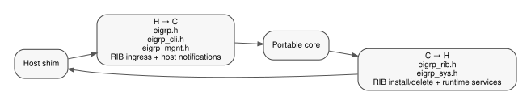

# OpenEIGRP Public Core/Shim API Specification

Copyright (C) 2026 Donnie V. Savage

## 1. Purpose and scope

This document is the authoritative integration API specification between the
portable OpenEIGRP core and a host-platform shim.

It answers four questions:

1. which C headers form the public core/shim boundary;
2. which side implements and calls each public function;
3. which OpenEIGRP-owned values, structures, callbacks, and opaque identities may
   cross the boundary; and
4. what ownership, lifetime, threading, and translation rules apply when they do.

This is a repository-wide contract. FRR-specific call chains belong in
`frr/specs/integration.md`. BIRD-specific call chains belong under `bird/`.
Portable DUAL, topology, packetizer, RTP, and TLV internals belong under
`eigrp/specs/` and are intentionally not part of this API.

OpenEIGRP is the implementation project. EIGRP is the routing protocol. Public C
symbols intentionally retain the existing `eigrp_*` and `EIGRP_*` names.

The declarations in the five installed public headers are the source of truth:

```text
eigrp/code/eigrp.h
eigrp/code/eigrp_cli.h
eigrp/code/eigrp_mgnt.h
eigrp/code/eigrp_rib.h
eigrp/code/eigrp_sys.h
```

If this document and a current public header disagree, the header describes the
current build and this document must be corrected. Adding a symbol or public type
to one of these headers is an API change and requires updating this specification.

## 2. Boundary model

The platform shim translates host-native objects into OpenEIGRP-owned public
values and calls portable semantic APIs. The portable core calls host services
through the same public contract.

```text
                        host platform
                             |
              +--------------+--------------+
              |                             |
        northbound shim                southbound shim
              |                             |
              | H -> C                      | C -> H
              v                             v
        eigrp_cli.h                    eigrp_sys.h
        eigrp_mgnt.h                   eigrp_rib.h
        eigrp.h                              ^
              ^                              |
              +--------------+---------------+
                             |
                       portable core
```

The management API is queried by the shim but returns core-owned snapshots. RIB
and system headers contain functions in both directions, so function ownership
must be determined per symbol rather than inferred from the header name.



### 2.1 Direction notation

This specification uses:

| Mark | Meaning |
|---|---|
| **H -> C** | host shim calls a function implemented by portable OpenEIGRP |
| **C -> H** | portable OpenEIGRP calls a function implemented by the host shim |
| **C callback -> H** | core invokes a shim-supplied callback during a core API call |
| **H callback -> C** | host scheduler/work-queue invokes a core-supplied callback |

### 2.2 Hard boundary rule

Only OpenEIGRP-owned public types declared by the five public headers may cross
this boundary. A shim must not include a private portable header merely to gain
field access.

The following are explicitly private and must not cross the public boundary:

- `eigrp_prefix_descriptor_t`;
- `eigrp_route_descriptor_t`;
- `eigrp_packet_t`;
- `eigrp_stream_t`;
- `eigrp_tlv_codec_t`;
- private DUAL/FSM objects;
- private topology/table/list objects;
- FRR `struct interface`, Zebra, VTY, YANG, event, stream, route-map, or list objects;
- BIRD protocol, channel, route-table, event-loop, timer, socket, or interface objects.

Opaque public pointers are identities, not permission to inspect private layout.

## 3. Common conventions

### 3.1 Result codes

`eigrp_result_t` is the semantic result contract for public operations.

| Value | Meaning |
|---|---|
| `EIGRP_RESULT_SUCCESS` | operation completed successfully |
| `EIGRP_RESULT_NOT_IMPLEMENTED` | reserved public result value; no current portable production feature target returns it |
| `EIGRP_RESULT_INVALID_ARGUMENT` | malformed, invalid, or inconsistent caller input |
| `EIGRP_RESULT_NOT_FOUND` | requested OpenEIGRP object or configuration does not exist |
| `EIGRP_RESULT_CONFLICT` | requested operation conflicts with existing configuration or ownership |
| `EIGRP_RESULT_UNSUPPORTED` | operation is valid in principle but unsupported for this capability/address family |
| `EIGRP_RESULT_INTERNAL_FAILURE` | implementation or host-service failure prevented completion |

A shim maps these to host-native error reporting. It must not replace a real
feature target with a generic CLI stub.

### 3.2 Set/reset operations

`eigrp_operation_t` carries configuration mutation intent:

```c
EIGRP_SET
EIGRP_RESET
```

`RESET` restores the semantic default for the target. It is not a generic
object deletion operation unless that API explicitly defines it that way.

### 3.3 Address families and identities

Public address-family values are:

```c
EIGRP_AFI_IPV4 = 4
EIGRP_AFI_IPV6 = 6
```

Public metric/scalar typedefs are also part of the boundary:

```c
eigrp_bandwidth_t       /* uint64_t */
eigrp_delay_t           /* uint64_t */
eigrp_metric_t          /* uint64_t */
eigrp_scaled_t          /* uint32_t */
eigrp_system_metric_t   /* uint32_t */
eigrp_system_delay_t    /* uint32_t */
eigrp_system_bandwidth_t/* uint32_t */
```

These names distinguish protocol/configuration meaning from raw host integer
fields even where their current storage width is identical.

Public scalar identities are OpenEIGRP-owned typedefs:

```c
eigrp_topology_id_t   /* uint16_t */
eigrp_vrid_t          /* uint16_t */
eigrp_vrf_id_t        /* uint32_t */
eigrp_ifindex_t       /* uint32_t */
eigrp_route_instance_t/* uint32_t */
```

The host adapter converts native identifiers to these values before entering the
portable API.

### 3.4 Pointer and string lifetime

Unless a function explicitly transfers ownership:

- input pointers are borrowed for the duration of the call;
- `const char *` fields in input structures are borrowed strings;
- snapshot `const char *` fields passed to callbacks are valid only for the
  callback invocation unless the caller copies them;
- opaque OpenEIGRP object pointers remain owned by the core;
- the shim must not free an opaque core object directly;
- a callback must not retain a pointer to a stack/snapshot object supplied by the
  core unless the API explicitly states that the storage is persistent.

### 3.5 Opaque identities

The following tags are public but their layouts are private:

| Type | Meaning |
|---|---|
| `eigrp_process_t` | global/process runtime identity |
| `eigrp_virt_router_t` | portable virtual-router identity |
| `eigrp_instance_t` | runtime address-family/AS/VRF instance |
| `eigrp_intf_t` | runtime EIGRP interface identity |
| `eigrp_nbr_t` | runtime EIGRP neighbor identity |
| `eigrp_event_t` | host-scheduler event handle identity |
| `eigrp_work_queue_t` | host work-queue identity |
| `eigrp_named_config_t` | named-mode parent configuration |
| `eigrp_af_config_t` | address-family configuration |
| `eigrp_intf_config_t` | interface configuration |

The only permitted operations on these objects are through public functions and
public context structures.

## 4. `eigrp.h` — common values, lifecycle, and opaque accessors

### 4.1 Public value structures

#### `eigrp_address_t`

```c
typedef struct eigrp_address {
    eigrp_afi_t afi;
    uint8_t bytes[16];
} eigrp_address_t;
```

Portable IP address representation. `afi` determines whether the first 4 bytes
or all 16 bytes are meaningful. Host-native address objects never cross the
boundary.

#### `eigrp_prefix_t`

```c
typedef struct eigrp_prefix {
    eigrp_address_t address;
    uint8_t prefix_length;
} eigrp_prefix_t;
```

Portable IPv4/IPv6 network prefix.

#### `eigrp_metrics_t`

```c
typedef struct eigrp_metrics {
    eigrp_delay_t delay;
    eigrp_bandwidth_t bandwidth;
    uint8_t mtu[3];
    uint8_t hop_count;
    uint8_t reliability;
    uint8_t load;
    uint8_t tag;
    uint8_t flags;
} eigrp_metrics_t;
```

Portable EIGRP vector metric representation used at the RIB/redistribution
boundary. This is protocol metric state, not a host RIB scalar metric.

#### `eigrp_metric_values_t`

```c
typedef struct eigrp_metric_values {
    uint32_t bandwidth;
    uint32_t delay;
    uint8_t reliability;
    uint8_t load;
    uint16_t mtu;
} eigrp_metric_values_t;
```

Configuration-oriented metric values used by semantic configuration APIs.

#### `eigrp_metric_weights_t`

```c
typedef struct eigrp_metric_weights {
    uint8_t tos;
    uint8_t k1;
    uint8_t k2;
    uint8_t k3;
    uint8_t k4;
    uint8_t k5;
    uint8_t k6;
} eigrp_metric_weights_t;
```

Configured EIGRP K-value/metric-weight set.

#### `eigrp_prefix_limit_t`

```c
typedef struct eigrp_prefix_limit {
    uint32_t maximum;
    uint8_t threshold;
    bool warning_only;
    bool dampened;
    uint16_t reset_time_minutes;
    uint16_t restart_minutes;
    uint16_t restart_count;
} eigrp_prefix_limit_t;
```

Shared configuration representation for maximum-prefix features.

Public inline helpers are also part of the API:

```c
bool eigrp_prefix_limit_runtime_supported(const eigrp_prefix_limit_t *limit);
bool eigrp_prefix_limit_allows(const eigrp_prefix_limit_t *limit,
                               uint32_t current, bool already_present);
bool eigrp_prefix_limit_threshold_crossed(const eigrp_prefix_limit_t *limit,
                                          uint32_t current);
```

#### `eigrp_redist_source_t`

```c
typedef struct eigrp_redist_source {
    eigrp_redist_protocol_t protocol;
    eigrp_route_instance_t route_instance;
} eigrp_redist_source_t;
```

Host-independent identity of a redistribution source. `protocol` is one of the
OpenEIGRP-owned `EIGRP_REDISTRIBUTE_PROTOCOL_*` values. The shim maps host route
protocol identifiers into this enum.

#### `eigrp_state_request_t`

```c
typedef struct eigrp_state_request {
    eigrp_afi_t afi;
    const char *vrf_name;
    uint16_t asn;
    bool all_vrfs;
    bool multicast;
} eigrp_state_request_t;
```

Normalized selector used by state/debug operations. `asn == 0` means all
configured AS contexts for APIs that support that selection.

#### `eigrp_instance_context_t`

```c
typedef struct eigrp_instance_context {
    eigrp_af_config_t *config;
    eigrp_instance_t *runtime;
    eigrp_topology_id_t topology_id;
} eigrp_instance_context_t;
```

Small public context joining retained AF configuration, optional runtime
identity, and topology identity. The pointed-to objects remain core-owned.

### 4.2 Public enums

The header also exports:

- `eigrp_result_t`;
- `eigrp_operation_t`;
- `eigrp_afi_t`;
- `eigrp_offset_direction_t` (`IN`, `OUT`);
- `eigrp_distribute_list_type_t` (access-list, prefix-list);
- `eigrp_filter_decision_t` (`PERMIT`, `DENY`);
- `eigrp_redist_protocol_t`;
- `eigrp_debug_scope_t` (terminal/config);
- `eigrp_debug_af_category_t`.

### 4.3 Core lifecycle and lookup API

All functions in this subsection are **H -> C** and are implemented by the
portable core. Process-wide `eigrp_init()` / `eigrp_terminate()` live in
`eigrp.c`; virtual-router and runtime-instance lifecycle, lookup, and iteration
live in `eigrp_instance.c`. This keeps `eigrp_instance_*` runtime ownership and
source navigation aligned with instance configuration ownership.

| Function | Contract |
|---|---|
| `eigrp_init()` | initialize portable OpenEIGRP process/library state after host services exist |
| `eigrp_terminate()` | terminate portable OpenEIGRP state after host ingress has been stopped |
| `eigrp_instance_create()` | create a runtime instance for a virtual router, AF, AS, and VRF |
| `eigrp_instance_delete()` | delete a runtime instance owned by the core |
| `eigrp_lookup()` | look up the legacy/default instance for a VRF |
| `eigrp_lookup_by_as_vrf()` | look up by AS and VRF |
| `eigrp_lookup_by_af_as_vrf()` | look up by AF, AS, and VRF |
| `eigrp_instance_iterate()` | iterate runtime instances through `eigrp_instance_iterate_cb` |

Callback:

```c
typedef eigrp_result_t (*eigrp_instance_iterate_cb)(
    eigrp_instance_t *instance, void *arg);
```

The callback receives a borrowed opaque runtime identity.

### 4.4 Opaque-object accessors

These are **H -> C** read-only accessors:

| Function | Returned value |
|---|---|
| `eigrp_instance_vrf_id()` | normalized VRF ID |
| `eigrp_instance_afi()` | IPv4/IPv6 AF |
| `eigrp_instance_asn()` | EIGRP autonomous-system number |
| `eigrp_instance_name()` | borrowed instance/named-parent presentation string |
| `eigrp_intf_ifindex()` | normalized interface index |
| `eigrp_intf_name()` | borrowed interface name |
| `eigrp_intf_address_read()` | copies portable interface prefix to caller storage |

A shim must use these accessors rather than private field access.

## 5. `eigrp_cli.h` — semantic configuration and administrative API

Every exported function in `eigrp_cli.h` is **H -> C**. The host parser,
YANG/configuration layer, or CLI adapter normalizes input and calls the owning
semantic target. These functions are not FRR-specific despite the term “CLI”.

### 5.1 Public structures and enums

#### `eigrp_intf_context_t`

```c
typedef struct eigrp_intf_context {
    eigrp_af_config_t *address_family;
    eigrp_intf_config_t *config;
    eigrp_intf_t *runtime;
} eigrp_intf_context_t;
```

Joins retained AF/interface configuration with an optional runtime interface.
All pointers are borrowed/core-owned identities.

#### Authentication

```c
typedef enum eigrp_authentication_mode {
    EIGRP_AUTHENTICATION_NONE = 0,
    EIGRP_AUTHENTICATION_MD5,
    EIGRP_AUTHENTICATION_HMAC_SHA256,
} eigrp_authentication_mode_t;

typedef struct eigrp_auth_hmac_config {
    uint8_t encryption_type;
    const char *password;
} eigrp_auth_hmac_config_t;
```

`password` is borrowed for the duration of the configuration call. Host keychain
objects themselves never cross the boundary.

#### Summary configuration

```c
typedef struct eigrp_summary_options {
    uint8_t administrative_distance;
    const char *leak_map;
} eigrp_summary_options_t;

typedef struct eigrp_summary_metric_config {
    bool metric_configured;
    eigrp_metric_values_t metric;
    bool distance_configured;
    uint8_t distance;
} eigrp_summary_metric_config_t;
```

#### Neighbor clear

```c
typedef struct eigrp_nbr_clear_request {
    const char *interface_name;
    const eigrp_address_t *address;
    bool soft;
} eigrp_nbr_clear_request_t;

typedef struct eigrp_nbr_clear_state {
    eigrp_address_t address;
    const char *interface_name;
    bool soft;
} eigrp_nbr_clear_state_t;

typedef void (*eigrp_nbr_clear_cb)(
    const eigrp_nbr_clear_state_t *state, void *arg);
```

The request contains optional selection values. For each affected neighbor the
core invokes the shim callback (**C callback -> H**) with a transient snapshot.

#### Topology clear

```c
typedef struct eigrp_topology_clear_request {
    const eigrp_prefix_t *destination;
} eigrp_topology_clear_request_t;
```

A null destination denotes the broader operation supported by the implementation;
a non-null pointer selects a destination.

#### Other public configuration enums

- `eigrp_nbr_log_type_t`;
- `eigrp_default_information_direction_t`;
- `eigrp_debug_packet_category_t`;
- `eigrp_debug_target_t`.

Debug bit masks declared in `eigrp_cli.h` are public selection constants and may
be used by a host presentation/parser layer. They do not expose internal debug
storage.

### 5.2 Instance and address-family lifecycle

| API | Purpose |
|---|---|
| `eigrp_instance_classic_validate()` | validate classic instance ownership/conflicts; optionally return owning named parent |
| `eigrp_instance_classic_create()` | create classic runtime/config binding |
| `eigrp_instance_classic_read()` | read classic runtime identity |
| `eigrp_instance_classic_delete()` | delete classic runtime/config binding |
| `eigrp_named_config_create()` | create a case-sensitive named parent |
| `eigrp_named_config_read()` | return opaque named configuration |
| `eigrp_named_config_delete()` | delete named parent configuration |
| `eigrp_af_config_create()` | create named-mode AF/VRF/AS configuration |
| `eigrp_af_config_read()` | read opaque AF configuration |
| `eigrp_af_config_context_read()` | resolve AF configuration/runtime/topology into public context |
| `eigrp_af_config_delete()` | delete AF configuration |
| `eigrp_instance_router_id_update()` | set/reset router ID through resolved instance context |
| `eigrp_af_config_shutdown_update()` | set/reset AF shutdown state |
| `eigrp_named_config_shutdown_update()` | set/reset named-parent shutdown state |
| `eigrp_af_config_distance_update()` | set/reset internal/external administrative distance |

### 5.3 Network participation

| API | Purpose |
|---|---|
| `eigrp_network_create()` | add a normalized EIGRP network prefix |
| `eigrp_network_delete()` | remove a normalized EIGRP network prefix |
| `eigrp_network_runtime_exists()` | query whether a network is active in runtime state |

### 5.4 Interface configuration

| API | Purpose |
|---|---|
| `eigrp_intf_config_create()` | create retained interface configuration under an AF |
| `eigrp_intf_config_read()` | read opaque retained interface configuration |
| `eigrp_intf_config_delete()` | delete retained interface configuration |
| `eigrp_intf_runtime_lookup()` | find runtime interface by name |
| `eigrp_intf_bandwidth_percent_update()` | set/reset EIGRP bandwidth percentage |
| `eigrp_intf_bandwidth_update()` | set/reset configured bandwidth override |
| `eigrp_intf_delay_update()` | set/reset configured delay override |
| `eigrp_intf_hello_interval_update()` | set/reset hello interval |
| `eigrp_intf_hold_time_update()` | set/reset hold time |
| `eigrp_intf_passive_update()` | set/reset passive state |
| `eigrp_intf_nexthop_self_update()` | set/reset next-hop-self behavior |
| `eigrp_intf_split_horizon_update()` | set/reset split horizon |
| `eigrp_intf_shutdown_update()` | set/reset interface shutdown state |

Public input limits include `EIGRP_INTERFACE_BANDWIDTH_MIN/MAX` and
`EIGRP_INTERFACE_DELAY_MIN/MAX`.

### 5.5 Neighbor operations

| API | Purpose |
|---|---|
| `eigrp_nbr_static_create()` | create static neighbor configuration |
| `eigrp_nbr_static_delete()` | remove static neighbor configuration |
| `eigrp_nbr_description_update()` | set/reset neighbor description |
| `eigrp_nbr_max_prefix_update()` | set/reset per-neighbor prefix limit |
| `eigrp_nbr_max_prefix_all_update()` | set/reset all-neighbor prefix limit |
| `eigrp_nbr_log_update()` | configure neighbor change/warning logging |
| `eigrp_nbr_clear()` | operationally clear selected neighbor(s), returning affected count and optional snapshots |

### 5.6 Authentication

| API | Purpose |
|---|---|
| `eigrp_auth_mode_update()` | set/reset interface authentication mode and direct HMAC configuration |
| `eigrp_auth_keychain_update()` | set/reset keychain name reference |

A keychain reference is a string identity. Actual host key lookup is performed
through `eigrp_sys_auth_key_lookup()`.

### 5.7 Summaries

| API | Purpose |
|---|---|
| `eigrp_summary_create()` | create interface summary with normalized options |
| `eigrp_summary_delete()` | remove interface summary |
| `eigrp_summary_auto_update()` | set/reset automatic summary behavior |
| `eigrp_summary_metric_update()` | set/reset summary metric/distance attributes |

### 5.8 Metrics and topology controls

| API | Purpose |
|---|---|
| `eigrp_metric_default_update()` | set/reset default metric vector |
| `eigrp_metric_weights_update()` | set/reset K-values/weights |
| `eigrp_metric_variance_update()` | set/reset variance |
| `eigrp_traffic_share_balanced_update()` | set/reset balanced traffic-share behavior |
| `eigrp_metric_maximum_hops_update()` | set/reset maximum hops |
| `eigrp_metric_version_update()` | set/reset metric/TLV version capability |
| `eigrp_topology_create()` | create topology configuration/runtime target |
| `eigrp_topology_delete()` | delete topology configuration/runtime target |
| `eigrp_topology_default_information_update()` | set/reset default-information filtering |
| `eigrp_topology_max_prefix_update()` | set/reset topology prefix limit |
| `eigrp_topology_maximum_paths_update()` | set/reset maximum selected paths |
| `eigrp_topology_clear()` | operationally clear topology state, optionally for one destination |

### 5.9 Filtering and redistribution

| API | Purpose |
|---|---|
| `eigrp_offset_add()` | add offset-list semantic configuration |
| `eigrp_offset_remove()` | remove offset-list semantic configuration |
| `eigrp_distribute_add()` | add access/prefix distribute filter |
| `eigrp_distribute_remove()` | remove access/prefix distribute filter |
| `eigrp_redist_add()` | configure redistribution source, optional metric, and optional route-map name |
| `eigrp_redist_remove()` | remove redistribution source |
| `eigrp_redist_max_prefix_update()` | set/reset redistribution prefix limit |

Host ACL/prefix-list/route-map objects do not cross the API. Only their names and
normalized permit/deny results do.

### 5.10 Timers and event-log administration

| API | Purpose |
|---|---|
| `eigrp_timer_active_time_update()` | set/reset DUAL active-time configuration |
| `eigrp_eventlog_clear()` | clear the instance event log |
| `eigrp_eventlog_size_update()` | set/reset ring size |

### 5.11 Debug configuration

| API | Purpose |
|---|---|
| `eigrp_debug_update()` | set/reset general/neighbor/notification/transmit debug flags |
| `eigrp_debug_af_update()` | set/reset AF-scoped debug selection |
| `eigrp_debug_packet_update()` | set/reset packet-category/direction/detail selection |
| `eigrp_debug_packet_category_name()` | portable display name for packet category |
| `eigrp_debug_packet_category_cli_name()` | portable CLI token for packet category |

## 6. `eigrp_mgnt.h` — runtime-state and instrumentation API

Every exported function in `eigrp_mgnt.h` is **H -> C**. The core returns
read-only snapshots or invokes shim callbacks with transient snapshots. A shim
must use these APIs for show/telemetry rather than traversing private runtime
objects.

### 6.1 Interface state

```c
typedef struct eigrp_intf_state {
    const char *interface_name;
    bool config_present;
    bool runtime_present;
    bool passive;
    bool shutdown;
    bool multicast_enabled;
    bool authentication_configured;
    uint8_t authentication_mode;
    uint32_t bandwidth;
    uint32_t bandwidth_percent;
    uint32_t delay;
    uint32_t mtu;
    uint32_t hello_interval;
    uint16_t hold_time;
    uint32_t peer_count;
    unsigned long output_queue_count;
    unsigned long reliable_queue_count;
    uint8_t reliability;
    uint8_t load;
    uint16_t tlv1_peer_count;
    uint16_t tlv2_peer_count;
    bool split_horizon;
    bool next_hop_self;
    bool hello_timer_running;
    uint32_t hello_timer_remaining;
    uint64_t unreliable_multicast_sent;
    uint64_t reliable_multicast_sent;
    uint64_t unreliable_unicast_sent;
    uint64_t reliable_unicast_sent;
    uint64_t multicast_exceptions;
    uint64_t cr_packets_sent;
    uint64_t retransmissions_sent;
    bool bandwidth_percent_configured;
    bool hello_interval_configured;
    bool hold_time_configured;
} eigrp_intf_state_t;
```

Callback and walker:

```c
typedef eigrp_result_t (*eigrp_intf_state_iterate_cb)(
    const eigrp_intf_state_t *state, void *arg);

eigrp_result_t eigrp_intf_state_iterate(
    eigrp_af_config_t *config, eigrp_instance_t *runtime,
    const char *interface_name, eigrp_intf_state_iterate_cb callback,
    void *arg);
```

`interface_name == NULL` permits the broader walk supported by the implementation.

### 6.2 Neighbor state

```c
typedef struct eigrp_nbr_state {
    eigrp_address_t address;
    const char *interface_name;
    const char *state_name;
    bool static_configured;
    bool runtime_present;
    uint16_t hold_time;
    uint64_t uptime_seconds;
    unsigned long reliable_queue_count;
    uint32_t sequence_number;
    uint32_t prefix_count;
    uint64_t retransmit_count;
    uint8_t retry_count;
    bool srtt_valid;
    uint32_t srtt_msec;
    uint32_t rto_msec;
    uint8_t os_major;
    uint8_t os_minor;
    uint8_t tlv_major;
    uint8_t tlv_minor;
    uint8_t tlv_version;
} eigrp_nbr_state_t;
```

Public callback/walker:

```c
typedef eigrp_result_t (*eigrp_nbr_state_iterate_cb)(
    const eigrp_nbr_state_t *state, void *arg);

eigrp_result_t eigrp_nbr_state_iterate(
    eigrp_af_config_t *config, eigrp_instance_t *runtime,
    const char *interface_name, bool static_only,
    eigrp_nbr_state_iterate_cb callback, void *arg);
```

### 6.3 Topology state

```c
typedef struct eigrp_topology_prefix_state {
    eigrp_prefix_t destination;
    bool active;
    uint32_t feasible_distance;
    uint32_t successor_count;
    uint64_t serial_number;
} eigrp_topology_prefix_state_t;

typedef struct eigrp_topology_route_state {
    eigrp_address_t next_hop;
    const char *interface_name;
    bool connected;
    bool successor;
    bool feasible_successor;
    uint32_t distance;
    uint32_t reported_distance;
} eigrp_topology_route_state_t;
```

Callbacks and walkers:

```c
typedef eigrp_result_t (*eigrp_topology_prefix_state_cb)(
    const eigrp_topology_prefix_state_t *state, void *arg);
typedef eigrp_result_t (*eigrp_topology_route_state_cb)(
    const eigrp_topology_route_state_t *state, void *arg);
typedef eigrp_result_t (*eigrp_topology_instance_iterate_cb)(
    eigrp_instance_t *runtime, void *arg);

eigrp_result_t eigrp_topology_state_iterate(...);
eigrp_result_t eigrp_topology_instance_iterate(...);
```

The snapshots intentionally expose route-selection results without exposing
prefix/route descriptor internals.

### 6.4 Timer state

```c
typedef enum eigrp_timer_state_type {
    EIGRP_TIMER_STATE_HELLO = 0,
    EIGRP_TIMER_STATE_PEER_HOLD,
} eigrp_timer_state_type_t;

typedef struct eigrp_timer_state {
    eigrp_timer_state_type_t type;
    const char *interface_name;
    bool neighbor_present;
    eigrp_address_t neighbor_address;
    uint32_t expiration_seconds;
} eigrp_timer_state_t;
```

```c
typedef eigrp_result_t (*eigrp_timer_state_cb)(
    const eigrp_timer_state_t *state, void *arg);

eigrp_result_t eigrp_timer_state_iterate(
    const eigrp_instance_context_t *context,
    eigrp_timer_state_cb callback, void *arg);
```

### 6.5 Event log

```c
#define EIGRP_EVENTLOG_DEFAULT_SIZE 500U
typedef uintptr_t eventmsg_arg_t;

typedef struct eigrp_eventlog_msg {
    uint64_t timestamp;
    uint16_t opcode;
    eigrp_prefix_t addr;
    eventmsg_arg_t arg1;
    eventmsg_arg_t arg2;
    eventmsg_arg_t arg3;
    eventmsg_arg_t arg4;
} eigrp_eventlog_msg_t;

typedef struct eigrp_eventlog_state {
    uint32_t capacity;
    uint32_t count;
    uint64_t written;
    uint64_t overwritten;
} eigrp_eventlog_state_t;
```

`timestamp` is Unix epoch milliseconds for cross-router correlation. The
`addr` field carries the event prefix/address context; four machine-word
arguments carry event-specific scalar data interpreted by the portable event
formatter. `written` counts records accepted since the log was cleared and
`overwritten` counts records displaced by ring wrap or resize, allowing a host
to show whether diagnostic history was lost.

```c
typedef eigrp_result_t (*eigrp_eventlog_msg_cb)(
    uint32_t event_number, const eigrp_eventlog_msg_t *entry,
    const char *format, void *arg);

eigrp_result_t eigrp_eventlog_state_read(...);
eigrp_result_t eigrp_eventlog_msg_iterate(...);
const char *eigrp_eventlog_format_read(unsigned long opcode);
eigrp_result_t eigrp_eventlog_msg_format(...);
```

The shim may format through `eigrp_eventlog_msg_format()` instead of decoding
opcode arguments itself.

### 6.6 Traffic/accounting state

```c
typedef struct eigrp_statistics_traffic_state {
    uint16_t sent_valid;
    uint16_t received_valid;
    uint64_t sent_ack;
    uint64_t sent_hello;
    uint64_t sent_query;
    uint64_t sent_reply;
    uint64_t sent_update;
    uint64_t sent_sia_query;
    uint64_t sent_sia_reply;
    uint64_t received_ack;
    uint64_t received_hello;
    uint64_t received_query;
    uint64_t received_reply;
    uint64_t received_update;
    uint64_t received_sia_query;
    uint64_t received_sia_reply;
} eigrp_statistics_traffic_state_t;

typedef struct eigrp_statistics_accounting_state {
    eigrp_address_t neighbor_address;
    const char *interface_name;
    const char *neighbor_state;
    uint32_t prefix_count;
} eigrp_statistics_accounting_state_t;
```

`sent_valid` and `received_valid` use the public
`EIGRP_STATISTICS_TRAFFIC_*` bit masks to distinguish valid counters from
unsupported/unavailable categories.

APIs:

```c
eigrp_result_t eigrp_statistics_accounting_iterate(...);
eigrp_result_t eigrp_statistics_traffic_state_read(...);
```

### 6.7 Capability and protocol status

```c
typedef struct eigrp_status_capability_state {
    const char *release;
    bool tlv1;
    bool tlv2;
    bool wide_metrics;
    bool ipv4;
    bool ipv6;
    bool bfd;
    bool manet;
    bool mtr;
    bool evn;
    bool snmp;
} eigrp_status_capability_state_t;

typedef struct eigrp_status_protocol_state {
    const char *instance_name;
    eigrp_af_config_t *config;
    eigrp_afi_t afi;
    const char *vrf_name;
    uint16_t asn;
    bool shutdown;
    bool router_id_configured;
    uint32_t router_id;
    bool runtime_present;
} eigrp_status_protocol_state_t;
```

`config` is an opaque identity intended only as input to other public management
walkers.

APIs:

```c
eigrp_result_t eigrp_status_capability_state_read(...);
eigrp_result_t eigrp_status_protocol_iterate(...);
eigrp_result_t eigrp_status_tech_support_iterate(...);
```

### 6.8 Debug state

```c
typedef struct eigrp_debug_af_state {
    bool used;
    eigrp_afi_t afi;
    uint16_t asn;
    bool all_vrfs;
    char vrf_name[64];
    eigrp_debug_af_category_t category;
    bool neighbor_set;
    eigrp_address_t neighbor;
} eigrp_debug_af_state_t;
```

APIs:

```c
size_t eigrp_debug_af_state_count(void);
bool eigrp_debug_af_state_read(
    eigrp_debug_scope_t scope, size_t index,
    eigrp_debug_af_state_t *state);
```

## 7. `eigrp_rib.h` — bidirectional RIB exchange

This header deliberately contains both directions of the RIB contract.

### 7.1 Public RIB types

#### `eigrp_rib_nexthop_t`

```c
typedef struct eigrp_rib_nexthop {
    eigrp_ifindex_t ifindex;
    bool gateway_present;
    eigrp_address_t gateway;
    uint64_t weight;
} eigrp_rib_nexthop_t;
```

`weight == 0` requests host-default/unweighted forwarding behavior. A nonzero
weight is a forwarding-share hint derived by OpenEIGRP.

#### `eigrp_rib_route_t`

```c
typedef enum eigrp_rib_route_type {
    EIGRP_RIB_ROUTE_INTERNAL = 0,
    EIGRP_RIB_ROUTE_EXTERNAL,
} eigrp_rib_route_type_t;

typedef struct eigrp_rib_route {
    eigrp_prefix_t prefix;
    const eigrp_rib_nexthop_t *nexthops;
    size_t nexthop_count;
    uint64_t metric;
    uint32_t tag;
    union {
        struct {
            uint32_t admin_dist;
            eigrp_rib_route_type_t type;
        } install;
        struct {
            eigrp_redist_source_t source;
            eigrp_metrics_t vecmetric;
        } redist;
    };
} eigrp_rib_route_t;
```

The top-level `metric` is host/RIB scalar metadata. It is not an EIGRP seed
vector. For redistribution, `redist.vecmetric` carries the normalized EIGRP
vector. A zero bandwidth+delay pair means no inherent EIGRP vector is supplied.
The host/process side must populate source-route/interface-derived vectors where
required before the AF consumes the route.

The anonymous union is selected by direction:

- route install/delete toward the host uses `install`;
- host-originated redistribution uses `redist`.

#### `eigrp_rib_event_t`

```c
typedef enum eigrp_rib_event_type {
    EIGRP_RIB_EVENT_UPDATE = 0,
    EIGRP_RIB_EVENT_DELETE,
} eigrp_rib_event_type_t;

struct eigrp_rib_event {
    eigrp_rib_event_type_t type;
    eigrp_rib_route_t route;
    eigrp_rib_nexthop_t *nexthops;
    eigrp_rib_event_t *next;
};
```

This is a public event container for host-originated RIB work crossing the
process/AF boundary. When an enqueue path documents successful ownership
transfer, the AF owns the event after enqueue. Callers must not reuse transferred
storage.

### 7.2 Host-implemented RIB services — C -> H

The shim implements these symbols:

| API | Host responsibility |
|---|---|
| `eigrp_rib_init()` | initialize host RIB integration |
| `eigrp_rib_finish()` | finish host RIB integration |
| `eigrp_rib_instance_delete()` | release host RIB state for an instance |
| `eigrp_rib_route_add()` | install/update selected OpenEIGRP route in host RIB |
| `eigrp_rib_route_del()` | remove selected OpenEIGRP route from host RIB |
| `eigrp_rib_redistribute_add()` | subscribe host RIB source identified by `eigrp_redist_source_t` |
| `eigrp_rib_redistribute_remove()` | unsubscribe host RIB source |

The shim translates `eigrp_rib_route_t` to the platform RIB representation. It
must not make DUAL successor/feasibility decisions.

### 7.3 Core-implemented RIB ingress/control — H -> C

The portable core implements:

| API | Purpose |
|---|---|
| `eigrp_rib_redist_add()` | submit normalized host source-route update for redistribution |
| `eigrp_rib_redist_del()` | submit normalized host source-route withdrawal |
| `eigrp_rib_event_process()` | process one normalized queued RIB event in the target AF |
| `eigrp_rib_routes_replay_instance()` | replay currently selected routes for one instance after host-RIB reconnect |
| `eigrp_rib_routes_replay()` | replay currently selected routes for all instances |

A platform RIB callback should normalize its native route into
`eigrp_rib_route_t` and enter through `eigrp_rib_redist_add/del()`. It must not
call topology or redistribution internals directly.

## 8. `eigrp_sys.h` — host runtime/system contract

`eigrp_sys.h` has two classes of public symbol:

1. services implemented by the host shim and called by the core; and
2. normalized host notifications implemented by the core and called by the shim.

### 8.1 Public scheduling/work types

```c
typedef enum eigrp_work_queue_result {
    EIGRP_WORK_QUEUE_SUCCESS = 0,
    EIGRP_WORK_QUEUE_REQUEUE,
    EIGRP_WORK_QUEUE_BLOCKED,
} eigrp_work_queue_result_t;

typedef eigrp_work_queue_result_t (*eigrp_work_queue_func_t)(
    eigrp_work_queue_t *queue, void *data);
typedef void (*eigrp_work_queue_delete_func_t)(
    eigrp_work_queue_t *queue, void *data);
typedef void (*eigrp_event_callback_t)(void *arg);
```

The core supplies these callbacks to host scheduling services. The host invokes
them according to scheduler/work-queue semantics without interpreting EIGRP data.

### 8.2 Normalized interface runtime state

```c
typedef struct eigrp_intf_runtime_state {
    const char *interface_name;
    eigrp_ifindex_t ifindex;
    eigrp_prefix_t address;
    uint8_t type;
    bool secondary;
    bool operative;
    uint32_t bandwidth;
    uint32_t mtu;
} eigrp_intf_runtime_state_t;
```

This is the host-to-core interface snapshot. The host must normalize its native
interface/address object before notification or interface walk callbacks.
`interface_name` is borrowed during the call/callback.

Removal reason:

```c
typedef enum eigrp_intf_remove_reason {
    EIGRP_INTERFACE_REMOVE_HOST = 1,
    EIGRP_INTERFACE_REMOVE_CONFIG,
    EIGRP_INTERFACE_REMOVE_FINAL,
} eigrp_intf_remove_reason_t;
```

The reason preserves semantic distinction between host disappearance,
configuration-driven removal, and final teardown.

### 8.3 Packet receive metadata

```c
typedef struct eigrp_packet_rx_meta {
    eigrp_vrf_id_t ingress_vrf_id;
    uint16_t network_header_length;
    uint16_t eigrp_length;
    bool destination_multicast;
} eigrp_packet_rx_meta_t;
```

The shim supplies normalized receive metadata. It does not expose host packet or
socket objects to the core.

### 8.4 Filter runtime snapshot

```c
#define EIGRP_SYS_FILTER_DIRECTION_MAX 2U

typedef struct eigrp_filter_runtime_snapshot {
    const char *access_list[EIGRP_SYS_FILTER_DIRECTION_MAX];
    const char *prefix_list[EIGRP_SYS_FILTER_DIRECTION_MAX];
} eigrp_filter_runtime_snapshot_t;
```

This snapshot carries host policy object names only. The core retains its own
copy/runtime policy state; host-native policy objects remain private.

### 8.5 Host-implemented lifecycle services — C -> H

| API | Contract |
|---|---|
| `eigrp_sys_runtime_init()` | initialize host runtime adapter state before portable runtime starts |
| `eigrp_sys_runtime_finish()` | release host runtime adapter state after portable runtime stops |

### 8.6 Host scheduling/time services — C -> H

| API | Contract |
|---|---|
| `eigrp_sys_event_cancel()` | cancel event and update/clear public opaque handle as required |
| `eigrp_sys_event_add()` | queue immediate core callback on host scheduler |
| `eigrp_sys_timer_add()` | queue delayed core callback in milliseconds |
| `eigrp_sys_read_add()` | arm read readiness for instance protocol socket |
| `eigrp_sys_write_add()` | arm write readiness for instance protocol socket |
| `eigrp_sys_timer_remaining_seconds()` | report remaining timer time for management state |
| `eigrp_sys_monotime_msec()` | monotonic milliseconds for protocol timing |
| `eigrp_sys_wallclock_msec()` | wall-clock epoch milliseconds for externally correlated logs |
| `eigrp_sys_software_version()` | provide platform software major/minor version fields for EIGRP hello/version data |

`eigrp_sys_event_add()` may be called from the process receive/demux thread. A
host implementation must safely marshal/wake the native scheduler from that
execution context. The supplied callback executes in host scheduler context
until a more specific AF-thread contract supersedes it.

### 8.7 Host work-queue services — C -> H

| API | Contract |
|---|---|
| `eigrp_sys_work_queue_create()` | create host work queue associated with an opaque EIGRP instance and core callbacks |
| `eigrp_sys_work_queue_free()` | destroy host queue |
| `eigrp_sys_work_queue_clear()` | remove queued work, invoking delete semantics where required |
| `eigrp_sys_work_queue_enqueue()` | enqueue borrowed/transferred core work item according to queue contract |
| `eigrp_sys_work_queue_instance()` | recover owning opaque instance identity |

The host queue wrapper may store native queue objects privately, but only the
opaque `eigrp_work_queue_t *` crosses back into core code.

### 8.8 Host socket/interface services — C -> H

| API | Contract |
|---|---|
| `eigrp_sys_socket_open()` | open/bind/configure protocol transport for an instance |
| `eigrp_sys_socket_close()` | close protocol transport |
| `eigrp_sys_socket_send_buffer_ensure()` | ensure minimum send buffer capacity |
| `eigrp_sys_router_id_get()` | read normalized host-selected router ID |
| `eigrp_sys_vrf_resolve()` | map VRF name to `eigrp_vrf_id_t` |
| `eigrp_sys_interface_walk()` | enumerate normalized host interfaces through callback |
| `eigrp_sys_multicast_interface_update()` | set/reset interface selection for multicast transport |
| `eigrp_sys_multicast_join()` | join EIGRP multicast group on runtime interface |
| `eigrp_sys_multicast_leave()` | leave EIGRP multicast group |

Interface walker callback:

```c
typedef void (*eigrp_sys_interface_walk_cb)(
    const eigrp_intf_runtime_state_t *state, void *arg);
```

The callback receives a transient normalized snapshot.

### 8.9 Host packet envelope — C -> H

Family-neutral entry points:

```c
int eigrp_sys_packet_send(
    eigrp_instance_t *eigrp, eigrp_intf_t *ei,
    const eigrp_address_t *destination,
    const uint8_t *payload, size_t length);

bool eigrp_sys_packet_receive(
    eigrp_instance_t *eigrp,
    uint8_t *buffer, size_t capacity,
    size_t *received_length,
    eigrp_ifindex_t *ifindex,
    eigrp_address_t *source,
    eigrp_address_t *destination,
    eigrp_packet_rx_meta_t *meta);
```

AF-specific compatibility entry points are also public:

```c
eigrp_sys_ipv4_packet_send()
eigrp_sys_ipv4_packet_receive()
eigrp_sys_ipv6_packet_send()
eigrp_sys_ipv6_packet_receive()
```

The shim owns socket and IP-header mechanics. The core owns EIGRP payload,
checksum/authentication semantics, RTP, opcode dispatch, packetization, ACKs,
and retransmission policy.

For send, `payload` is borrowed for the call. For receive, caller-provided output
storage is filled by the shim; the shim must not return pointers into host-native
packet objects.

### 8.10 Host policy/key services — C -> H

| API | Contract |
|---|---|
| `eigrp_sys_policy_init()` | initialize host policy integration |
| `eigrp_sys_policy_finish()` | finish host policy integration |
| `eigrp_sys_policy_instance_create()` | create per-instance host policy state |
| `eigrp_sys_policy_instance_delete()` | delete per-instance host policy state |
| `eigrp_sys_filter_evaluate()` | evaluate named host ACL/prefix-list against normalized prefix and return permit/deny |
| `eigrp_sys_redistribute_route_map_evaluate()` | evaluate named route-map against normalized redistributed route |
| `eigrp_sys_summary_leak_map_evaluate()` | evaluate named leak-map against normalized prefix |
| `eigrp_sys_auth_key_lookup()` | resolve keychain name into numeric key ID and copied key string |

The host may use native policy/key objects internally. Only names, normalized
route/prefix input, copied key data, and OpenEIGRP decision enums cross the
boundary.

### 8.11 Core-implemented host notifications — H -> C

These symbols are declared in `eigrp_sys.h` because they are part of the system
boundary, but they are implemented by the portable core and called by the shim:

| API | Host event normalized into core |
|---|---|
| `eigrp_sys_intf_update()` | interface/address creation or state/attribute update |
| `eigrp_sys_intf_down()` | host interface becomes non-operative |
| `eigrp_sys_intf_remove()` | interface removed for a specific semantic reason |
| `eigrp_sys_intf_addr_update()` | interface address removal/change notification |
| `eigrp_sys_policy_runtime_update()` | host policy objects changed and portable policy users must refresh/re-evaluate |
| `eigrp_sys_filter_runtime_replace()` | replace retained runtime filter-name snapshot globally or for one interface |

The shim must call these normalized entry points instead of private interface,
neighbor, network, or topology functions.

## 9. Callback contract

Callbacks are part of the public API and require explicit ownership rules.

### 9.1 Shim-supplied callbacks invoked by core

These include:

- `eigrp_instance_iterate_cb`;
- `eigrp_nbr_clear_cb`;
- every `eigrp_*_state_*_cb` management walker callback;
- `eigrp_eventlog_msg_cb`;
- `eigrp_statistics_accounting_cb`;
- `eigrp_status_protocol_cb`.

Unless stated otherwise, callback snapshot pointers and strings are borrowed and
valid only for the callback. Returning a non-success `eigrp_result_t` from a
walker callback may terminate/propagate through that walk according to the
implementation.

### 9.2 Core-supplied callbacks invoked by host

These include:

- `eigrp_event_callback_t`;
- `eigrp_work_queue_func_t`;
- `eigrp_work_queue_delete_func_t`;
- `eigrp_sys_interface_walk_cb` is the inverse case: the shim invokes a
  core-supplied walker callback while servicing `eigrp_sys_interface_walk()`.

The shim must preserve callback/data pairing. It must not substitute host-native
objects for callback data supplied by the core.

## 10. Threading and execution context

The public API is not a declaration that every function is safe from every
thread.

Required boundary rules are:

1. host scheduler callbacks run in the host scheduler context unless the API
   explicitly documents another owner;
2. the process receive/demux path may request host events from a non-scheduler
   thread, so `eigrp_sys_event_add()` must safely marshal to the host loop;
3. host RIB and interface callbacks must normalize data before transferring work
   to the core's owning context;
4. opaque runtime pointers must not outlive their core-owned object;
5. teardown must cancel host callbacks before deleting the referenced portable
   runtime;
6. a shim must not use locking to reach into private core structures. Synchronize
   at public API/event boundaries instead.

Platform-specific thread mappings are documented in each shim specification.

## 11. Configuration retention versus runtime capability

Public configuration APIs describe semantic OpenEIGRP configuration and the
capabilities of the active runtime/host.

A shim must permit configuration retention/writeback where the contract requires
it even when a valid option returns `EIGRP_RESULT_UNSUPPORTED` for the active
runtime. Capability limits terminate at the real semantic target and must not be
hidden behind a generic platform stub or false success. The current portable
production source has no feature target that returns
`EIGRP_RESULT_NOT_IMPLEMENTED`.

## 12. Data translation requirements

### 12.1 Host to core

Before entering the core, translate:

- native AF values -> `eigrp_afi_t`;
- native IP/prefix objects -> `eigrp_address_t` / `eigrp_prefix_t`;
- native interface IDs -> `eigrp_ifindex_t`;
- native VRF IDs/names -> `eigrp_vrf_id_t` and public strings;
- native interface state -> `eigrp_intf_runtime_state_t`;
- native RIB route/nexthops -> `eigrp_rib_route_t` / `eigrp_rib_nexthop_t`;
- native route protocols -> `eigrp_redist_protocol_t` plus route instance;
- native policy results -> `eigrp_filter_decision_t`;
- native packet metadata -> `eigrp_packet_rx_meta_t`.

### 12.2 Core to host

Before calling the host framework, translate:

- `eigrp_rib_route_t` -> host route install/delete objects;
- `eigrp_address_t` / `eigrp_prefix_t` -> host address representation;
- `eigrp_intf_t` identity -> public accessor values, then host interface lookup;
- opaque scheduler/work handles -> private host wrapper objects;
- normalized policy names/route snapshots -> native policy evaluator input.

A shim should perform native object lookup at the last responsible boundary. The
portable core must not cache host pointers.

## 13. Public API inventory by implementation owner

This section inventories the current public symbols by implementation owner.

### 13.1 Portable-core implemented symbols — shim may call

From `eigrp.h`:

```text
eigrp_init
eigrp_terminate
eigrp_instance_create
eigrp_instance_delete
eigrp_lookup
eigrp_lookup_by_as_vrf
eigrp_lookup_by_af_as_vrf
eigrp_instance_iterate
eigrp_instance_vrf_id
eigrp_instance_afi
eigrp_instance_asn
eigrp_instance_name
eigrp_intf_ifindex
eigrp_intf_name
eigrp_intf_address_read
```

From `eigrp_cli.h`:

```text
eigrp_instance_classic_validate
eigrp_instance_classic_create
eigrp_instance_classic_read
eigrp_instance_classic_delete
eigrp_named_config_create
eigrp_named_config_read
eigrp_named_config_delete
eigrp_af_config_create
eigrp_af_config_read
eigrp_af_config_context_read
eigrp_af_config_delete
eigrp_instance_router_id_update
eigrp_af_config_shutdown_update
eigrp_named_config_shutdown_update
eigrp_af_config_distance_update
eigrp_network_create
eigrp_network_delete
eigrp_network_runtime_exists
eigrp_intf_config_create
eigrp_intf_config_read
eigrp_intf_config_delete
eigrp_intf_runtime_lookup
eigrp_intf_bandwidth_percent_update
eigrp_intf_bandwidth_update
eigrp_intf_delay_update
eigrp_intf_hello_interval_update
eigrp_intf_hold_time_update
eigrp_intf_passive_update
eigrp_intf_nexthop_self_update
eigrp_intf_split_horizon_update
eigrp_intf_shutdown_update
eigrp_nbr_static_create
eigrp_nbr_static_delete
eigrp_nbr_description_update
eigrp_nbr_max_prefix_update
eigrp_nbr_max_prefix_all_update
eigrp_nbr_log_update
eigrp_nbr_clear
eigrp_auth_mode_update
eigrp_auth_keychain_update
eigrp_summary_create
eigrp_summary_delete
eigrp_summary_auto_update
eigrp_summary_metric_update
eigrp_metric_default_update
eigrp_metric_weights_update
eigrp_metric_variance_update
eigrp_traffic_share_balanced_update
eigrp_metric_maximum_hops_update
eigrp_metric_version_update
eigrp_topology_create
eigrp_topology_delete
eigrp_topology_default_information_update
eigrp_topology_max_prefix_update
eigrp_topology_maximum_paths_update
eigrp_topology_clear
eigrp_offset_add
eigrp_offset_remove
eigrp_distribute_add
eigrp_distribute_remove
eigrp_redist_add
eigrp_redist_remove
eigrp_redist_max_prefix_update
eigrp_timer_active_time_update
eigrp_eventlog_clear
eigrp_eventlog_size_update
eigrp_debug_update
eigrp_debug_af_update
eigrp_debug_packet_update
eigrp_debug_packet_category_name
eigrp_debug_packet_category_cli_name
```

From `eigrp_mgnt.h`:

```text
eigrp_intf_state_iterate
eigrp_nbr_state_iterate
eigrp_topology_state_iterate
eigrp_topology_instance_iterate
eigrp_timer_state_iterate
eigrp_eventlog_state_read
eigrp_eventlog_msg_iterate
eigrp_eventlog_format_read
eigrp_eventlog_msg_format
eigrp_statistics_accounting_iterate
eigrp_statistics_traffic_state_read
eigrp_status_capability_state_read
eigrp_status_protocol_iterate
eigrp_status_tech_support_iterate
eigrp_debug_af_state_count
eigrp_debug_af_state_read
```

From the core-owned side of `eigrp_rib.h`:

```text
eigrp_rib_routes_replay_instance
eigrp_rib_routes_replay
eigrp_rib_redist_add
eigrp_rib_redist_del
eigrp_rib_event_process
```

From the core-owned side of `eigrp_sys.h`:

```text
eigrp_sys_intf_update
eigrp_sys_intf_down
eigrp_sys_intf_remove
eigrp_sys_intf_addr_update
eigrp_sys_policy_runtime_update
eigrp_sys_filter_runtime_replace
```

### 13.2 Host-shim implemented symbols — core may call

From `eigrp_rib.h`:

```text
eigrp_rib_init
eigrp_rib_finish
eigrp_rib_instance_delete
eigrp_rib_route_add
eigrp_rib_route_del
eigrp_rib_redistribute_add
eigrp_rib_redistribute_remove
```

From `eigrp_sys.h`:

```text
eigrp_sys_runtime_init
eigrp_sys_runtime_finish
eigrp_sys_event_cancel
eigrp_sys_event_add
eigrp_sys_timer_add
eigrp_sys_read_add
eigrp_sys_write_add
eigrp_sys_timer_remaining_seconds
eigrp_sys_monotime_msec
eigrp_sys_wallclock_msec
eigrp_sys_software_version
eigrp_sys_work_queue_create
eigrp_sys_work_queue_free
eigrp_sys_work_queue_clear
eigrp_sys_work_queue_enqueue
eigrp_sys_work_queue_instance
eigrp_sys_socket_open
eigrp_sys_socket_close
eigrp_sys_socket_send_buffer_ensure
eigrp_sys_router_id_get
eigrp_sys_vrf_resolve
eigrp_sys_interface_walk
eigrp_sys_multicast_interface_update
eigrp_sys_multicast_join
eigrp_sys_multicast_leave
eigrp_sys_packet_send
eigrp_sys_packet_receive
eigrp_sys_ipv4_packet_send
eigrp_sys_ipv4_packet_receive
eigrp_sys_ipv6_packet_send
eigrp_sys_ipv6_packet_receive
eigrp_sys_policy_init
eigrp_sys_policy_finish
eigrp_sys_policy_instance_create
eigrp_sys_policy_instance_delete
eigrp_sys_filter_evaluate
eigrp_sys_redistribute_route_map_evaluate
eigrp_sys_summary_leak_map_evaluate
eigrp_sys_auth_key_lookup
```

### 13.3 Public inline helpers

```text
eigrp_prefix_limit_runtime_supported
eigrp_prefix_limit_allows
eigrp_prefix_limit_threshold_crossed
```

## 14. Public data-type inventory

The following public non-opaque data structures are exposed to the shim by the
five-header contract.

From `eigrp.h`:

```text
eigrp_address_t
eigrp_prefix_t
eigrp_metrics_t
eigrp_metric_values_t
eigrp_metric_weights_t
eigrp_prefix_limit_t
eigrp_redist_source_t
eigrp_state_request_t
eigrp_instance_context_t
```

From `eigrp_cli.h`:

```text
eigrp_intf_context_t
eigrp_auth_hmac_config_t
eigrp_summary_options_t
eigrp_summary_metric_config_t
eigrp_nbr_clear_request_t
eigrp_nbr_clear_state_t
eigrp_topology_clear_request_t
```

From `eigrp_mgnt.h`:

```text
eigrp_intf_state_t
eigrp_nbr_state_t
eigrp_topology_prefix_state_t
eigrp_topology_route_state_t
eigrp_timer_state_t
eigrp_eventlog_msg_t
eigrp_eventlog_state_t
eigrp_statistics_traffic_state_t
eigrp_statistics_accounting_state_t
eigrp_status_capability_state_t
eigrp_status_protocol_state_t
eigrp_debug_af_state_t
```

From `eigrp_rib.h`:

```text
eigrp_rib_nexthop_t
eigrp_rib_route_t
eigrp_rib_event_t
```

From `eigrp_sys.h`:

```text
eigrp_intf_runtime_state_t
eigrp_packet_rx_meta_t
eigrp_filter_runtime_snapshot_t
```

Public enums, scalar typedefs, callbacks, constants, and opaque identities are
also part of the source contract even though they are not repeated in this
non-opaque-structure list.

## 15. API-change rules

A change is a public boundary change when it does any of the following:

- adds/removes/renames a symbol in one of the five public headers;
- changes a public function parameter, return type, or callback signature;
- changes a public structure field, field type, or field meaning;
- adds a host-native type to a public declaration;
- exposes a currently private portable structure;
- changes ownership/lifetime/threading semantics of a public argument;
- changes an enum value or public constant relied on by shims.

Such a change must update this specification and all platform shims in the same
work item unless an explicitly approved migration strategy says otherwise.

Do not add alias wrappers or parallel legacy APIs simply to avoid updating a
shim. The normal rule is one predictable public semantic API and platform-local
adaptation around it.

## 16. Platform-spec relationship

This specification defines **what** crosses the portable boundary.

Platform specifications define **how** native platform mechanisms satisfy it:

```text
specs/public-api.md
    public types, ownership, symbol direction, semantic contract

frr/specs/integration.md
    FRR/YANG/Zebra/event-loop/socket/policy call flows implementing that contract

bird/README.md
    current BIRD/BSD boundary; no runtime adapter is present in this tree
```

A platform spec may name native functions and objects, but it may not enlarge the
portable API by reaching into private OpenEIGRP headers.

## Appendix A. Exact public function and callback declarations
This appendix repeats the callable declarations from the five public headers in
normalized one-line form for review and shim implementation. Structure layouts are
defined in Sections 4-8. The headers remain authoritative for compilation.

### A.1 `eigrp.h`

```c
static inline bool eigrp_prefix_limit_runtime_supported( const eigrp_prefix_limit_t *limit);
static inline bool eigrp_prefix_limit_allows(const eigrp_prefix_limit_t *limit, uint32_t current, bool already_present);
static inline bool eigrp_prefix_limit_threshold_crossed( const eigrp_prefix_limit_t *limit, uint32_t current);
typedef eigrp_result_t (*eigrp_instance_iterate_cb)(eigrp_instance_t *instance, void *arg);
void eigrp_init(void);
void eigrp_terminate(void);
eigrp_instance_t *eigrp_instance_create(eigrp_virt_router_t *virt_router, eigrp_afi_t afi, uint16_t as, eigrp_vrf_id_t vrf_id);
void eigrp_instance_delete(eigrp_instance_t *instance);
eigrp_instance_t *eigrp_lookup(eigrp_vrf_id_t vrf_id);
eigrp_instance_t *eigrp_lookup_by_as_vrf(uint16_t as, eigrp_vrf_id_t vrf_id);
eigrp_instance_t *eigrp_lookup_by_af_as_vrf(eigrp_afi_t afi, uint16_t as, eigrp_vrf_id_t vrf_id);
eigrp_result_t eigrp_instance_iterate(eigrp_instance_iterate_cb callback, void *arg);
eigrp_vrf_id_t eigrp_instance_vrf_id(const eigrp_instance_t *eigrp);
eigrp_afi_t eigrp_instance_afi(const eigrp_instance_t *eigrp);
uint16_t eigrp_instance_asn(const eigrp_instance_t *eigrp);
const char *eigrp_instance_name(const eigrp_instance_t *eigrp);
eigrp_ifindex_t eigrp_intf_ifindex(const eigrp_intf_t *ei);
const char *eigrp_intf_name(const eigrp_intf_t *ei);
eigrp_result_t eigrp_intf_address_read(const eigrp_intf_t *ei, eigrp_prefix_t *address);
```

### A.2 `eigrp_cli.h`

```c
typedef void (*eigrp_nbr_clear_cb)(const eigrp_nbr_clear_state_t *state, void *arg);
eigrp_result_t eigrp_instance_classic_validate( uint16_t asn, eigrp_vrf_id_t vrf_id, const char **owner_name);
eigrp_result_t eigrp_instance_classic_create( uint16_t asn, eigrp_vrf_id_t vrf_id, eigrp_instance_t **runtime);
eigrp_instance_t *eigrp_instance_classic_read(uint16_t asn, eigrp_vrf_id_t vrf_id);
eigrp_result_t eigrp_instance_classic_delete(eigrp_instance_t *runtime);
eigrp_result_t eigrp_named_config_create(const char *name);
eigrp_named_config_t *eigrp_named_config_read(const char *name);
eigrp_result_t eigrp_named_config_delete(const char *name);
eigrp_result_t eigrp_af_config_create( const char *name, eigrp_afi_t afi, const char *vrf_name, uint16_t asn);
eigrp_af_config_t *eigrp_af_config_read( const char *name, eigrp_afi_t afi, const char *vrf_name, uint16_t asn);
eigrp_result_t eigrp_af_config_context_read( const char *name, eigrp_afi_t afi, const char *vrf_name, uint16_t asn, eigrp_instance_context_t *context);
eigrp_result_t eigrp_af_config_delete( const char *name, eigrp_afi_t afi, const char *vrf_name, uint16_t asn);
eigrp_result_t eigrp_instance_router_id_update(eigrp_operation_t operation, eigrp_instance_context_t *context, uint32_t router_id);
eigrp_result_t eigrp_af_config_shutdown_update(eigrp_operation_t operation, eigrp_af_config_t *af);
eigrp_result_t eigrp_named_config_shutdown_update(eigrp_operation_t operation, eigrp_named_config_t *parent);
eigrp_result_t eigrp_af_config_distance_update(eigrp_operation_t operation, eigrp_af_config_t *af, uint8_t internal_distance, uint8_t external_distance);
eigrp_result_t eigrp_network_create(eigrp_instance_context_t *context, const eigrp_prefix_t *prefix);
eigrp_result_t eigrp_network_delete(eigrp_instance_context_t *context, const eigrp_prefix_t *prefix);
eigrp_result_t eigrp_network_runtime_exists( eigrp_instance_t *eigrp, const eigrp_prefix_t *prefix, bool *exists);
eigrp_result_t eigrp_intf_config_create(eigrp_af_config_t *af, const char *interface_name);
eigrp_intf_config_t *eigrp_intf_config_read( eigrp_af_config_t *af, const char *interface_name);
eigrp_result_t eigrp_intf_config_delete(eigrp_af_config_t *af, const char *interface_name);
eigrp_intf_t *eigrp_intf_runtime_lookup( eigrp_instance_t *runtime, const char *interface_name);
eigrp_result_t eigrp_intf_bandwidth_percent_update(eigrp_operation_t operation, eigrp_intf_context_t *context, uint32_t percent);
eigrp_result_t eigrp_intf_bandwidth_update(eigrp_operation_t operation, eigrp_intf_context_t *context, uint32_t bandwidth);
eigrp_result_t eigrp_intf_delay_update(eigrp_operation_t operation, eigrp_intf_context_t *context, uint32_t delay);
eigrp_result_t eigrp_intf_hello_interval_update(eigrp_operation_t operation, eigrp_intf_context_t *context, uint16_t seconds);
eigrp_result_t eigrp_intf_hold_time_update(eigrp_operation_t operation, eigrp_intf_context_t *context, uint16_t seconds);
eigrp_result_t eigrp_intf_passive_update(eigrp_operation_t operation, eigrp_intf_context_t *context);
eigrp_result_t eigrp_intf_nexthop_self_update(eigrp_operation_t operation, eigrp_intf_context_t *context);
eigrp_result_t eigrp_intf_split_horizon_update(eigrp_operation_t operation, eigrp_intf_context_t *context);
eigrp_result_t eigrp_intf_shutdown_update(eigrp_operation_t operation, eigrp_intf_context_t *context);
eigrp_result_t eigrp_nbr_static_create(eigrp_af_config_t *af, const eigrp_address_t *address, const char *interface_name);
eigrp_result_t eigrp_nbr_static_delete(eigrp_af_config_t *af, const eigrp_address_t *address, const char *interface_name);
eigrp_result_t eigrp_nbr_description_update(eigrp_operation_t operation, eigrp_instance_context_t *context, const eigrp_address_t *address, const char *description);
eigrp_result_t eigrp_nbr_max_prefix_update(eigrp_operation_t operation, eigrp_instance_context_t *context, const eigrp_address_t *address, const eigrp_prefix_limit_t *limit);
eigrp_result_t eigrp_nbr_max_prefix_all_update(eigrp_operation_t operation, eigrp_instance_context_t *context, const eigrp_prefix_limit_t *limit);
eigrp_result_t eigrp_nbr_log_update(eigrp_operation_t operation, eigrp_instance_context_t *context, eigrp_nbr_log_type_t type, bool enabled, uint16_t seconds);
eigrp_result_t eigrp_nbr_clear( eigrp_instance_t *runtime, const eigrp_nbr_clear_request_t *request, eigrp_nbr_clear_cb callback, void *arg, size_t *affected_count);
eigrp_result_t eigrp_auth_mode_update(eigrp_operation_t operation, eigrp_intf_context_t *context, eigrp_authentication_mode_t mode, const eigrp_auth_hmac_config_t *hmac);
eigrp_result_t eigrp_auth_keychain_update(eigrp_operation_t operation, eigrp_intf_context_t *context, const char *keychain);
eigrp_result_t eigrp_summary_create( eigrp_intf_context_t *context, const eigrp_prefix_t *prefix, const eigrp_summary_options_t *options);
eigrp_result_t eigrp_summary_delete( eigrp_intf_context_t *context, const eigrp_prefix_t *prefix);
eigrp_result_t eigrp_summary_auto_update(eigrp_operation_t operation, eigrp_instance_context_t *context);
eigrp_result_t eigrp_summary_metric_update(eigrp_operation_t operation, eigrp_instance_context_t *context, const eigrp_prefix_t *prefix, const eigrp_summary_metric_config_t *config);
eigrp_result_t eigrp_metric_default_update(eigrp_operation_t operation, eigrp_instance_context_t *context, const eigrp_metric_values_t *metric);
eigrp_result_t eigrp_metric_weights_update(eigrp_operation_t operation, eigrp_instance_context_t *context, const eigrp_metric_weights_t *weights);
eigrp_result_t eigrp_metric_variance_update(eigrp_operation_t operation, eigrp_instance_context_t *context, uint8_t variance);
eigrp_result_t eigrp_traffic_share_balanced_update(eigrp_operation_t operation, eigrp_instance_context_t *context);
eigrp_result_t eigrp_metric_maximum_hops_update(eigrp_operation_t operation, eigrp_instance_context_t *context, uint8_t maximum_hops);
eigrp_result_t eigrp_metric_version_update(eigrp_operation_t operation, eigrp_instance_context_t *context);
eigrp_result_t eigrp_topology_create(eigrp_instance_context_t *context);
eigrp_result_t eigrp_topology_delete(eigrp_instance_context_t *context);
eigrp_result_t eigrp_topology_default_information_update(eigrp_operation_t operation, eigrp_instance_context_t *context, eigrp_default_information_direction_t direction, const char *access_list);
eigrp_result_t eigrp_topology_max_prefix_update(eigrp_operation_t operation, eigrp_instance_context_t *context, const eigrp_prefix_limit_t *limit);
eigrp_result_t eigrp_topology_maximum_paths_update(eigrp_operation_t operation, eigrp_instance_context_t *context, uint8_t maximum_paths);
eigrp_result_t eigrp_topology_clear( eigrp_instance_context_t *context, const eigrp_topology_clear_request_t *request, size_t *affected_count);
eigrp_result_t eigrp_offset_add(eigrp_instance_context_t *context, const char *access_list, eigrp_offset_direction_t direction, uint32_t offset, const char *interface_name);
eigrp_result_t eigrp_offset_remove(eigrp_instance_context_t *context, const char *access_list, eigrp_offset_direction_t direction, uint32_t offset, const char *interface_name);
eigrp_result_t eigrp_distribute_add( eigrp_instance_context_t *context, eigrp_distribute_list_type_t type, const char *name, eigrp_offset_direction_t direction, const char *interface_name);
eigrp_result_t eigrp_distribute_remove( eigrp_instance_context_t *context, eigrp_distribute_list_type_t type, const char *name, eigrp_offset_direction_t direction, const char *interface_name);
eigrp_result_t eigrp_redist_add( eigrp_instance_context_t *context, const eigrp_redist_source_t *source, const eigrp_metric_values_t *metric, const char *route_map);
eigrp_result_t eigrp_redist_remove( eigrp_instance_context_t *context, const eigrp_redist_source_t *source);
eigrp_result_t eigrp_redist_max_prefix_update(eigrp_operation_t operation, eigrp_instance_context_t *context, const eigrp_prefix_limit_t *limit);
eigrp_result_t eigrp_timer_active_time_update(eigrp_operation_t operation, eigrp_instance_context_t *context, uint16_t seconds);
eigrp_result_t eigrp_eventlog_clear(eigrp_instance_context_t *context);
eigrp_result_t eigrp_eventlog_size_update(eigrp_operation_t operation, eigrp_instance_context_t *context, uint32_t size);
eigrp_result_t eigrp_debug_update(eigrp_operation_t operation, eigrp_debug_target_t target, unsigned long flags, eigrp_debug_scope_t scope);
eigrp_result_t eigrp_debug_af_update(eigrp_operation_t operation, const eigrp_state_request_t *request, eigrp_debug_af_category_t category, const eigrp_address_t *neighbor, eigrp_debug_scope_t scope);
eigrp_result_t eigrp_debug_packet_update(eigrp_operation_t operation, uint32_t packet_mask, unsigned long flags, eigrp_debug_scope_t scope);
const char *eigrp_debug_packet_category_name(eigrp_debug_packet_category_t category);
const char *eigrp_debug_packet_category_cli_name(eigrp_debug_packet_category_t category);
```

### A.3 `eigrp_mgnt.h`

```c
typedef eigrp_result_t (*eigrp_intf_state_iterate_cb)( const eigrp_intf_state_t *state, void *arg);
eigrp_result_t eigrp_intf_state_iterate( eigrp_af_config_t *config, eigrp_instance_t *runtime, const char *interface_name, eigrp_intf_state_iterate_cb callback, void *arg);
typedef eigrp_result_t (*eigrp_nbr_state_iterate_cb)( const eigrp_nbr_state_t *state, void *arg);
eigrp_result_t eigrp_nbr_state_iterate( eigrp_af_config_t *config, eigrp_instance_t *runtime, const char *interface_name, bool static_only, eigrp_nbr_state_iterate_cb callback, void *arg);
typedef eigrp_result_t (*eigrp_topology_prefix_state_cb)( const eigrp_topology_prefix_state_t *state, void *arg);
typedef eigrp_result_t (*eigrp_topology_route_state_cb)( const eigrp_topology_route_state_t *state, void *arg);
typedef eigrp_result_t (*eigrp_topology_instance_iterate_cb)( eigrp_instance_t *runtime, void *arg);
eigrp_result_t eigrp_topology_state_iterate( eigrp_af_config_t *config, eigrp_instance_t *runtime, const eigrp_prefix_t *destination, bool all_links, eigrp_topology_prefix_state_cb prefix_callback, eigrp_topology_route_state_cb route_callback, void *arg);
eigrp_result_t eigrp_topology_instance_iterate( eigrp_afi_t afi, eigrp_vrf_id_t vrf_id, uint16_t asn, eigrp_topology_instance_iterate_cb callback, void *arg);
typedef eigrp_result_t (*eigrp_timer_state_cb)( const eigrp_timer_state_t *state, void *arg);
eigrp_result_t eigrp_timer_state_iterate(const eigrp_instance_context_t *context, eigrp_timer_state_cb callback, void *arg);
typedef eigrp_result_t (*eigrp_eventlog_msg_cb)( uint32_t event_number, const eigrp_eventlog_msg_t *entry, const char *format, void *arg);
eigrp_result_t eigrp_eventlog_state_read( const eigrp_instance_context_t *context, eigrp_eventlog_state_t *state);
eigrp_result_t eigrp_eventlog_msg_iterate( const eigrp_instance_context_t *context, eigrp_eventlog_msg_cb callback, void *arg);
const char *eigrp_eventlog_format_read(unsigned long opcode);
eigrp_result_t eigrp_eventlog_msg_format( const eigrp_eventlog_msg_t *entry, char *buffer, size_t buffer_size);
typedef eigrp_result_t (*eigrp_statistics_accounting_cb)( const eigrp_statistics_accounting_state_t *state, void *arg);
eigrp_result_t eigrp_statistics_accounting_iterate( const eigrp_instance_context_t *context, uint32_t *total_prefix_count, eigrp_statistics_accounting_cb callback, void *arg);
eigrp_result_t eigrp_statistics_traffic_state_read( const eigrp_instance_context_t *context, eigrp_statistics_traffic_state_t *state);
eigrp_result_t eigrp_status_capability_state_read( eigrp_status_capability_state_t *state);
typedef eigrp_result_t (*eigrp_status_protocol_cb)( const eigrp_status_protocol_state_t *state, void *arg);
eigrp_result_t eigrp_status_protocol_iterate( eigrp_status_protocol_cb callback, void *arg);
eigrp_result_t eigrp_status_tech_support_iterate( eigrp_status_protocol_cb callback, void *arg);
size_t eigrp_debug_af_state_count(void);
bool eigrp_debug_af_state_read( eigrp_debug_scope_t scope, size_t index, eigrp_debug_af_state_t *state);
```

### A.4 `eigrp_rib.h`

```c
void eigrp_rib_init(void);
void eigrp_rib_finish(void);
void eigrp_rib_instance_delete(eigrp_instance_t *eigrp);
eigrp_result_t eigrp_rib_route_add(eigrp_instance_t *eigrp, const eigrp_rib_route_t *route);
eigrp_result_t eigrp_rib_route_del(eigrp_instance_t *eigrp, const eigrp_prefix_t *prefix);
eigrp_result_t eigrp_rib_routes_replay_instance(eigrp_instance_t *eigrp);
eigrp_result_t eigrp_rib_routes_replay(void);
eigrp_result_t eigrp_rib_redistribute_add( eigrp_instance_t *eigrp, const eigrp_redist_source_t *source);
eigrp_result_t eigrp_rib_redistribute_remove( eigrp_instance_t *eigrp, const eigrp_redist_source_t *source);
eigrp_result_t eigrp_rib_redist_add( eigrp_instance_t *eigrp, const eigrp_rib_route_t *route);
eigrp_result_t eigrp_rib_redist_del( eigrp_instance_t *eigrp, const eigrp_rib_route_t *route);
eigrp_result_t eigrp_rib_event_process( eigrp_instance_t *eigrp, const eigrp_rib_event_t *event);
```

### A.5 `eigrp_sys.h`

```c
typedef eigrp_work_queue_result_t (*eigrp_work_queue_func_t)(eigrp_work_queue_t *queue, void *data);
typedef void (*eigrp_work_queue_delete_func_t)(eigrp_work_queue_t *queue, void *data);
typedef void (*eigrp_event_callback_t)(void *arg);
typedef void (*eigrp_sys_interface_walk_cb)(const eigrp_intf_runtime_state_t *state, void *arg);
void eigrp_sys_runtime_init(void);
void eigrp_sys_runtime_finish(void);
void eigrp_sys_event_cancel(eigrp_event_t **event);
void eigrp_sys_event_add(eigrp_event_t **event, eigrp_event_callback_t callback, void *arg);
void eigrp_sys_timer_add(eigrp_event_t **event, eigrp_event_callback_t callback, void *arg, uint32_t delay_msec);
void eigrp_sys_read_add(eigrp_event_t **event, eigrp_instance_t *eigrp, eigrp_event_callback_t callback, void *arg);
void eigrp_sys_write_add(eigrp_event_t **event, eigrp_instance_t *eigrp, eigrp_event_callback_t callback, void *arg);
uint32_t eigrp_sys_timer_remaining_seconds(const eigrp_event_t *event);
uint64_t eigrp_sys_monotime_msec(void);
uint64_t eigrp_sys_wallclock_msec(void);
void eigrp_sys_software_version(uint8_t *major, uint8_t *minor);
eigrp_work_queue_t *eigrp_sys_work_queue_create( eigrp_instance_t *eigrp, const char *name, eigrp_work_queue_func_t workfunc, eigrp_work_queue_delete_func_t deletefunc);
void eigrp_sys_work_queue_free(eigrp_work_queue_t *queue);
void eigrp_sys_work_queue_clear(eigrp_work_queue_t *queue);
void eigrp_sys_work_queue_enqueue(eigrp_work_queue_t *queue, void *data);
eigrp_instance_t *eigrp_sys_work_queue_instance(eigrp_work_queue_t *queue);
eigrp_result_t eigrp_sys_socket_open(eigrp_instance_t *eigrp);
void eigrp_sys_socket_close(eigrp_instance_t *eigrp);
void eigrp_sys_socket_send_buffer_ensure(eigrp_instance_t *eigrp, uint32_t minimum);
bool eigrp_sys_router_id_get(eigrp_instance_t *eigrp, uint32_t *router_id);
eigrp_result_t eigrp_sys_vrf_resolve(const char *vrf_name, eigrp_vrf_id_t *vrf_id);
eigrp_result_t eigrp_sys_interface_walk(eigrp_instance_t *eigrp, eigrp_sys_interface_walk_cb callback, void *arg);
int eigrp_sys_multicast_interface_update(eigrp_operation_t operation, eigrp_instance_t *eigrp, eigrp_intf_t *ei);
int eigrp_sys_multicast_join(eigrp_instance_t *eigrp, eigrp_intf_t *ei);
int eigrp_sys_multicast_leave(eigrp_instance_t *eigrp, eigrp_intf_t *ei);
int eigrp_sys_packet_send(eigrp_instance_t *eigrp, eigrp_intf_t *ei, const eigrp_address_t *destination, const uint8_t *payload, size_t length);
bool eigrp_sys_packet_receive(eigrp_instance_t *eigrp, uint8_t *buffer, size_t capacity, size_t *received_length, eigrp_ifindex_t *ifindex, eigrp_address_t *source, eigrp_address_t *destination, eigrp_packet_rx_meta_t *meta);
int eigrp_sys_ipv4_packet_send(eigrp_instance_t *eigrp, eigrp_intf_t *ei, const eigrp_address_t *destination, const uint8_t *payload, size_t length);
bool eigrp_sys_ipv4_packet_receive(eigrp_instance_t *eigrp, uint8_t *buffer, size_t capacity, size_t *received_length, eigrp_ifindex_t *ifindex, eigrp_address_t *source, eigrp_address_t *destination, eigrp_packet_rx_meta_t *meta);
int eigrp_sys_ipv6_packet_send(eigrp_instance_t *eigrp, eigrp_intf_t *ei, const eigrp_address_t *destination, const uint8_t *payload, size_t length);
bool eigrp_sys_ipv6_packet_receive(eigrp_instance_t *eigrp, uint8_t *buffer, size_t capacity, size_t *received_length, eigrp_ifindex_t *ifindex, eigrp_address_t *source, eigrp_address_t *destination, eigrp_packet_rx_meta_t *meta);
void eigrp_sys_policy_init(void);
void eigrp_sys_policy_finish(void);
eigrp_result_t eigrp_sys_policy_instance_create(eigrp_instance_t *eigrp);
void eigrp_sys_policy_instance_delete(eigrp_instance_t *eigrp);
eigrp_result_t eigrp_sys_filter_evaluate( eigrp_instance_t *eigrp, eigrp_distribute_list_type_t type, const char *name, const eigrp_prefix_t *prefix, eigrp_filter_decision_t *decision);
eigrp_result_t eigrp_sys_redistribute_route_map_evaluate( eigrp_instance_t *eigrp, const char *name, const eigrp_rib_route_t *route, eigrp_filter_decision_t *decision);
eigrp_result_t eigrp_sys_summary_leak_map_evaluate( eigrp_instance_t *eigrp, const char *name, const eigrp_prefix_t *prefix, eigrp_filter_decision_t *decision);
bool eigrp_sys_auth_key_lookup(const char *keychain_name, uint32_t *key_id, char *key_string, size_t key_string_size);
void eigrp_sys_intf_update( eigrp_vrf_id_t vrf_id, const eigrp_intf_runtime_state_t *state);
void eigrp_sys_intf_down(eigrp_vrf_id_t vrf_id, eigrp_ifindex_t ifindex, const char *interface_name, uint8_t type, uint32_t bandwidth, uint32_t mtu);
void eigrp_sys_intf_remove(eigrp_vrf_id_t vrf_id, eigrp_ifindex_t ifindex, eigrp_intf_remove_reason_t reason);
void eigrp_sys_intf_addr_update(eigrp_vrf_id_t vrf_id, eigrp_ifindex_t ifindex, const eigrp_prefix_t *address, eigrp_intf_remove_reason_t reason);
void eigrp_sys_policy_runtime_update(void);
eigrp_result_t eigrp_sys_filter_runtime_replace( eigrp_instance_t *eigrp, const char *interface_name, const eigrp_filter_runtime_snapshot_t *snapshot);
```
